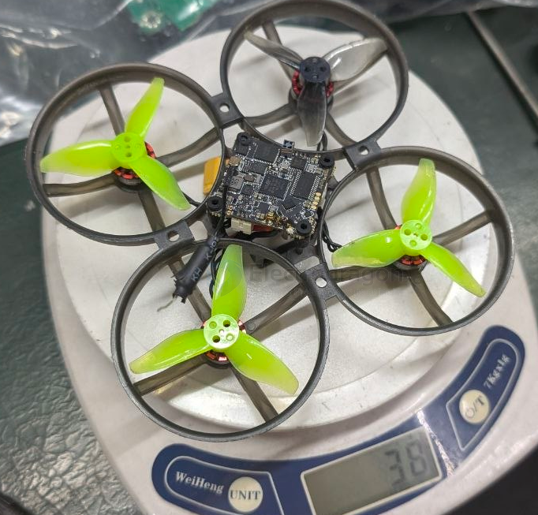
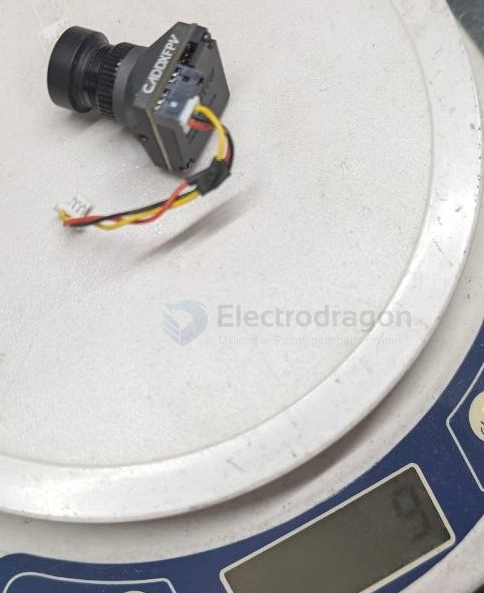
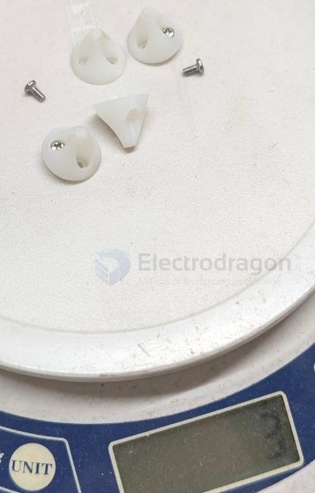

# FPV-load-dat

- [[FPV-purpose-dat]] - [[FPV-types-dat]] - [[FPV-load-dat]] - [[indoor-fly-dat]]

== [[TX800-dat]] + [[MS-519-dat]] + [[camera-action-dat]] = RMB 250 + 500 = 750

- [[thrust-dat]]

## higher weight for human control feeling 

### Human Control Feel & Flight Dynamics Breakdown

| Flight Characteristic | Stock Mobula8 (43g Dry / ~69g AUW) | Your Build (50g Dry / ~76g AUW) |
| :--- | :--- | :--- |
| **Thrust-to-Weight Ratio** | **~7.5 : 1** | **~6.4 : 1** |
| **Hover Throttle Point** | **18% – 20%** | **23% – 25%** |
| **Dive Recovery & Catching** | Instant, violent stop. Catches momentum near the ground effortlessly. | Has slight momentum "hang". Requires applying throttle **10–15% earlier** to catch dives. |
| **Cornering & Momentum** | Extremely snappy; changes direction on a dime. | Minor outward drift on sharp 90° turns due to higher inertia. |
| **Roll/Pitch Snaps** | Twitchy and ultra-fast. | Slightly smoother, "heavier" feeling transitions. |
| **Wind Resistance** | Easily bumped around by light wind. | **Better**. Extra mass carries momentum through wind gusts outdoors. |

---

### Betaflight Throttle Curve Compensation

To make a 50g dry build feel closer to stock response on your transmitter sticks:

* **Throttle Mid (Midpoint):** Set to `0.25` (aligns the center of your control curve with your new hover point).
* **Throttle Expo:** Set to `0.15` (smooths out fine altitude adjustments around the hover point).

## mobula8 

- [[mobula8-dat]] - [[EX1103-dat]] - [[FPV-load-dat]] - [[Thrust-dat]]

- [[FPV-purpose-dat]] - [[FPV-types-dat]] - [[FPV-load-dat]] - [[indoor-fly-dat]]

- [[FPV-2.0in-dat]] == 85 mm - [[mobula8-dat]]

38g without [[camera-FPV-dat]]

[[camera-FPV-dat]] == 9g 

The stock analog camera on the Happymodel Mobula8 is the Caddx Ant Nano FPV Camera.  

Weight & Specs Comparison
| Component                    | Weight                   | Key Specs                                         |
| ---------------------------- | ------------------------ | ------------------------------------------------- |
| Stock Analog Cam (Caddx Ant) | ~2.0g – 2.7g (with wire) | 1200TVL resolution, 14x14mm nano size, 1.8mm lens |
| Your Current Camera          | 9.0g                     | ~6.3g to 7.0g heavier than stock                  |

- [[stand-dat]] == 3g

- Base Drone: 38g
- Camera: 9g
- Landing Gear / Ground Stands: 3g (0.75g each)
- Total Dry Weight: 50g

Performance Impact on a 2S 85mm Whoop

Stock Weight Reference: A factory analog Mobula8 weighs around 43g dry. At 50g, you are ~7g (or 16%) heavier than the base model.

All-Up Weight (AUW) with Battery:

- With a standard 2S 450mAh LiPo (~26g), your AUW is ~76g.

- With a 2S 550mAh LiPo (~29g), your AUW is ~79g.

- [[thrust-dat]]

`Flight Dynamics`: The EX1103 11000KV motors on the Mobula8 provide plenty of thrust for 50g dry weight. You will still have excellent power for outdoor freestyle and cruising, though aggressive punch-outs and freestyle recovers will feel slightly heavier.

Weight Optimization Recommendations

- Landing Gear: If you want to recover 3g easily, consider removing the ground stands and landing directly on the durable plastic ducts.

- Camera Mount: Ensure the 9g camera is mounted as close to the center of gravity as possible so it doesn't cause pitch bias.

## Can the BetaFPV Pavo25 (Bee25) Carry a 120g GoPro?

Yes, the **BetaFPV Pavo25** can carry a **120g GoPro** (like the HERO11 Mini), but **with limitations**.

---

### 🔋 Battery & Flight Time

- **Recommended battery**: 4S 650–850mAh LiPo
- **With a naked GoPro (~30g)**: ~4–5 minutes of flight
- **With a full GoPro (~120g)**: ~2–3 minutes of flight
- **Heavier load** = more power draw = **shorter flight time** and **higher heat**

---

### ⚙️ Hardware Requirements

- **Motors**: Stock 1404 4500KV can lift it, but performance drops
- **Battery**: Use a **high C-rate** (≥75C) to avoid voltage sag
- **Frame**: Strip off any unnecessary accessories to reduce weight

---

### 🛑 Potential Drawbacks

- **Increased ESC and motor temperature**
- **Reduced agility and climb rate**
- **Poor handling in wind**
- **Shorter battery life**
- **Risk of motor burnout** if pushed too hard

---

### ✅ Tips for Better Performance

- Use a **"naked GoPro"** (~30–35g) to lighten the load
- Fly in **calm weather**
- Limit aggressive maneuvers
- Consider switching to a **larger cinewhoop** (like Pavo30, Defender 25, or CineLog30)

---

### 📦 Summary

| Payload            | Flyable? | Flight Time | Notes                             |
| ------------------ | -------- | ----------- | --------------------------------- |
| Naked GoPro (~30g) | ✅ Yes    | ~4–5 min    | Best performance                  |
| Full GoPro (~120g) | ⚠️ Yes    | ~2–3 min    | Limited performance, extra strain |

## ref 

- [[FPV-dat]]