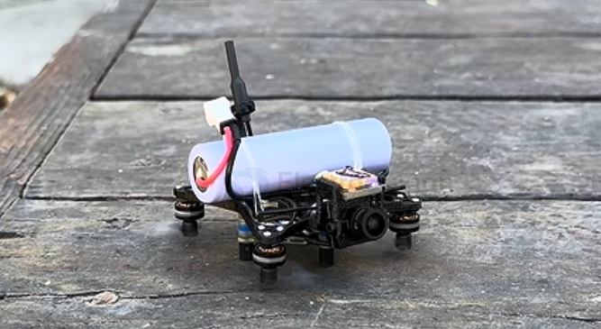

# FPV-long-range-dat

- [[FPV-long-range-dat]] - [[RC-RF-module-bay-dat]]

## build 

3KM+GPS_return / https://www.youtube.com/watch?v=gvf1hfomu-A&list=LL&index=4

build case - 65mm 

- [[video-digital-dat]]

- [[FPV-frame-dat]] - [[FPV-frame-pusher-dat]]

- [[propeller-FPV-dat]] - [[propeller-FPV-bi-dat]]

- [[18650-dat]] - [[18650-tabless-dat]]

- [[RC-RF-module-bay-dat]] - [[ELRS-HF-RF-Module-dat]]

### 1. Project Goal & Baseline Setup

- [[meteor65-dat]] - [[betaFPV-dat]]

* **Objective:** Build the smallest possible long-range FPV quadcopter (constrained to a 65mm motor-to-motor frame size) targeting a **15+ minute flight time** and a **3+ km range**.
* **Baseline Build:**
* Meteor 65 Pro Frame (with prop guards) + Matrix 3-in-1 HD flight controller.
* BetaFPV P1 Air HD VTX/camera combo. - [[video-digital-dat]]
* Standard 802 motors (19,000 KV) and 300mAh LiPo battery.

* **Baseline Limitations:** Short flight time (~3 minutes with stock LiPo, max ~6.5 minutes with 680mAh LiPo), limited internal receiver range (~1 km), and lack of GPS and advanced long-range features.

---

### 2. Iterative Design & Mechanical Improvements

* **Custom 3D-Printed Frame (PETG):**
* **Design Change:** Designed a completely new frame from scratch featuring thin triangular arms for high stiffness-to-weight ratio, integrated mounts to eliminate a heavy canopy, and an extended antenna mount.
* **Prop Guard Removal:** Removed prop guards to eliminate aerodynamic drag and make room for larger, more efficient **40mm bi-blade propellers**.
* **Pusher Motor Configuration:** Inverted the motors to mount them underneath the frame. This ensures an unobstructed path for airflow over the arms, significantly reducing turbulence and drag.
* **Vibration & Stiffness Fixes:** Initial 3D-printed PETG frames suffered from structural flex, causing screen ripples and oscillations. This was successfully resolved by adding **struts along the arms and cross-bracing in the center** to stiffen the frame.

- [[propeller-FPV-dat]] - [[FPV-long-range-dat]]

- [[motor-mount-dat]] - [[motor-dat]] - [[FPV-long-range-dat]]

- [[fab-3d-print-dat]] - [[PETG-dat]] == strong materials - [[FPV-frame-dat]]

* **Electronics & Weight Optimization:**
* **Receiver Upgrade:** Desoldered internal resistors on the flight controller to switch to an external long-range receiver with a proper T-antenna.
* **Motor Downsizing:** Swapped out the 802 motors for smaller **702 motors** (and later tested lower KV 23,000 KV and 28,000 KV options) to save weight and optimize efficiency.
* **Hardware Tweaks:** Replaced heavy metal fasteners with **nylon bolts** to shave off extra grams.
* **GPS Integration:** Added a compact GPS module on top of the camera for **Betaflight GPS Rescue** and real-time telemetry tracking.

- [[antenna-FPV-dat]] - [[FPV-long-range-dat]] - [[antenna-dipole-dat]]

- [[motor-dat]] - [[FPV-long-range-dat]]

- [[bolt-dat]] - [[FPV-long-range-dat]]

- [[location-dat]] - [[telemetry-dat]] - [[FPV-long-range-dat]]

---

### 3. Power & Battery Testing

The creator tested multiple battery capacities and cell chemistries:

* **Small LiPos (300mAh – 680mAh):** Provided great agility and responsiveness, but maximum flight times plateaued around 6.5 minutes.
* **Lightweight Li-Ion (18350 - 1200mAh):** Failed to deliver good results because it lacked high discharge ratings (only rated for 10A), causing severe voltage sag and sluggish performance (~3 minutes flight time).
* **High-Performance Li-Ion (18650 - 3000mAh):** Despite being heavy, this cell is rated for high discharge currents (60A). Combined with the new pusher frame and 40mm props, it unlocked the maximum endurance, achieving **16 minutes and 15 seconds** (and later **17 minutes and 19 seconds** with optimized 23,000 KV motors).

- [[18650-dat]] - [[21700-dat]] - [[FPV-long-range-dat]]

### 4. Troubleshooting & Software Optimization

* **Random Disconnects / Desyncs:** The drone was repeatedly falling out of the sky mid-flight due to motor desyncs. This was diagnosed and fixed by changing the Betaflight ESC protocol from **DShot600 down to DShot300**.
* **GPS Rescue Tuning:** Adjusted the descent rate on the Betaflight GPS Rescue feature, optimizing it to safely guide the aircraft back within controller range during gusty mountain winds.

---

### 5. Final Mission Result

* **Field Test:** Tested in extreme conditions at Snow Peak (battling 12–20 mph winds and elevation gains).
* **Outcome:** The tiny quad successfully achieved the target **3 km distance** benchmark while enduring strong head- and tailwinds. Although it narrowly missed making the full round-trip back to the exact takeoff point due to heavy battery drain against the wind, the engineering experiment proved that an ultra-micro 65mm-class platform can successfully perform long-range mountain missions.

[file-tag: [http://www.youtube.com/watch?v=gvf1hfomu-A](http://www.youtube.com/watch?v=gvf1hfomu-A)]

## design 

== [[battery-dat]] - [[rf-long-range-dat]] - [[location-FPV-dat]] == [[RTH-dat]] - [[location-dat]] - [[Line-Of-Sight-dat]] - [[VTX-dat]]

- [[video-transmission-dat]] - [[camera-digital-dat]]

## info 

- [[FPV-whoop-micro-dat]] - [[FPV-whoop-cine-dat]] - [[FPV-toothpick-dat]]  - [[FPV-long-range-dat]]  - [[FPV-heavy-lift-dat]]

- [[RF-dat]] - [[RF-long-range-dat]]

## upgrade your FPV system for long range 

Mobula6/8 + 400mW + VR03 原装
• 户外实际可达: 200-500m 可用（续航也限制）

加好天线（¥100 内）
• 户外实际可达: 500m-1km

换分集眼镜（Skyzone 04X）
• 户外实际可达: 1-2km

## 📋 远航的正确打开方式（分级）

入门远航（1-3km）
- 配置: 5寸机 + 400mW-1W VTX + 高增益天线
- 距离: 1-3km

进阶远航（3-10km）
- 配置: 长航时机 + 定向天线追踪（地面站）
- 距离: 3-10km

超远航
- 配置: DJI O4 数字 + 双天线追踪
- 距离: 10km+

---

💡 一句话总结

车库 30-50m 是环境问题，不是 5.8G 不行——5.8G 在户外开阔地 + 好天线，公里级轻松。但远航的门槛主要在飞机续航和天线系统，不是单纯"加大功率"。你的小机做好近距离（车库 30-50m、户外 200-500m）就很棒了，远航是未来大机的事 👍

## 📊 远航配置需要什么

**VTX 功率**
• 你现在的（近距离机）: 400mW
• 远航需要的: 400mW-1W（够）

**天线**
• 你现在的（近距离机）: 原装小天线
• 远航需要的: 高增益定向天线（图传 5-8dBi 平板天线指向飞机）⭐️ 关键

**眼镜天线**
• 你现在的（近距离机）: VR03 单天线
• 远航需要的: 分集接收 + 高增益天线（或地面站+平板天线）⭐️ 关键

**飞机**
• 你现在的（近距离机）: 2寸小机
• 远航需要的: 大机（续航 10min+，抗风）

## ref 