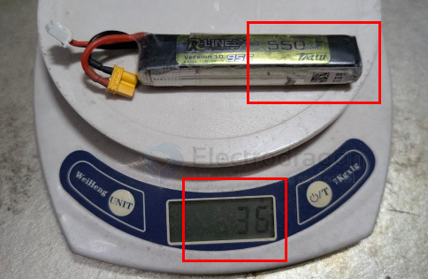

# FPV-stability-dat.md

- [[FPV-stability-dat]] - [[FPV-dat]] - [[FPV-control-dat]] - [[mobula8-dat]] 

Mobula8 (Happymodel 85mm micro freestyle quad) tends to drift outdoors — the main reason is that the frame is too light (about 60g bare). The improvement idea under light wind is:

---

1. Most direct: add weight (more weight improves stability)

The core issue with small quads is that the thrust-to-weight ratio is too high and the overall weight is too low, so the airframe gets carried along by the wind.

- Use a larger battery (550–660mAh 2S)
  - Effect: ✅ adds 10–15g, increases inertia, and makes it noticeably more stable

- Add GoPro or camera payload
  - Effect: more stable, but it hurts maneuverability

- Add weight blocks to the frame
  - Effect: simple and blunt, but it reduces flight time

A small quad gaining 10–20% in weight is the most effective physical way to improve wind resistance.

Mobula8 原厂电池是 Happymodel 2S 450mAh BT2.0 接口 锂电，重量约 25g 左右（24-27g 视批次）。

配重参考（Mobula8 模拟版）： -- 裸机（官方标称） -- • 重量: 43g

原厂 450mAh 2S 电池 - • 重量: ~25g

**全机带原厂电池** - • 重量: ~68g

550 mAh == 36g 

---

2. Tuning (Betaflight filtering / attitude)

- [[betaflight-dat]] - [[betaflight-PID-dat]]

The drifting feeling often comes from overly aggressive filtering and low attitude gain:

- Reduce gyro filtering: lower the D-term filter one step from default so the flight controller trusts the gyro more (note: this introduces some high-frequency noise; for the Mobula8 F4 flight controller, use it moderately)
- Increase Roll/Pitch P values: default PID is usually conservative, and increasing P by 10–15% can make attitude recovery faster
- Increase `angle-mode limits`: if you fly in Angle mode, raise max_angle from 45° to 60–65° to give the attitude correction more room

---

1. Mode selection

`Angle (self-level)`
- Outdoor light-wind performance: it drifts with the wind and recovers slowly

`Horizon`
- Outdoor light-wind performance: a compromise and recommended

`Acro (manual)`
- Outdoor light-wind performance: ✅ most resistant to wind! The pilot manually compensates for wind effects and is not limited by the flight controller

For outdoor flying, it is often best to go directly to Acro mode, paired with throttle management, which is more effective than any tuning change.

---

4. Propeller selection

- [[propeller-dat]]

- Replace the props with 3-blade or 4-blade props (the stock ones may be 2-blade): thrust becomes more linear and the response to wind feels smoother
- Check whether the props are deformed or loose — small quads have soft props, and even slight deformation can make drifting worse

---

1. Routine checks

- Frame / hoops: if the outer ring of a hoop-frame quad has been hit, it can deform and create uneven drag, causing a drift bias in flight
- Center of gravity: keep the battery centered; shifting it forward or backward will amplify the drifting feeling

---

Priority summary

① Use a larger battery to add weight → ② Use Acro mode → ③ Increase P values → ④ Check props and frame
