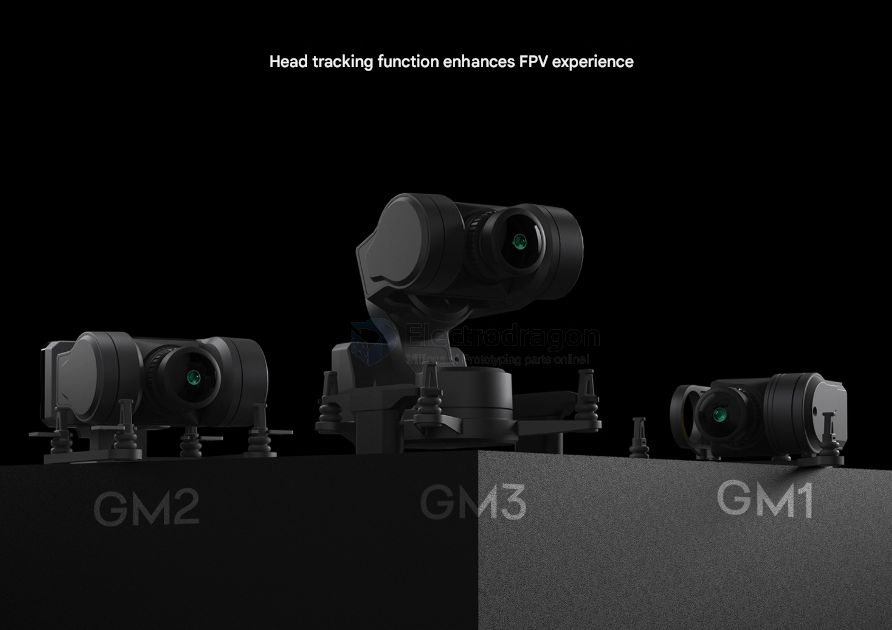

# Goggles-dat

- [[DJI-dat]] - [[fat-shark-dat]] - [[sky-zone-dat]]

- [[DJI-goggles-dat]]

- [[walksnail-dat]]

- GogglesX 
- Goggles L

- [[head-track-dat]] - [[head-track]]

## pair 

3. **Enter auto-scan mode on goggles**  
   - Press the **Band/Channel button** (short press or long press, depending on goggles model) to start **auto-search/scan**.  
   - The goggles will automatically scan through all frequencies to lock onto the strongest signal.  

## Features 

- eye view == 155 degree 

- fly speed == 27M/s

- freestyle 

- stablization 

- battery 

## Analog FPV drones:

- If your drone transmits on **5.8 GHz analog** (common for micro/Whoop drones), Aquila16 can receive it.
- support OSD or digital link.

## mechanical Gimbal 

- GM1 
- GM2 
- GM3 

## Rotorama 008D Pro == 朗视特

Rotorama 008D are basic FPV goggles for starting FPV pilots. The basis is a 4.3" IPS display with an aspect ratio of 16:9 and a resolution of 800x480 pixels, which is sufficient for displaying an analog video signal. The reception is taken care of by a dual receiver supporting all the usual 40 channels. In the package you can find two basic antennas with circular polarization. The goggles support the DVR function, when the received image can be recorded on an SD card of up to 32GB (FAT32). It is possible to connect headphones or an external video receiver.  Power is provided by an integrated battery with a capacity of 2000mAh, which is enough for 2-3 hours of operation. The battery is charged via USB connector. The goggles are delivered in a hard case with a zipper.

Key Features
- Size: 144x155x113mm
- Connector: RP-SMA
- Receiver: Dual 40Ch
- Display: 4.3" IPS 800x480px 16:9
- Battery: Integrated 2000mAh
- Input voltage: 5-23V
- Supporting DVR

## BeeRotor

-   **Second Generation Upgrades:**
    -   New DVR recording function, can record flight video in real-time, and play back flight recordings.
    -   With audio recording function, can record the sound of the aircraft flying in the air.
    -   Increased fan and heat dissipation holes, can effectively prevent fogging of the lens during long-term use.
    -   Comes with new BEEROTOR mushroom antenna and flat panel antenna for better performance.
    -   Dual 5.8G reception, high sensitivity, strong anti-interference ability, good reception effect.
    -   Built-in 5-inch high-definition screen, strong FPV immersion, making the flight feel immersive.
    -   The shell is made of EPP molding, ultra-light and drop-resistant, weighing only 236g.
    -   2-6S LIPO wide voltage input, low battery requirements, strong applicability.

-   **Product Parameters:**
    -   Dimensions: 165*150*115mm
    -   Weight: Ready-to-use 242 grams (without antenna)
        -   Or 264 grams (including flat panel and Honeydrop antenna)
    -   Battery Voltage Range:
        -   7-25VDC power supply range, 2S or 3S is recommended.
        -   A 2200mAh 2S 7.4V battery can be used for approximately 3 hours of FPV.
        -   When the battery is low, an external battery can be plugged in for charging while in use.
    -   Display Screen Size: 5.0 inches, 800*480px
    -   Brightness: 600cd/m2
    -   Lens: 2.9x, PMMA, no dispersion, no distortion, Fresnel
    -   Headband: Three-way adjustable T-strap

## SkyZone 

## ref 

- [[goggles]] - [[FPV]]