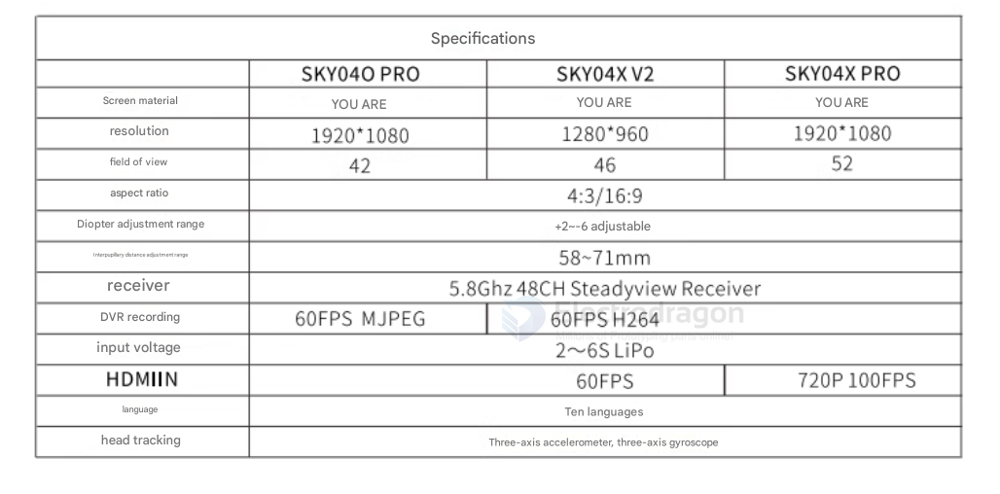

# skyzone-dat

## Skyzone SKY04L V2

Skyzone SKY04L V2 是一款纯正的传统模拟 FPV 飞行眼镜（使用 5.8G 模拟图传频段，接收模拟发射机的视频信号）。

它标配的 SteadyView 接收机和内部电路，都是为了解调模拟复合视频信号（CVBS）设计的，无法直接接收大疆、Walksnail、HDZero 等数字高清图传系统的信号。如果你想用它来飞数字机，同样需要像前面讨论的一样去外接数字图传的接收端或改用其他设备。

## Skyzone SKY03S

Skyzone SKY03S（搭载 OLED 屏幕的经典双目眼镜）和前面提到的 SKY02 系列一样，机身上没有设计旋钮式的近视调节功能。

## skyzone sky02x 

Skyzone SKY02X 是一款老牌的双目模拟眼镜，它机身上没有像 SKY04X 那样自带的近视调节旋钮。

如果你近视或远视，想要使用 SKY02X 看清画面，需要采用以下方式解决：

插卡式矫正镜片： SKY02X 的内部镜片卡槽兼容 Fat Shark 规格的近视/远视矫正镜片。你需要在网上（如淘宝或专门的 FPV 镜片店）根据自己的度数定制专门的嵌入式近视镜片，卡在眼镜内部使用。

直接佩戴隐形眼镜，或者如果度数非常浅，部分人可能勉强能裸眼看清，但通常近视飞手都需要额外定制插片。

## skyezone 02 

无论是 SKY02、SKY02S、SKY02C 还是 SKY02X 这一整代 SKY02 系列双目眼镜，设计上都没有内置近视度数调节旋钮。

跟 SKY02X 一样，整个 SKY02 系列解决近视的方式是：

眼镜内部带有镜片卡槽，兼容标准尺寸的 Fat Shark 近视矫正插片。

如果需要近视矫正，必须去配一张专用的卡入式近视镜片塞进眼镜里，或者选择戴隐形眼镜飞行。

## analog 

SKYZONE COBRA SD

SKYZONE COBRA X V2

SKYZONE COBRA S 

SKYZONE COBRA X V4

## Skyzone Cobra X V2

Skyzone Cobra X V2 依然是一款箱式眼镜（Box Goggles），和前面提到的 Cobra SD 以及你现在用的 BETAFPV VR03 结构类似。它的机身上没有双目眼镜那种单独的近视调节旋钮。

不过，处理近视的逻辑和双目眼镜完全不同：

因为它是箱式大屏幕设计，内部空间相对宽松，绝大多数飞手都可以直接戴着自己的日常近视眼镜闭眼套进去使用，不需要去定制专门的卡片镜片。

V2 版本相比早期的 V1，主要升级了更稳定的接收固件和部分菜单体验，屏幕表现依然是箱式机里数一数二的（1280x720 分辨率，带顶级的 SteadyView 稳像分集接收）。

## Skyzone Cobra X（V4版本）

性价比箱式眼镜（大屏幕/佩戴眼镜友好）：Skyzone Cobra X（V4版本）

模拟支持： 内置 SteadyView 接收机（单接收机或高级版，具体看 V4 配置），附带优秀的 DVR 录像功能。  

屈光度调节： 箱式眼镜（单大屏）通常不需要专门的屈光度调节旋钮，因为它的物理设计空间大，允许绝大多数飞手直接戴着自己的近视眼镜闭眼往里套。  

性价比评价： 如果你的诉求是“性价比高”且不想折腾定制近视镜片，Cobra X 是目前市面上公认最强的箱式模拟眼镜之一，价格远低于双目眼镜，兼顾了清晰度和大视野。

## digital FPV Goggles

SKYZONE 04X PRO

Skyzone SKY02S V+ 3D 5.8G 40CH FPV Goggles
- 10 years 

## ref 

- [[goggles-dat]]