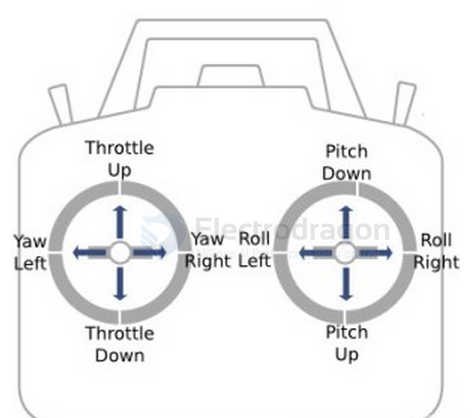
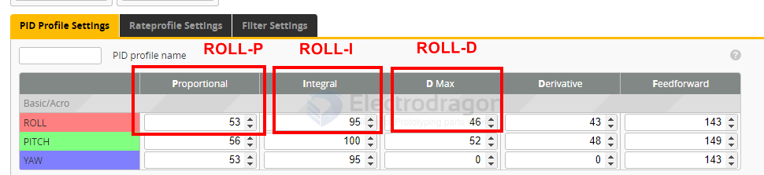
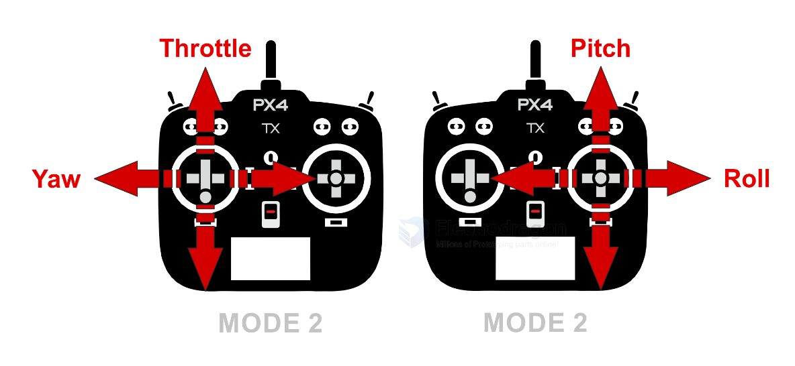

# RC-controller-dat

Check **Channel Map**: should be **AETR**.

- A: Aileron (Roll)
- E: Elevator (Pitch)
- T: Throttle
- R: Rudder (Yaw)

A Roll E Pitch R Yaw T Throttle

Roll Pitch Yaw Throttle

- [[radiomaster-dat]] - [[lightradio-dat]]

- [[mobula8-dat]]

## drift 

### 2. Calibration & Orientation

7. Betaflight → `Setup` → **Calibrate Accelerometer** (drone must be level).  
8. In `Setup` 3D model: tilt the drone → model should move the same way.  
- If not → fix in Configuration → `Board Alignment` (Yaw 90/180/270 etc).   

- **Calibrate Accelerometer**: Betaflight → Setup → Calibrate on a perfectly flat surface.
- Make sure the quad is completely still during calibration.
- Check **Setup Tab 3D model** → it must move exactly like the real quad.
- If model twitches on its own → gyro noise or vibration problem.

### 4. Fixing “Steady Right Drift”

12. If subtrim is correct but it still drifts → go to `PID Tuning`.  
13. Increase **Roll I-term** slightly (+1 → +4, test each step).  
14. If oscillations appear → reduce Roll P or Roll D by small steps (-1).  
15. Check Motor Idle value: `Configuration → DShot Idle` around **5%** (or min_command ≈1050).

- Reset to Betaflight **default PIDs** for Mobula8 (start clean).
- Reduce **Roll/Pitch P by 10%** if oscillations occur.
- Increase **I-term by +5** if drift is slow and continuous.

### 4. Angle Mode Settings
- If drift only happens in **Angle Mode**:
  - Use small **Accelerometer Roll/Pitch Trim** adjustments.  
  - Example: Drift forward → Pitch Trim negative.

### If drift happens in **Acro Mode too** 

→ it’s not accelerometer, it’s mechanical or PID.

## 🛠️ PID Tuning for Slow & Smooth Flight (Mobula8)

- [[PID-dat]]

### 1. Start from Defaults
- In Betaflight Configurator → **PID Tuning Tab** → click *Reset to Defaults*.
- This gives you a stable baseline.

### 2. Lower P and D Gains (Gentler Response)
- Roll / Pitch **P**: reduce by ~20%
- Roll / Pitch **D**: reduce by ~20%
- Yaw can stay default.
👉 Lower P/D = less aggressive corrections → smoother flying.

### 3. Increase I-Term Slightly (Stable Hover)
- Roll / Pitch **I**: increase by +10–15%  
👉 Helps hold level in hover, prevents drift.

### 4. Add a Bit of Damping (TPA / D-Term Filter)
- Leave filters at default first.  
- If motors get hot, lower D-Term a bit more.

### 5. Rates (Most Important for Smooth Flying)
Go to **Rates Tab**:
- **RC Rate**: 0.80 → change to **0.50**
- **Super Rate**: 0.70 → change to **0.60**
- **Expo**: set to **0.25–0.30**
👉 Slows down stick sensitivity, smoother camera movement.

### 6. Throttle Curve (for Gentle Hover)
- Betaflight: use **Throttle Expo** in PID Tuning → Throttle tab.  
  - Throttle Mid: set to ~0.50  
  - Throttle Expo: set to 0.20–0.30  
👉 Gives finer control near hover point.

### 7. Test Hover Indoors
- Arm in **Angle Mode**.  
- Slowly raise throttle.  
- Quad should lift smoothly without sudden jerks.  
- Adjust Expo if still too sensitive.

---
### ✅ Summary for Smooth / Cinewhoop-style Flying
- Lower **P/D** = softer movements.  
- Raise **I** = stable hover.  
- Reduce **Rates** + add **Expo** = slower stick response.  
- Throttle Expo = smoother lift / descend.  

# RC-console-dat

- [[Wfly-dat]] - [[WFT06x-dat]] - [[WFR06S-dat]]

- [[radiomaster-dat]]

## RC Tx 

- [[PX4-dat]] 

## RC Receiver 

When you push the **RC console (joystick or stick) up and down**, you're typically controlling the throttle or elevator channel, depending on the mode of your transmitter. The PWM (Pulse Width Modulation) signal output sent to the receiver or flight controller varies accordingly:

PWM signal range: ~1000 µs (microseconds) to ~2000 µs

    Center/stick neutral: ~1500 µs

    Stick fully down: ~1000 µs

    Stick fully up: ~2000 µs

Example:

If you're using Mode 2 (common mode):

Left stick up/down = Throttle

    Stick down = 1000 µs (zero throttle)

    Stick up = 2000 µs (full throttle)

If it's controlling elevator (pitch):

    Stick down (nose down) = 1000 µs

    Stick up (nose up) = 2000 µs

## ref 

- https://docs.px4.io/v1.11/en/getting_started/rc_transmitter_receiver.html

- [[RC-dat]]