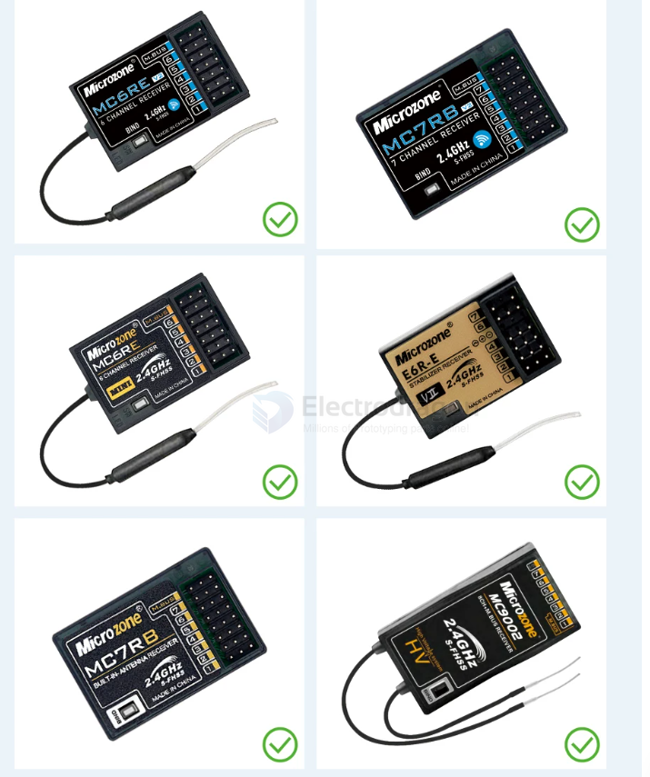

# rc-receiver-PWM-dat

- [[rc-transmitter-dat]] - [[rc-receiver-dat]] - [[rc-receiver-PWM-dat]] - [[rc-controller-dat]]

## provider

- [[microzone-dat]]

## specs 

- MC6RE-V2
- 茶色透明
- 固定翼、多轴、车、船
- 6个PWM信号,1个SBUS信号
- 2401MHz-2478MHz
- >800m
- DC:4.5-6V
- 支持
- 触点对频
- 快速恢复信号
- 支持
- 6C-MINI、C7-MINI、8B-MINI、Classic-10
- 外置天线
- 110mm
- 37*23*13(mm)
- 7g

## ref 

