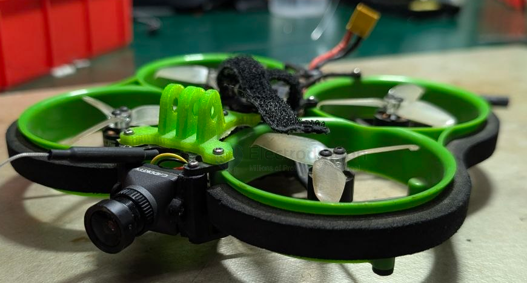
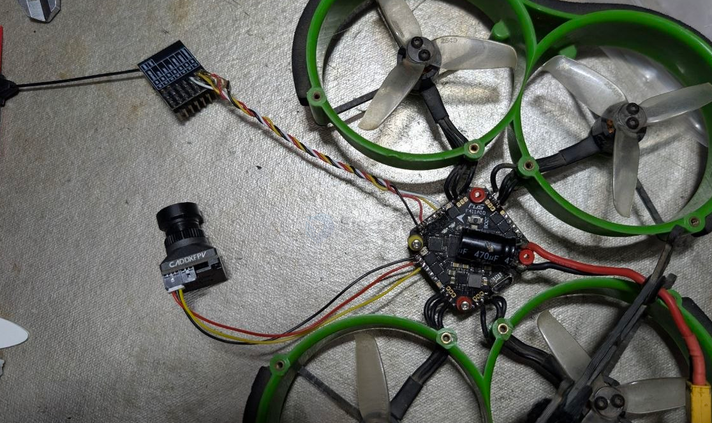

# FUS-X111-dat

## tech 

- [[motor-fan-ducted-dat]] - [[motor-dat]] - [[fan-dat]] - [[FPV-whoop-cine-dat]] - [[FPV-dat]] - [[FUS-X111-dat]] - [[indoor-fly-dat]]

- [[FPV-build-dat]] - [[FPV-2.5in-dat]] - [[FUS-X111-dat]]

- [[ELRS-RX-PWM-dat]] - [[FUS-X111-dat]]

- [[betaflight-dat]]

## thrust

- [[Thrust-dat]]

## info 

Wheelbase / Size
• Official data: 111mm / 155 × 173 × 38mm

**Dry weight**
• Official data: 117g (complete aircraft including FPV transmitter/camera, excluding battery)

**Motors**
• Official data: FUS 1106 3800KV ×4

**Propellers**
• Official data: 2540-3 (2.5-inch three-blade)

Flight controller / ESC
• Official data: 20A & F411 AIO

**Official recommended battery**
• Official data: 2–4S 450–650mAh

Official flight time
• Official data: 4S 500mAh → approx. 8 minutes indoors

⚠️ Note: The 3800KV value indicates that this aircraft is intended for 4S operation (at 3S the rotor speed is relatively low).

🎯 Part II: Thrust-to-weight ratio calculation (TWR = total thrust ÷ total weight)

Thrust is estimated (no official bench data; estimated based on 1106 + 2540-3 + duct losses):

3S configuration (estimated total thrust ~640g)
- 450mAh (45g) → total weight 162g → TWR 4.0:1 (battery weight 28%)
- 650mAh (60g) → total weight 177g → TWR 3.6:1 (34%)
- 850mAh (75g) → total weight 192g → TWR 3.3:1 (39%)

4S configuration (estimated total thrust ~960g)
- 450mAh (58g) → total weight 175g → TWR 5.5:1 (33%)
- 500mAh (65g) → total weight 182g → TWR 5.3:1 (36%)
- 650mAh (78g) → total weight 195g → TWR 4.9:1 (40%)

💡 Part III: Conclusion — Best battery

⭐️ Preferred: 4S 500–650mAh (XT30)
- TWR 4.9–5.3:1 (more than enough thrust for a ducted quad, better wind resistance)
- Battery weight is 36–40% of total aircraft weight (right in the “battery ≤40% of total weight” endurance sweet spot)
- Best match for 3800KV motors

Second choice: 3S 650–850mAh (XT30)
- TWR 3.3–3.6:1 (usable, but thrust is about 1/3 weaker)
- Compatible with your existing charger

❌ Not recommended: over 850mAh (battery share >40%, diminishing returns in endurance and making the aircraft heavier)

screws 

- [[bolt-hex-dat]] 
    - M2 * 6 
    - M2 * 8 ? 

## build 

final 1 

## PCB

- [[flight-controller-dat]]

layout 

- [[VTX-dat]] - [[ELRS-dat]], installtion hole == 25.5 x 25.5mm

- [[camera-FPV-dat]]
  

GND
5V
VIN
LED
BZ-
5V
GND

RX1
TX1
VOUT
5V
GND

RX1
TX1
VOUT
5V
GND

- [[FPV-wiring-dat]] - [[FPV-build-dat]] - [[FUS-X111-dat]]

## specs 

F411 & 20A AI0 board

- Size:32.5*32.5mm
- Mounting pattern: 25.5*25.5mm (3mm harf
- Weight: 6.3g
- Connector: Micro-USB
- MCU: STM32F411
- Gyro: MPU6000(SPI)
- Blackbox: Not included
- BEC output: 5V 2A
- Constant current: 20A,25A(Peak)
- Input: 2-4s (support HV)
- Current sensor: Included
- BLHeli: BLHeli-S
- Target: MATEK F411
- ESC  Firmware:G H 30  BLS
- VIDEO TRANSMISSION
- Power—25MW/100MW/200MW
- IRC Tramp— Support to change power and frequen .control (TXD)
- Number of signal channel: 40
- Frequency adjustment: short press button

Product Introduction

The FUS X-111 is a 2.5-inch ducted-fanqund which was designed to flying indisadvanany narrowed space, and without commontages of 2 or 3-inch such asther for beginners or pros, the FUS X-111 can perfectly proilar expererience to a larger quad with a reasonable price of 2-inch quad.

Features

The material combination of CF/ABS/EVAalong with triangle/cross structure,can provide you higher durability and intensity with minimum weight.

Thanks to the ultimate weight-reduce design, the FUS X-11I can provide youmore than 8 minutes indoor flying by a 4s 500mah battery, and performanceway better than an ordinary 2-inch quad.

Extended features

The FUS X-111 can install the DJI-Vista HD Digital FPV system, or HDrecording/FPV camera. Also you can mount your motion camera such as Runcamvideo recorder、gopro、 insta on the X-11l with 3D printing parts. Eitherway, X-1ll is perfectly capable for HD FPV or filming.

## diff 

diff info 

    # diff all
    ###WARNING: NO CUSTOM DEFAULTS FOUND###

    # version
    # Betaflight / STM32F411 (S411) 4.2.0 Jun 14 2020 / 03:04:43 (8f2d21460) MSP API: 1.43
    ###ERROR: diff: NO CONFIG FOUND###
    # start the command batch
    batch start

    # reset configuration to default settings
    defaults nosave

    board_name MATEKF411
    manufacturer_id MTKS
    mcu_id 005a00513130511630343830
    signature 

    # name: X111 V2

    # resources
    resource BEEPER 1 B02
    resource MOTOR 1 B04
    resource MOTOR 2 B05
    resource MOTOR 3 B06
    resource MOTOR 4 B07
    resource MOTOR 5 B03
    resource MOTOR 6 B10
    resource PPM 1 A03
    resource LED_STRIP 1 A08
    resource SERIAL_TX 1 A09
    resource SERIAL_TX 2 A02
    resource SERIAL_RX 1 A10
    resource SERIAL_RX 2 A03
    resource I2C_SCL 1 B08
    resource I2C_SDA 1 B09
    resource LED 1 C13
    resource LED 2 C14
    resource SPI_SCK 1 A05
    resource SPI_SCK 2 B13
    resource SPI_MISO 1 A06
    resource SPI_MISO 2 B14
    resource SPI_MOSI 1 A07
    resource SPI_MOSI 2 B15
    resource ADC_BATT 1 B00
    resource ADC_CURR 1 B01
    resource OSD_CS 1 B12
    resource GYRO_EXTI 1 A01
    resource GYRO_CS 1 A04
    resource USB_DETECT 1 C15

    # timer
    timer A03 AF3
    # pin A03: TIM9 CH2 (AF3)
    timer B04 AF2
    # pin B04: TIM3 CH1 (AF2)
    timer B05 AF2
    # pin B05: TIM3 CH2 (AF2)
    timer B06 AF2
    # pin B06: TIM4 CH1 (AF2)
    timer B07 AF2
    # pin B07: TIM4 CH2 (AF2)
    timer B03 AF1
    # pin B03: TIM2 CH2 (AF1)
    timer B10 AF1
    # pin B10: TIM2 CH3 (AF1)
    timer A00 AF2
    # pin A00: TIM5 CH1 (AF2)
    timer A02 AF2
    # pin A02: TIM5 CH3 (AF2)
    timer A08 AF1
    # pin A08: TIM1 CH1 (AF1)

    # dma
    dma ADC 1 0
    # ADC 1: DMA2 Stream 0 Channel 0
    dma pin B04 0
    # pin B04: DMA1 Stream 4 Channel 5
    dma pin B05 0
    # pin B05: DMA1 Stream 5 Channel 5
    dma pin B06 0
    # pin B06: DMA1 Stream 0 Channel 2
    dma pin B07 0
    # pin B07: DMA1 Stream 3 Channel 2
    dma pin B03 0
    # pin B03: DMA1 Stream 6 Channel 3
    dma pin B10 0
    # pin B10: DMA1 Stream 1 Channel 3
    dma pin A00 0
    # pin A00: DMA1 Stream 2 Channel 6
    dma pin A02 0
    # pin A02: DMA1 Stream 0 Channel 6
    dma pin A08 0
    # pin A08: DMA2 Stream 6 Channel 0

    # feature
    feature -RX_PARALLEL_PWM
    feature -AIRMODE
    feature RX_SERIAL
    feature RANGEFINDER
    feature RSSI_ADC
    feature LED_STRIP
    feature OSD

    # map
    map TAER1234

    # serial
    serial 1 64 115200 57600 0 115200

    # led
    led 0 8,6::CO:5
    led 1 9,6::CO:5
    led 2 10,6::CO:5
    led 3 11,6::CO:5
    led 4 12,6::CO:5
    led 5 13,6::CO:5
    led 6 14,6::CO:5
    led 7 15,6::CO:5

    # aux
    aux 0 0 0 1700 2100 0 0
    aux 1 1 1 900 1300 0 0
    aux 2 13 3 1700 2100 0 0
    aux 3 28 2 1300 1700 0 0
    aux 4 35 2 1700 2100 0 0

    # vtxtable
    vtxtable bands 6
    vtxtable channels 8
    vtxtable band 1 BAND_A   A CUSTOM  5865 5845 5825 5805 5785 5765 5745 5725
    vtxtable band 2 BAND_B   B CUSTOM  5733 5752 5771 5790 5999 5828 5847 5866
    vtxtable band 3 BAND_E   E CUSTOM  5705 5685 5665 5645 5885 5905 5925 5945
    vtxtable band 4 AIRWAVE  F CUSTOM  5740 5760 5780 5800 5820 5840 5860 5880
    vtxtable band 5 RACEBAND R CUSTOM  5658 5695 5732 5769 5806 5843 5880 5917
    vtxtable band 6 LOWRACE  L CUSTOM  5362 5399 5436 5473 5510 5547 5584 5621
    vtxtable powerlevels 4
    vtxtable powervalues 14 23 27 29
    vtxtable powerlabels 25 200 500 800

    # master
    set acc_calibration = 1,62,36,1
    set mag_bustype = I2C
    set mag_i2c_device = 1
    set mag_hardware = NONE
    set baro_bustype = I2C
    set baro_i2c_device = 1
    set baro_hardware = NONE
    set serialrx_provider = CRSF
    set dshot_idle_value = 500
    set dshot_burst = AUTO
    set dshot_bidir = ON
    set dshot_bitbang = OFF
    set motor_pwm_protocol = DSHOT300
    set motor_poles = 12
    set current_meter = ADC
    set battery_meter = ADC
    set beeper_inversion = ON
    set beeper_od = OFF
    set beeper_dshot_beacon_tone = 3
    set small_angle = 180
    set osd_vbat_pos = 14720
    set osd_rssi_pos = 2427
    set osd_tim_2_pos = 2488
    set osd_flymode_pos = 2522
    set osd_throttle_pos = 2458
    set osd_craft_name_pos = 491
    set osd_home_dist_pos = 352
    set osd_warnings_pos = 14729
    set osd_avg_cell_voltage_pos = 14752
    set osd_disarmed_pos = 2314
    set osd_flip_arrow_pos = 2498
    set system_hse_mhz = 8
    set vtx_band = 5
    set vtx_channel = 4
    set vtx_power = 1
    set vtx_freq = 5769
    set max7456_spi_bus = 2
    set dashboard_i2c_bus = 1
    set gyro_1_bustype = SPI
    set gyro_1_spibus = 1
    set gyro_1_sensor_align = CW180
    set gyro_1_align_yaw = 1800
    set name = X111 V2

    profile 0

    # profile 0
    set vbat_pid_gain = ON
    set iterm_rotation = ON

    profile 1

    profile 2

    # restore original profile selection
    profile 0

    rateprofile 0

    rateprofile 1

    rateprofile 2

    rateprofile 3

    rateprofile 4

    rateprofile 5

    # restore original rateprofile selection
    rateprofile 0

    # save configuration
    save

## ref 

