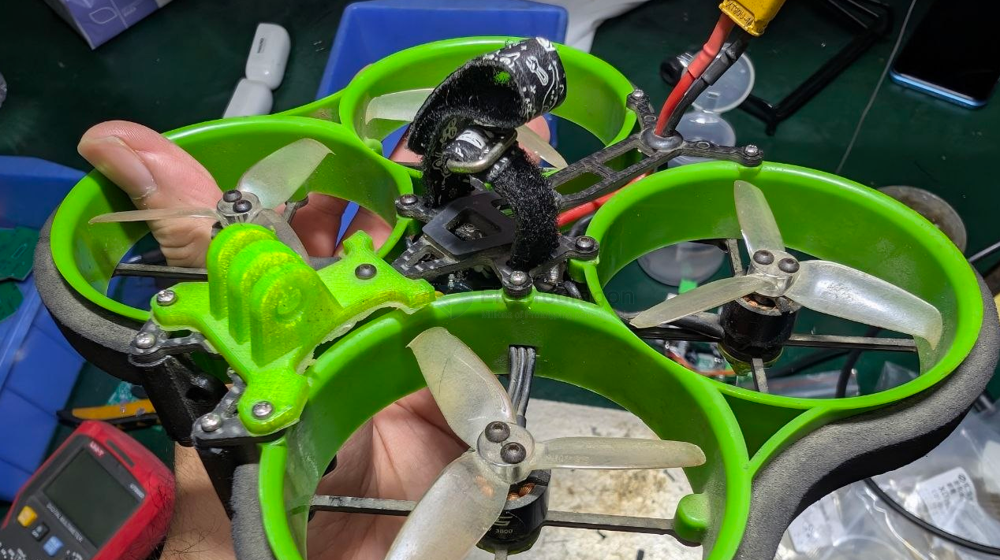
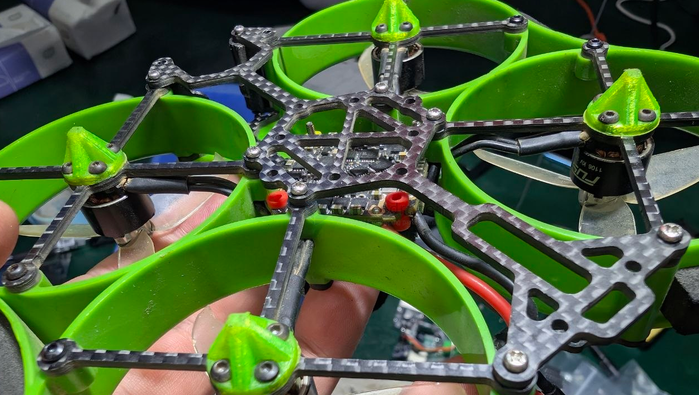
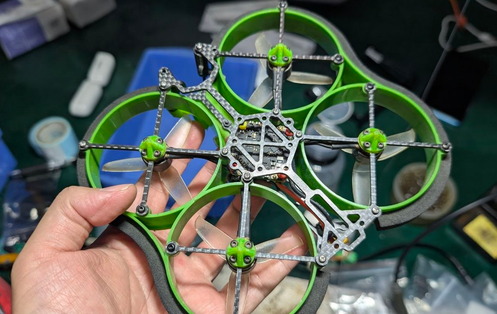
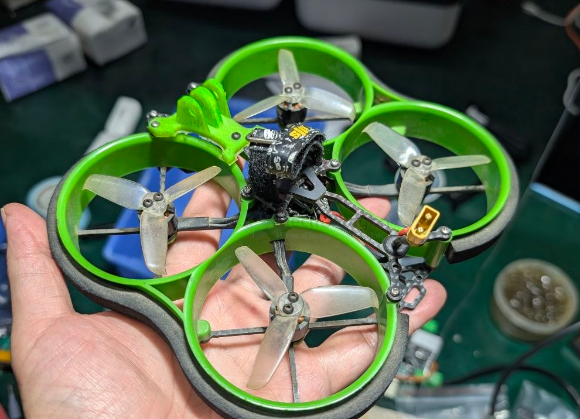
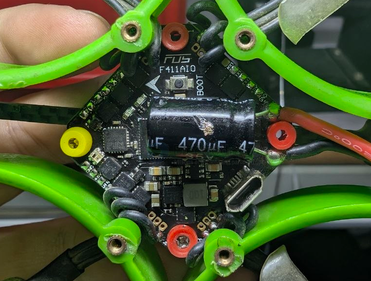
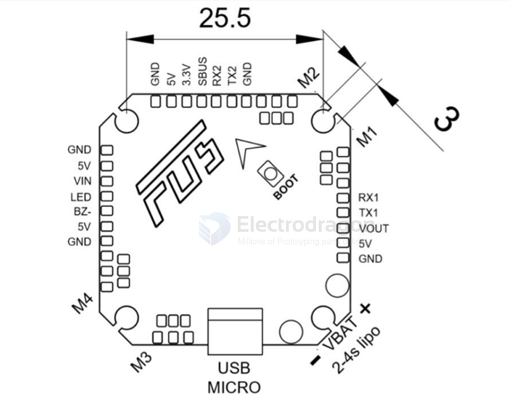
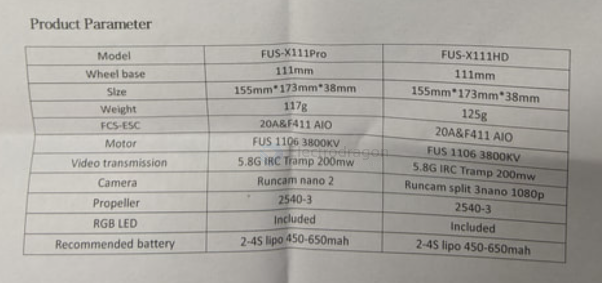

# FUS-X111-dat

- [[FPV-build-dat]] - [[FPV-2.5in-dat]] - [[FUS-X111-dat]]

screws 

- [[bolt-hex-dat]] 
    - M2 * 6 
    - M2 * 8 ? 

## build 

## PCB

- [[flight-controller-dat]]

layout 

- [[VTX-dat]] - [[ELRS-dat]]

GND
5V
VIN
LED
BZ-
5V
GND

RX1
TX1
VOUT
5V
GND

RX1
TX1
VOUT
5V
GND

- [[FPV-wiring-dat]] - [[FPV-build-dat]] - [[FUS-X111-dat]]

## specs 

F411 & 20A AI0 board

- Size:32.5*32.5mm
- Mounting pattern: 25.5*25.5mm (3mm harf
- Weight: 6.3g
- Connector: Micro-USB
- MCU: STM32F411
- Gyro: MPU6000(SPI)
- Blackbox: Not included
- BEC output: 5V 2A
- Constant current: 20A,25A(Peak)
- Input: 2-4s (support HV)
- Current sensor: Included
- BLHeli: BLHeli-S
- Target: MATEK F411
- ESC  Firmware:G H 30  BLS
- VIDEO TRANSMISSION
- Power—25MW/100MW/200MW
- IRC Tramp— Support to change power and frequen .control (TXD)
- Number of signal channel: 40
- Frequency adjustment: short press button

Product Introduction

The FUS X-111 is a 2.5-inch ducted-fanqund which was designed to flying indisadvanany narrowed space, and without commontages of 2 or 3-inch such asther for beginners or pros, the FUS X-111 can perfectly proilar expererience to a larger quad with a reasonable price of 2-inch quad.

Features

The material combination of CF/ABS/EVAalong with triangle/cross structure,can provide you higher durability and intensity with minimum weight.

Thanks to the ultimate weight-reduce design, the FUS X-11I can provide youmore than 8 minutes indoor flying by a 4s 500mah battery, and performanceway better than an ordinary 2-inch quad.

Extended features

The FUS X-111 can install the DJI-Vista HD Digital FPV system, or HDrecording/FPV camera. Also you can mount your motion camera such as Runcamvideo recorder、gopro、 insta on the X-11l with 3D printing parts. Eitherway, X-1ll is perfectly capable for HD FPV or filming.

## ref 

