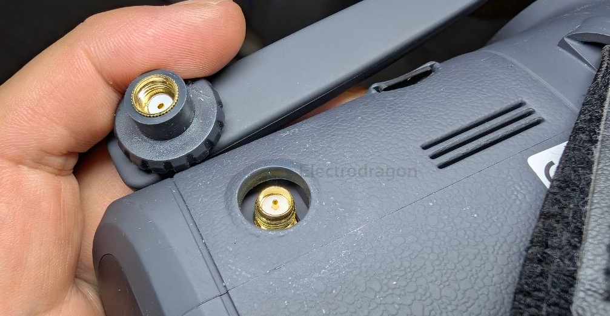

# VR03-dat

- [[FPV-goggles-dat]] - [[VRX-dat]] - [[betaFPV-dat]] - [[VR03-dat]]

- [[antenna-FPV-dat]] - [[VR03-dat]] - [[conn-SMA-dat]]

- 尺寸168.8x182.1x98.5mm
- 重量约400g
- 视频制式N制/P制
- 支持通道48CH
- 屏幕尺寸4.3英寸
- 屏幕分辨率800*480
- 电池3.7V，2000mAh
- 普通模式续航约2小时
- 录像模式续航约1小时10分
- 最大充电电流1A
- 天线接口RP-SMA
- 充电口Type-C
- 卡槽MicroSD卡（支持FAT系统，最高支持64GB，建议C10）
- 分辨率480P
- 文件格式AVI

## info 

## ref 

