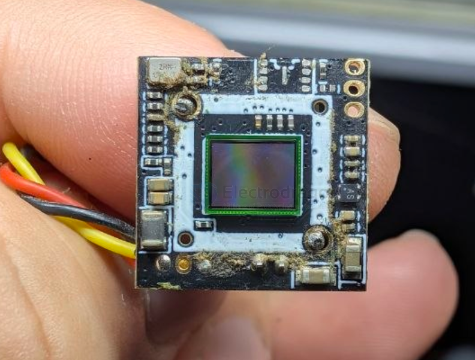
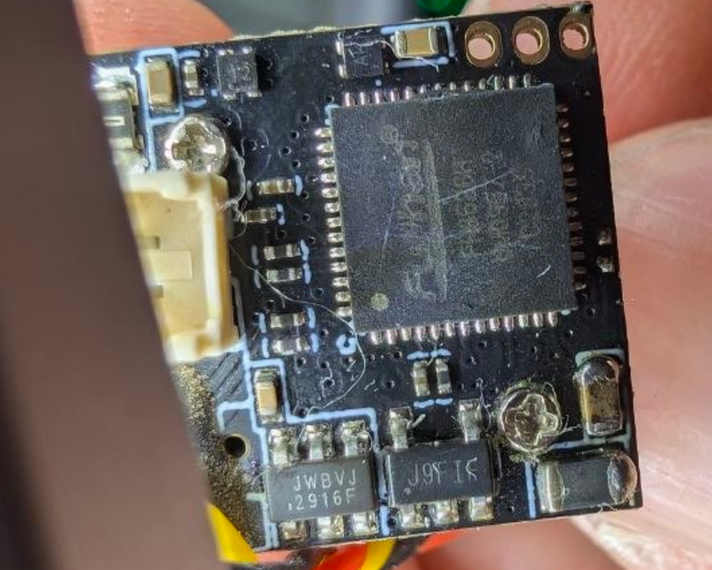

# caddx-ant-dat

- [[caddx-ratelpro-dat]] - [[caddx-dat]] - [[walksnail-dat]] - [[caddx-ant-dat]]

- [[camera-FPV-dat]] - [[sensor-camera-dat]]

caddx-ant-dat

- [[chip-cn-dat]] - [[fullhan-dat]] - [[FH8686-dat]] - [[media-ISP-dat]] - [[video-dat]] - [[video-analog-dat]] - [[caddx-ant-dat]] 

## build 

`J9FIF` SOT23-5 == xx unknown ?? 

`JWBVJ` SOT23-6 - [[JW5017-dat]] - [[joulwatt-dat]]

- [[dcdc-down-dat]] - [[JW5017-dat]] - [[joulwatt-dat]] - [[caddx-ant-dat]]

### Caddx ANT 1200TVL

- [[mobula8-dat]] == Caddx ANT 1200TVL == 4:3

## ref 

