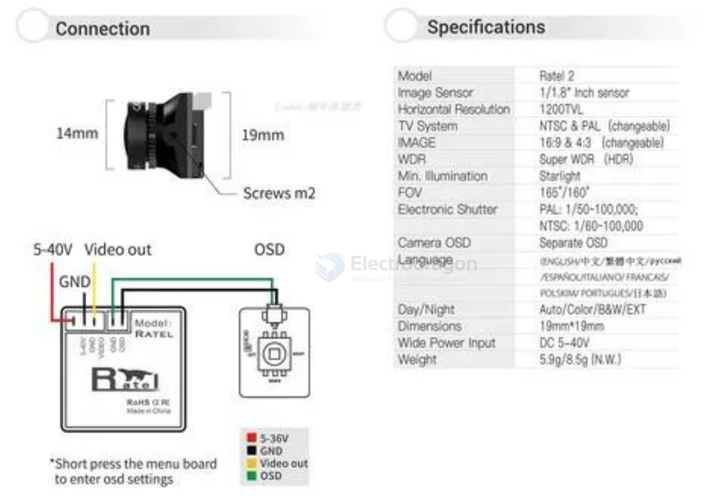

# caddx-ratel2-dat

- [[caddx-ratel2-dat]] - [[caddx-dat]]

MODEL: RATEL2

- 传感器1/1.8" Inch Starlight Sensor
- 水平分辨率1200TVL
- 水平视场角165°
- 镜头2.1mmlens
- 视频制式NTSC&PAL（可调）
- 图像比例4:3&16:9（可调）
- 宽动态SuperWDR
- 降噪3DNR
- 低照度0.0001LUX
- 视频输出CVBS

## ref 

