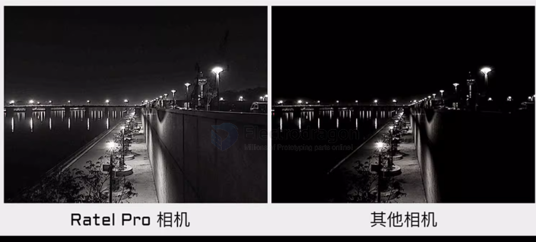
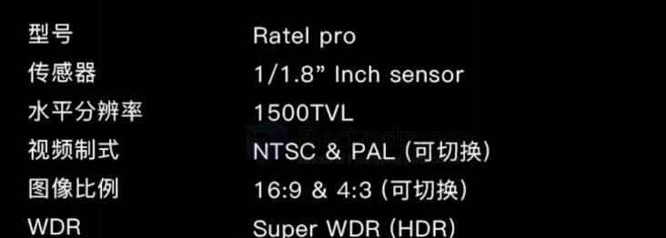
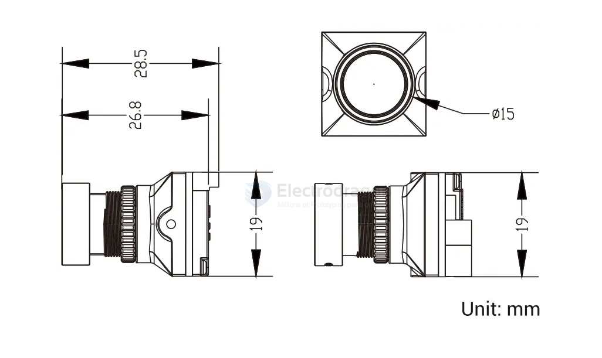
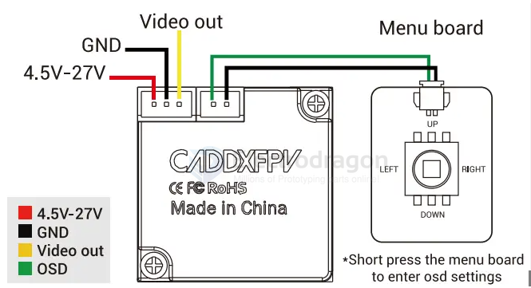

# caddx-ratelpro-dat

- [[caddx-ratelpro-dat]] - [[caddx-dat]] - [[walksnail-dat]]

- [[caddx-ant-dat]]

- [[camera-rack-dat]] - [[camera-wireless-dat]]

- size == dia. 15 x 19 x 19 

### ratel pro 

- [[X12-dat]]

lens diameter 15mm 

body dimesnion ~20mm 

wiring 

# caddx-RatelPro-dat

- [[caddx-RatelPro-dat]] - [[caddx-dat]]

Ratel Pro ("平头哥") black-light, night-vision, wide-dynamic FPV camera

pitch 1.25 mm

### specs

| spec                  | value                                                                                             |
| --------------------- | ------------------------------------------------------------------------------------------------- |
| Model                 | Ratel Pro                                                                                         |
| Sensor                | 1/1.8"                                                                                            |
| Horizontal resolution | 1500 TVL                                                                                          |
| Video system          | NTSC & PAL (switchable)                                                                           |
| Aspect ratio          | 16:9 & 4:3 (switchable)                                                                           |
| WDR                   | Super WDR (HDR)                                                                                   |
| Minimum illumination  | 0.00001 lux                                                                                       |
| Lens                  | 5 Mega                                                                                            |
| Electronic shutter    | PAL 1/50–1/100,000; NTSC 1/60–1/100,000                                                           |
| FOV                   | 125°                                                                                              |
| OSD menu              | supported                                                                                         |
| Languages             | English / 中文 / 繁體中文 / Русский / Español / Italiano / Français / Polski / Português / 日本語 |
| Scene modes           | Auto / Color / B&W / EXT                                                                          |
| Dimensions            | 19 mm × 19 mm                                                                                     |
| Input voltage         | DC 4.5V–27V (wide voltage)                                                                        |
| Operating temperature | -20 ℃ ~ +60 ℃                                                                                     |
| Operating humidity    | 20% ~ 80%                                                                                         |
| Weight                | 9.5 g                                                                                             |

## ref 

