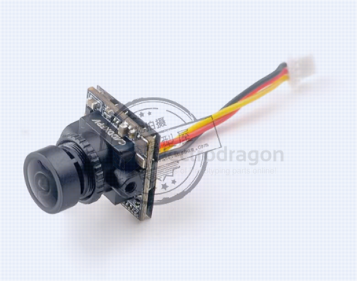

# caddxFPV-dat

- [[walksnail-dat]] is a brand of caddxFPV

## digial camera 

Several companies make digital FPV systems that can compete with or complement DJI O4. Here’s a detailed overview:

---

### 1. **Caddx FPV Systems**

| Model | Features | Notes |
|-------|----------|-------|
| **Caddx Nebula Pro / Vista** | HD 1080p or 4K video, low-latency digital feed, small form factor | Requires compatible goggles (Fat Shark or Caddx) |
| **Caddx Nebula Nano** | Ultra-lightweight for micro quads | Limited range (~500–800 m) |
| **Caddx Vista HD** | HDMI input, supports OSD | Compatible with multiple cameras, low latency (~30 ms) |

---

### 2. **Walksnail Avatar Series**

| Model | Features | Notes |
|-------|----------|-------|
| **Walksnail Avatar Kit / Module** | HD digital video, Wi-Fi phone viewing, low-latency (~100–200 ms) | Works with phone or tablet directly; good for casual FPV |
| **Walksnail Avatar Nano** | Micro lightweight module | For 2–3” frames, similar features |

### moonlight kit 

### Walksnail Avatar HD

Camera

- **Model:** Avatar HD V2 Camera
- **Image Sensor:** 1/3.2-inch 4MP 4:3 sensor
- **Resolution:**  
  - 1080P/60fps  
  - 720P/100fps  
  - 720P/60fps  
  - Compatible with 1080P/100fps and 1080P/120fps
- **Aspect Ratio:** 16:9; native 4:3
- **Lens:** 2.1mm
- **Field of View:** 160°
- **Aperture:** F2.0
- **Shutter:** Rolling shutter
- **Minimum Illumination:** 0.001 Lux
- **Weight:** 7.2g
- **Dimensions:** 19 × 19 × 22 mm
- **Coaxial Cable Length:** 140mm

VTX

- **Frequency:** 5.725–5.850 GHz
- **Transmitter Power (EIRP):**
  - FCC: <30 dBm
  - CE: <14 dBm
  - SRRC: <20 dBm
  - MIC: <25 dBm
- **I/O Ports:**
  - JST1.0 × 4 (Power Input)
  - JST0.8 × 6 (USB)
- **Mounting Holes:** 25.5 × 25.5 mm; 20 × 20 mm
- **Dimensions:** 33.5 × 33.5 × 10.5 mm
- **Storage:** 32 GB
- **Recording:** 1080P / 720P
- **Weight:** 15.4 g
- **Operating Temperature:** –20°C to 40°C
- **Channels:** 8
- **Wide Voltage Input:** 6V–25.2V
- **Supported FC Systems:** Betaflight, Inav, Fettec, ArduPilot, Kiss
- **OSD:** Canvas mode
- **Latency:** Average 22 ms (canvas mode)
- **Antenna:** 2 (IPEX)

## analog camera  

- caddx nano 
- Baby Ratel 2

### Caddx ANT 1200TVL

- [[mobula8-dat]] == Caddx ANT 1200TVL == 4:3

### ratel 2

Caddx蜗牛平头哥二代穿越机摄像头fpv摄像机夜视镜头无人机ratel2

### nano CADDX 蜗牛 Nano

### ratel pro 

- [[X12-dat]]

lens diameter 15mm 

body dimesnion ~20mm 

wiring 

## goggles 

- goggles HD

## gimbal 

- [[RC-gimbal-dat]]

## ref 

- [[caddxFPV]] - [[RC]]