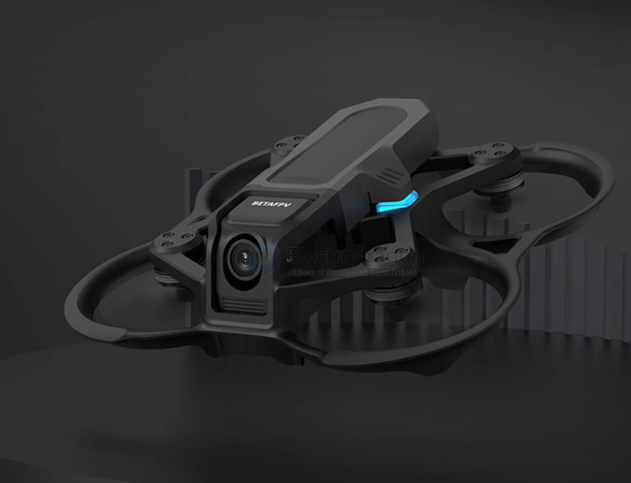

# Aquila16-dat

BT2.0 (BetaFPV’s low-resistance connector, better than PH2.0 for higher current draw)

- [[CONN-dat]]

## re-pair ELRS

- wait one minute after power on, no need radio, drone led color turn to quick GREEN flash, find expressLRS RX as a wifi spot

## ref 

- [[betaFPV-dat]]