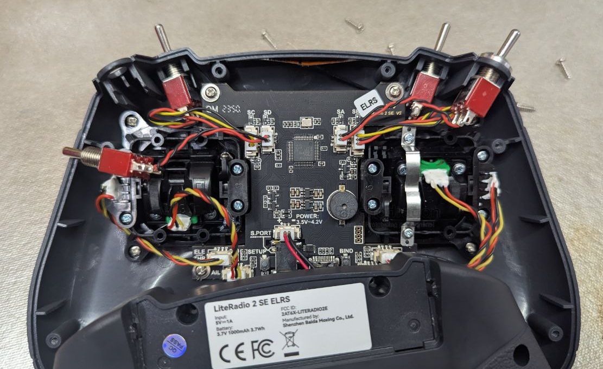
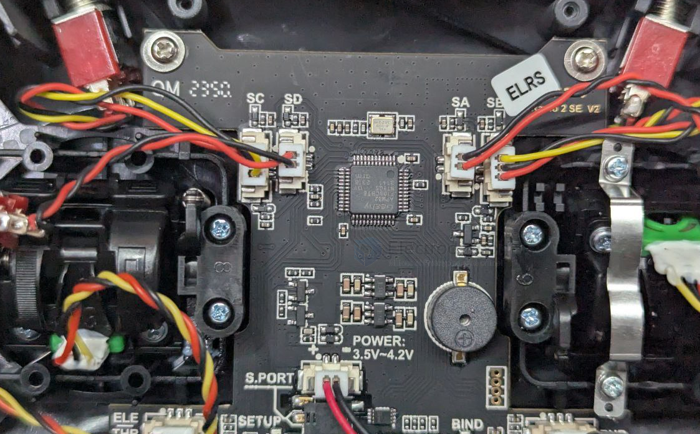
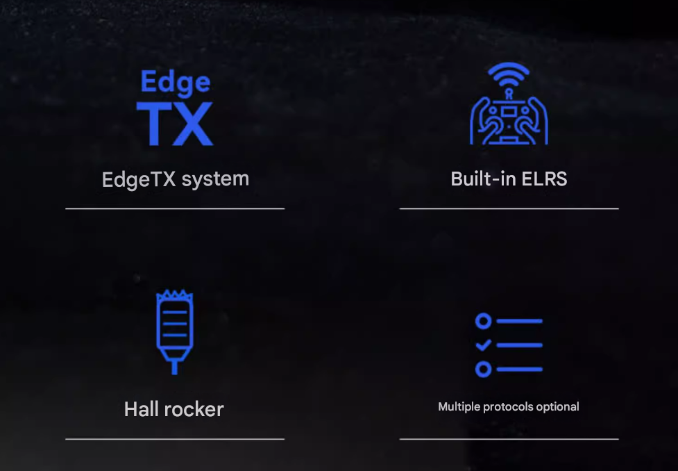
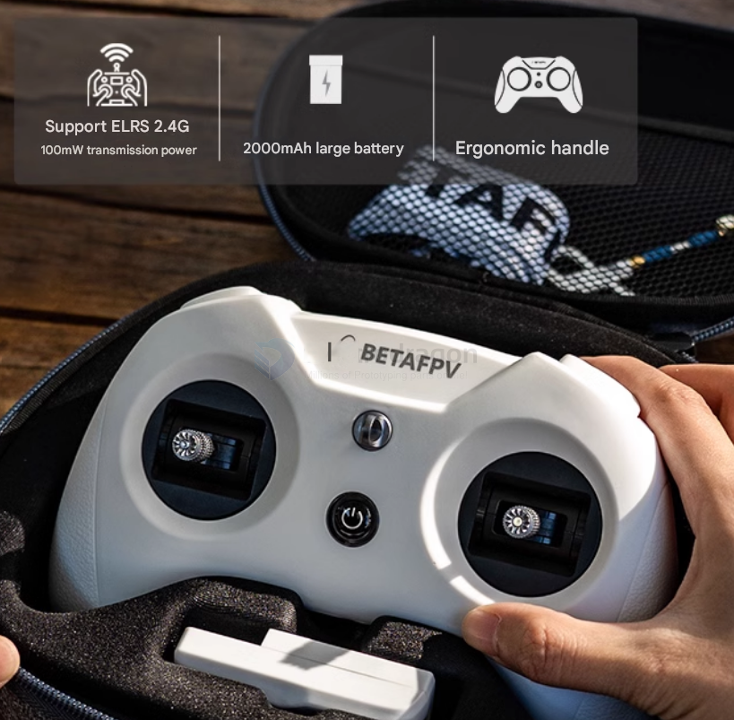

# lightradio-dat

## inside 

## Lightradio 3 Pro 

- professional version 
- build-in OLED display 

Choice of two protocols:

*   **Built-in ELRS 2.4G:** Maximum output power up to 250mW, built-in omnidirectional antenna, enables long-range flight.
*   **Built-in CC2500 version:** Supports Frsky D / Frsky X / SFHSS and other protocols, maximum 100mW transmission power.

## lightradio 3

- does NOT support original [[ELRS-dat]] system 

### info 

### Flight Controller

The application supports flight controller that can run LiteSilver firmeware.

- Lite Brushed FC V3
- Cetus FPV Kit
- Cetus Pro FPV Kit
- Cetus X FPV KIT
- Cetus Lite FPV Kit
- Aquila 16 FPV kit

Configurator for FC board is active.Follow the steps to enter FC Setup page.

1. Connect the FC board to the computer via USB data cable.
2. Select the virtual COM port and click the *Connect" button on the top right.

Note: If enter FC Setup page fail, please update the FC firmware first.

Click the "Firmware Flasher" tab on the left for firmware update.

### Radio Transmitter

Support the radio controller come with BETAFPV LiteRadio Firmware 2.0 Version.

- LiteRadio 1
- LiteRadio 2 SEV2
- LiteRadio 3
- LiteRadio 4 SE

The LiteRadio 2 SE Frsky or Bayang version is not supported. LiteRadio 2 and LiteRadio 3 Pro is powered by OpenTX system, please use the OpenTX Companion.

Click the yellow button below to active configurator for radio controller.

### Remote control parameters

- Model == LiteRadio3 remote control
- Remote control distance == 500-600 meters
- Frequency range == 2.4G (2403MHz-2447MHz)
- Support protocol == ELRS 2.4G/Frsky (CC2500)
- Channel == 8
- Support protocol == ELRS 2.4G
- Power == 25mW/50mW/100mW
- Adaptive drone type supports
  - Multi-rotor/support USB firmware update
  - BETAFPV Configurator connection
  - Custom LiteRadio system joystick calibration
- LED light == red light on/red warning/blue normal
- Battery built-in == 2000mAh1S battery
- Charging connector == Type-C

## BetaFPV Configurator 

[github release ](https://github.com/BETAFPV/BETAFPV_Configurator/releases)

[BETAFPV Configurator User Manual](https://support.betafpv.com/hc/en-us/articles/40712112687769-BETAFPV-Configurator-User-Manual)

[github BETAFPV_Configurator](https://github.com/BETAFPV/BETAFPV_Configurator)

### Connection 

- via serial port (USB)

## ref 

- [[betaFPV]] - [[FPV]]