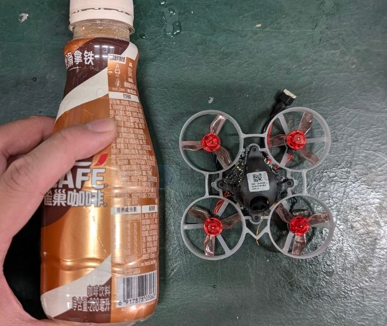
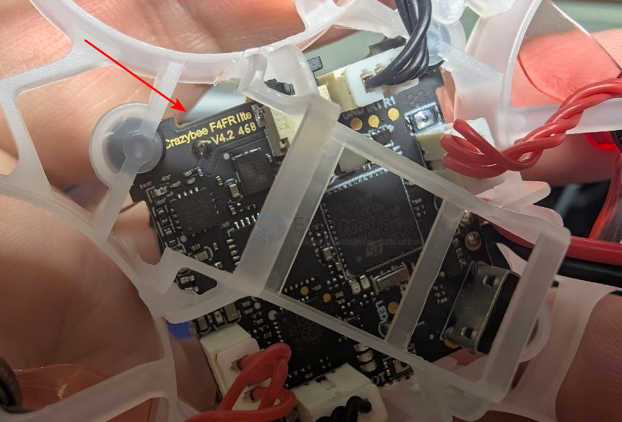

# mobula6-dat

- [[mobula8-dat]] - [[X12-dat]] - [[mobula6-dat]] - [[mobula7-dat]] - [[happymodel-dat]]

- [[FPV-dat]] - [[whoop-dat]]

- [[propeller-dat]]

- [[radiomaster-dat]] - [[radiomaster-pocket-dat]] - [[radiomaster-pocket-CC2500-dat]]

- [[crazybee-dat]] 

## version control - F4FR

- [[FRSKY-dat]]

The Happymodel `Crazybee F4FR Lite (v4.2)` is a 1S 4-in-1 AIO flight controller featuring an integrated SPI `Frsky` receiver, 5A BLHeli_S ESCs, 5.8GHz VTX, and Betaflight OSD.

- Hardware Specifications
- MCU: STM32F411CEU6 (100MHz, 512K Flash)
- Gyro Sensor: BMI270 / ICM20689 (SPI connection)
- Target Firmware: CRAZYBEEF4FR (Betaflight)
- Power Input: 1S LiPo / LiHV (DC 2.9V–4.35V)
- ESC: 5A continuous (6A peak) 4-in-1 BLHeli_S (O_H_5_REV16_7.HEX / DShot600)
- Receiver: Onboard SPI Frsky `D8 / D16 receiver`
- VTX: Onboard 5.8GHz 400mW OpenVTX (SmartAudio v2.1)
- Dimensions: 28.5mm × 28.5mm (Whoop mounting pattern)

board map 

                        [ TOP / FRONT ]
                        ___________________
                    /  [ CAM 5V ] [ G ]  \
                    /   [ CAM IN ] [ VTX ] \
                    |    ________________   |
                    |   |                |  |
    [ MOTOR 1 ]--- |---|   STM32F411    |---| ---[ MOTOR 2 ]
    (Bottom Right) |   |    PROCESSOR   |  |     (Top Right)
                    |   |________________|  |
                    |                       |
                    |  [BOOT]   [5V] [GND]  |
                    |  [  .  ]  [TX1] [RX1] |  <-- External RX /
                    |  [IR1]                 |      Serial Solder Pads
    [ MOTOR 3 ]--- |---|                |---| ---[ MOTOR 4 ]
    (Bottom Left)  |   |________________|  |     (Top Left)
                    \                     /
                    \_____ [ USB PORT ] /

Key Connection & Solder Pads

Camera Pads:

- 5V: Power supply for the camera
- GND: Ground connection for camera/VTX antenna
- CAM / VIN: Camera Video In to Betaflight OSD
- VTX / VO: Video Out from OSD to integrated VTX

External Receiver / UART Pads:

- 5V & GND: Power for external receiver
- TX1 / RX1: UART1 connections (RX1 for IBUS / DSM2 / DSMX)
- IR1 / IRX1: Inverted RX1 pad (used specifically for SBUS input)

Boot Pads:
BOOT: Two small solder pads. Bridge these while plugging in USB to enter DFU / Bootloader mode.

Binding Instructions (SPI Frsky)

- Connect the board to your computer via USB and open Betaflight Configurator.
- Go to the Receiver tab and ensure the receiver mode is set to SPI Rx with provider FC_PRTCL_FRSKY_D (for D8 mode) or FC_PRTCL_FRSKY_X (for D16 mode).
- Click Bind Receiver in the Receiver tab (or enter bind_rx in the CLI tab).
- Put your radio transmitter into Bind mode. The LEDs on the board will change from flashing to solid when bound.

## specs 

- **Frame size (wheelbase)**: 65 mm  
- **Diagonal motor-to-motor distance**: 65 mm  
- **Motor size**: 0802 (for most versions)  
- **Propeller size**: 31 mm (4-blade)  
- **Weight**: ~20 g (without battery), ~25 g (with 1S battery)  
- **Typical battery**: 1S 300–450 mAh LiPo  

✅ Mobula6 is an **ultralight 65mm whoop**, perfect for **indoor flying** and tight spaces.

- Spare parts specifications:
- Motor Mode: SE0702 KV28000 no plug version
- Configu-ration:9N12P
- Stator Diamter:7mm
- Stator Length:2mmShaft Diameter:Φ1mm
- Motor Dimension(Dia.*Len):Φ9.5mm*14mm
- Weight(g):1.46g
- No. of Cells(Lipo):1S only
- Propellers Materials: PC
- Inch:31mm
- Pitch:0.8in
- Weight: 0.21g
- Mount hole diameter: 1mm
- Flight controller MCU: STM32G473CEU6
- Gyro: [[ICM42688-dat]]
- Sensor: Voltage & Current
- BEC:5V, Max.2A
- UART: UART 1, UART 2, UART 3 (For RX), UART 4(For VTX)
- BetaFlight OSD: AT7456E
- ESC: 5A continuous
- RX: Serial ELRS 2.4GHz
- RX antenna: Enameled copper wire 31mm length
- Receiver firmware target: HappyModel EP1/EP2 2.4GHz RX
- OPENVTX:5.8GHz 48 channels, Max.400mW
- FC firmware target: CRAZYBEEG473
- USB port: SH1.0-4Pin
- Battery connector: A30
- Mounting hole size: 25.5mm x 25.5mm
- Weight: 3.83g without pigtail and vtx antenna
- Onboard 4in1 ESC Power supply: 1S LiPo/LiPo HV
- Current: 5A continuous peak 6A (3 seconds)
- Support BLHeliSuite programmable
- Factory firmware: Bluejay v0.21
- Firmware target:A_X_5_96KHz
- Default protocol: DSHOT300 DSHOT600
- Recommend ESC Startup power value to min1100/max1200
- Onboard Serial ExpressLRS receiver Packet Rate option: 50Hz/150Hz/250Hz/500Hz
- ExpressLRS Firmware version: V3.0
- RF Frequency: 2.4GHz
- Antenna : Enameled copper wire antenna
- Telemetry output Power: <12dBm
- Receiver protocol: Serial_based CRSF
- Compatible with ExpressLRS V3.x. x TX Module
- Could flash single ELRS receiver fi rmware by Wif
- ExpressLRS firmware target: Generic ESP32 2.4Ghz Rx and VTx
- Onboard 5.8g VTX OPENVTX Firmware
- Support firmware upgrade by openvtx configurator
- Output power: PIT/10/25/100/400
- Frequency: 5.8GHz 48 channels, with Raceband: 5658~5917MHz
- Channel SEL: SmartAudio2.1
- Modulation type:FM
- Operating temperature: -10°C~+80°℃
- Antenna port:IPEX1/U.FL
- Nano5 Camera Image Sensor:1/3"CMOS
- Horizontal Resolution:1200 TVL
- Lens: 2.1mm(M10)155°FOV
- TV System: NTSC
- Signal-to-Noise Ratio: >52dB
- Electronic Shutter: Auto
- Automatic Gain Control (AGC): Auto
- Minimum Ilumination: 0.001Lux@1.2F
- Digital Wide Dynamic Range: Auto
- Power Supply: DC 3-5.5V
- Current:110mA@5V 120mA@3.3V
- House Material:ABS
- Net Weight: 1.57g (1.0mm plug version)

## AIO 

[[Crazybee-dat]] [[G473-dat]] AIO 5合1飞行控制器

## ref 

