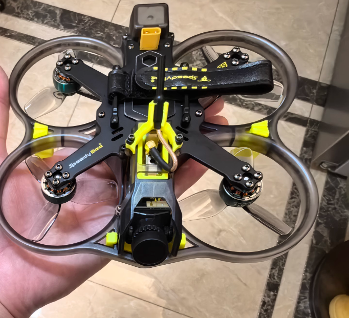
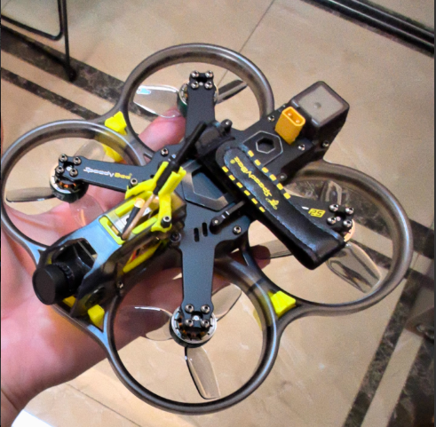

# bee25-dat

bee25 is a 2.5-inch frame specially designed for FPV aircraft, suitable for various small drones and FPV racing aircraft. It is made of high-strength carbon fiber material, featuring lightweight and high rigidity characteristics, capable of withstanding impacts and vibrations during high-speed flight.
The design of this frame emphasizes aerodynamics, providing good aerodynamic performance, reducing flight drag, and improving flight efficiency. It supports multiple motor and ESC configurations, suitable for different flight needs.

## drawbacks 

- the frame only support [[speedybee-dat]] its own [[VTX-dat]] == [[TX800]], because of the fixed size 

## assembled 

## TX800 

## ref 

- [[speedybee-dat]] - [[FPV-dat]]

- [[VTX-dat]] - [[MS-519-dat]] - [[sensor-Camera-dat]] - [[bee25-dat]]