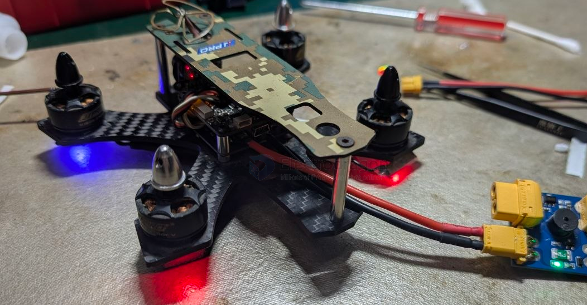
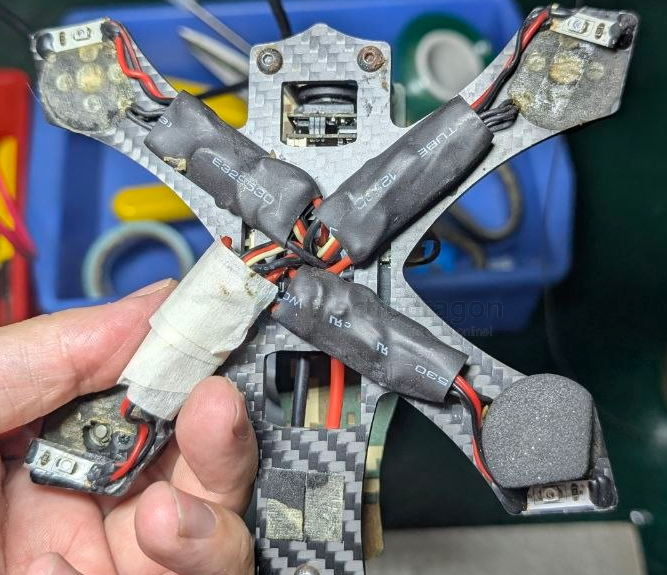
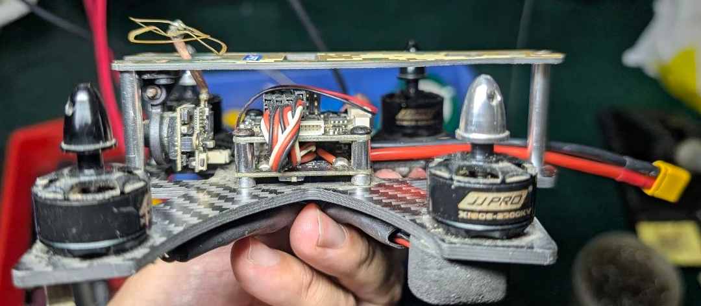
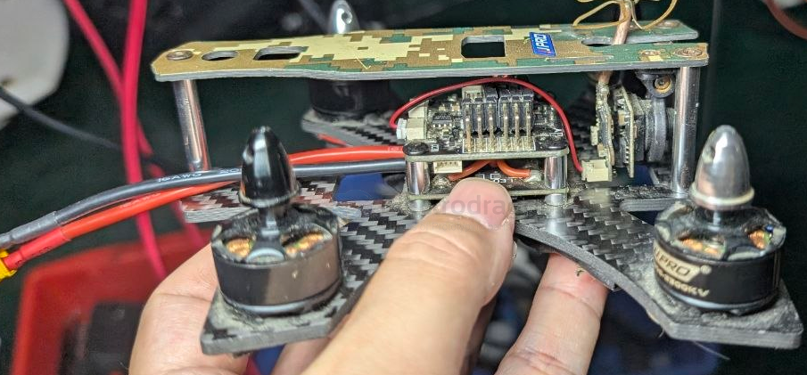

# Battler-dat

- [[jjpro-dat]] - [[FPV-fleet-dat]] - [[Battler-dat]]

- [[PPM-dat]]

- [[propeller-FPV-dat]]

## interface 

8 针的 ReceiverPort（接收机专用口）

- [[PPM-dat]]

## details 

- [[FPV-size-dat]]

📊 官方规格（供参考）

- • 轴距：130mm
- • 电机：1806 2300KV
- • 桨：3 寸（3045）
- • 电池：3S 850mAh
- • 全重：≈287g（含桨+电池）
- • 续航：≈5 分钟
- • 电调：Flycolor（原厂）
- • 摄像头：800TVL

- P130 "Battler"（含实测数据）
- 桨 → ⭐️ 3 寸（3045/3040/3050）
- 电池 → ⭐️ 3S 850-1050 / 4S 650-850

- [[installation-antenna-dat]]

- [[antenna-FPV-dat]] - [[VTX-dat]]

## ref 

