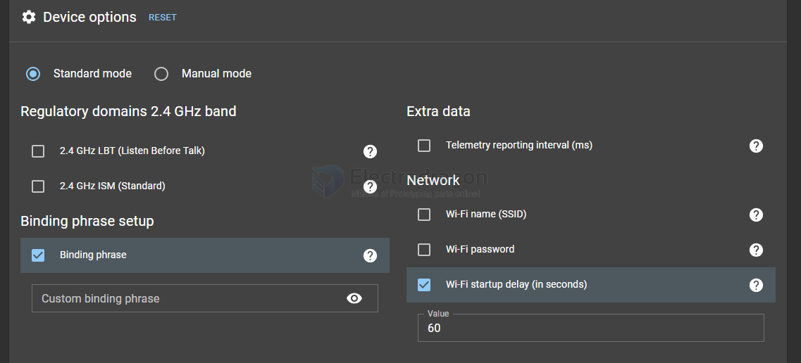
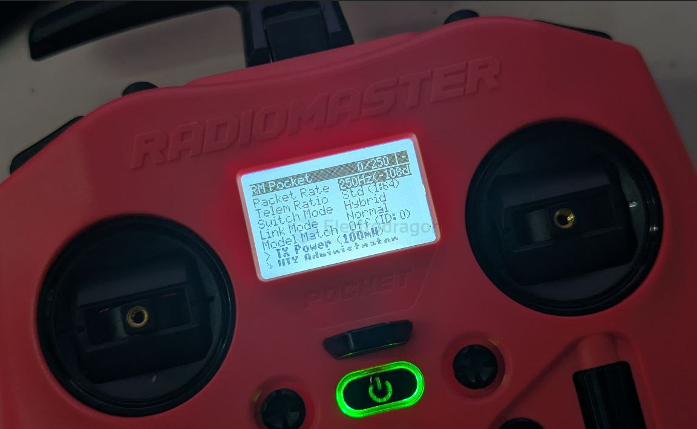
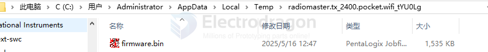
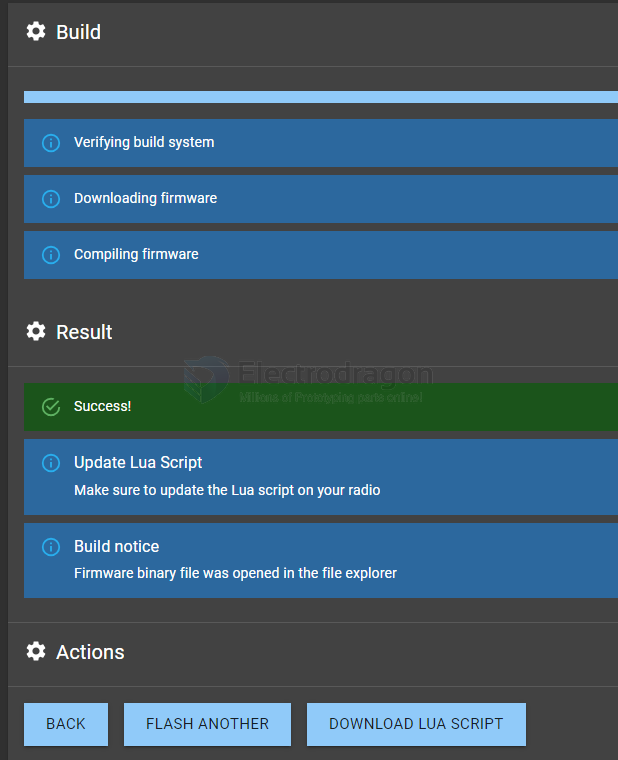

# radiomaster-dat

basic information vist at - [[RC-controller-dat]]

- [[esp32-s3-dat]] - [[NWI1243-dat]]

## model

- [[Radiomaster-TX16S-dat]] - [[Radiomaster-pocket-dat]]

## tech 

- [[edgeTX-dat]] system 

- [[CC2500-dat]] - [[ELRS-dat]]

## binding 

## Pocket Radio Controller (M2)

https://www.radiomasterrc.com/products/pocket-radio-controller-m2

https://cdn.shopify.com/s/files/1/0609/8324/7079/files/Pocket_1.pdf?v=1736839330

firmwares - https://www.radiomasterrc.com/pages/firmware-updates

    RadioMaster Pocket Internal 2.4GHz TX
    Firmware Rev. 3.5.4 (a6f9a2) ISM2G4

## wifi 

turn on wifi mode: 

1) Power on your Radiomaster transmitter.
2) Long-press SYS to open the System Menu.
3) Navigate to the TOOLS tab.
4) Run “ExpressLRS.lua”.
5) Select “WiFi Connectivity” → “Enable Wi-Fi”.
6) Wait for the module to restart into Wi-Fi mode.
7) On your phone/PC, connect to SSID: ExpressLRS TX (password: expresslrs).
8) Open a browser and go to: http://10.0.0.1
9) Update firmware or adjust settings in the ELRS WebUI.
10) Exit Wi-Fi mode by backing out of the script or power-cycling the radio.

better use this wifi option to connect your devices to your local network: 

    One-time connect to network, retain Home network setting

    http://elrs_tx.local

find firmware version 

    ExpressLRS
    RadioMaster Pocket Internal 2.4GHz TX
    Firmware Rev. 3.5.4 (a6f9a2) ISM2G4

## module downloads 

1) Power off your Radiomaster Pocket.
2) Remove the SD card (or plug in USB-C in storage mode).
3) Download the correct EdgeTX SD card pack for Radiomaster Pocket:
   - From: https://edgetx.org/sdcard
   - Choose the same EdgeTX version as your radio.
4) Download the latest ExpressLRS Lua script:
   - From: https://github.com/ExpressLRS/ExpressLRS
   - Copy `ExpressLRS.lua` into `/SCRIPTS/TOOLS/` on your SD card.
5) Safely eject the SD card (or USB storage) and restart the radio.
6) Go to [SYS] → TOOLS → Run ExpressLRS.lua.
7) The script should now load instead of freezing.

## bind with mobula8 setup 

- Packet Rate == 250Hz (-108d)
- telem Ratio == STD 
- Switch Mode == Hybrid 
- Link Mode == Off

## flash 

    You must choose regulatory domain for your device in 2.4 GHz band

    Custom binding phrase must be longer than 6 characters

## build firmware first 

## flash log 

    % Total    % Received % Xferd  Average Speed   Time    Time     Time  Current
                                    Dload  Upload   Total   Spent
        Left  Speed

    0     0    0     0    0     0      0      0 --:--:-- --:--:-- --:--:--     0
    12 1534k    0     0   12  192k      0   153k  0:00:09  0:00:01  0:00:08  154k
    20 1534k    0     0   20  320k      0   137k  0:00:11  0:00:02  0:00:09  137k
    25 1534k    0     0   25  384k      0   119k  0:00:12  0:00:03  0:00:09  119k
    33 1534k    0     0   33  512k      0   113k  0:00:13  0:00:04  0:00:09  113k
    37 1534k    0     0   37  576k      0   110k  0:00:13  0:00:05  0:00:08  110k
    45 1534k    0     0   45  704k      0   105k  0:00:14  0:00:06  0:00:08 96234
    50 1534k    0     0   50  768k      0   103k  0:00:14  0:00:07  0:00:07 90181
    54 1534k    0     0   54  832k      0   102k  0:00:15  0:00:08  0:00:07 92902
    62 1534k    0     0   62  960k      0   100k  0:00:15  0:00:09  0:00:06 91603
    66 1534k    0     0   66 1024k      0   100k  0:00:15  0:00:10  0:00:05 91548
    75 1534k    0     0   75 1152k      0    99k  0:00:15  0:00:11  0:00:04 93775
    79 1534k    0     0   79 1216k      0    98k  0:00:15  0:00:12  0:00:03 94064
    83 1534k    0     0   83 1280k      0    98k  0:00:15  0:00:13  0:00:02 93852
    91 1534k    0     0   91 1408k      0  99813  0:00:15  0:00:14  0:00:01 92958
    95 1534k    0     0   95 1472k      0  99416  0:00:15  0:00:15 --:--:-- 92639
    100 1534k    0     0  100 1534k      0  92904  0:00:16  0:00:16 --:--:-- 73560
    100 1534k    0     0  100 1534k      0  87667  0:00:17  0:00:17 --:--:-- 57992
    100 1535k  100    99  100 1534k      5  84899  0:00:19  0:00:18  0:00:01 47599
    100 1535k  100    99  100 1534k      5  84899  0:00:19  0:00:18  0:00:01 31982

    ** UPLOADING TO: http://192.168.72.9/update

    UPLOAD SUCCESS
    Update complete. Please wait for a few seconds while the device reboots.

## ref 

- [[console-dat]]