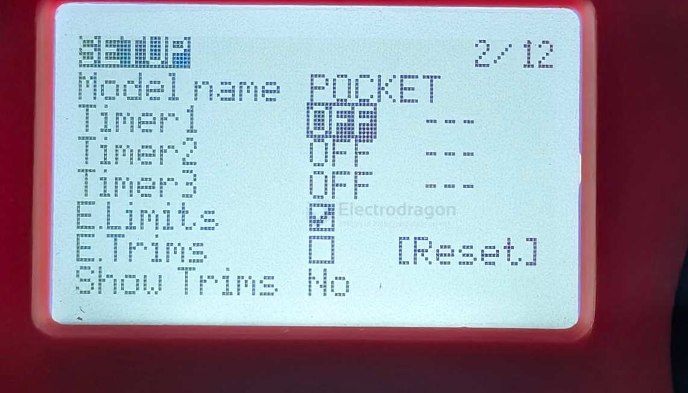
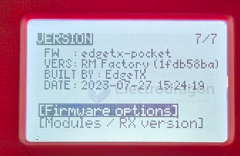
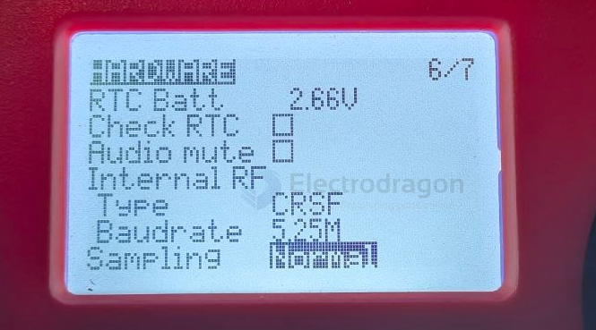
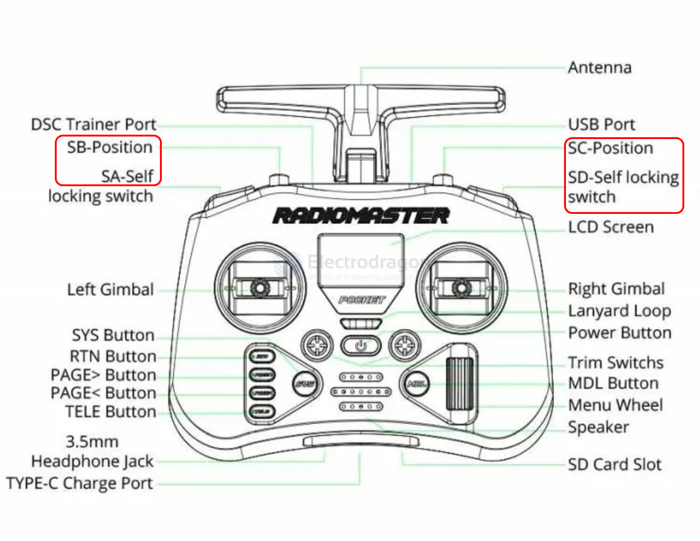

# radiomaster-pocket-dat.md

## DML setup 

setup page 2 

## SYS setup 

### navigate to hardware page 

Navigating to the H/W Page

`Press and hold` or simply press the SYS button to open the `system settings`.

Look at the very top right corner of your screen. You will see page tracking numbers like 1/7, 2/7, etc.

Press the `PAGE>` button repeatedly until you hit` page 6/7` (or 7/7 depending on your exact version).

Look at the top text label—it will say H/W. This is your `Hardware page!`

### check version 

Press the `PAGE<` button to 7/7

## Internal RF vs. External RF Settings

On the RadioMaster Pocket, these settings tell the radio where to send the control signals depending on whether you are using the built-in transmission chip or an add-on module.

---

### 1. Internal RF (Built-In Module)
This controls the transmitter chip that is physically soldered inside the RadioMaster Pocket's body. 

* **What it powers:** The built-in **ExpressLRS (ELRS) 2.4GHz** module (or CC2500 module, depending on your version). 
* **When to use it:** Turn this **ON** (set to `Mode: CRSF` for ELRS) when communicating directly with your drones or robots using the radio's native built-in antenna.
* **Power saving:** Turn it **OFF** if you aren't using it to save battery life.

---

### 2. External RF (Expansion Slot Module)
This controls the pinned expansion bay located on the back of the radio handset.

* **What it powers:** Removable external hardware modules that you snap into the back slot (such as a TBS Crossfire Nano TX, a 915MHz ELRS module, or a multi-protocol module).
* **When to use it:** Turn this **ON** (set to `Mode: CRSF` for Crossfire/External ELRS) only when you have physically plugged a module into the back bay.
* **Power saving:** Keep this **OFF** unless a module is plugged in, as it routes live battery power directly to those back pins.

---

### Summary Checklist:

| If you are using...                              | Internal RF | External RF |
| :----------------------------------------------- | :---------- | :---------- |
| The radio's built-in ELRS system                 | **CRSF**    | **OFF**     |
| A module plugged into the back (e.g., Crossfire) | **OFF**     | **CRSF**    |
| A PC simulator via USB cable                     | **OFF**     | **OFF**     |

## change baud rate 

### Step 2: Unlocking your Baud Rate
1. Once you are on the **H/W** page, scroll all the way down until you see **Internal RF**.
2. Right below where it says `Type: CRSF`, you should now see **Baudrate**. 
3. Change it from `400k` down to **`115k`**. 
4. Turn your radio off and back on again to save the changes.

---

> ⚠️ **One Final Reminder:** Now that your radio is outputting at 115,200 bps, you **must** open your ExpressLRS LUA script (Short press **SYS** $\rightarrow$ **ExpressLRS**) and drop your **Packet Rate** down to **50Hz** or **100Hz**. If you leave it at 250Hz or 500Hz, the 115,200 baud wire speed will instantly bottleneck and cause sensor errors.

## bootloader mode 

Bootloader: Turn off the radio transmitter. Push both `trim hat switches` inward together and press the power button.

`DFU`: Turn off the radio transmitter. Plug in the USB cable to the USB port on the `top` of the radio. - [[STM32-DFU-dat]] - [[STM32-dat]]

`Enter Bootloader Mode:` Turn your RadioMaster Pocket completely OFF. Hold both horizontal trim buttons (T1 and T4) inward toward the power button while pressing the power button. The screen will say "EdgeTX Bootloader".

In the context of the RadioMaster Pocket, T1 and T4 refer to the horizontal trim switches situated directly below the gimbals. T1 corresponds to your `Roll (Aileron) trim`, while T4 corresponds to your `Yaw (Rudder) trim`.

- [[edge-tx-dat]]

## version pocket 

## all buttons 

### Default Stick Assignments

RC template 

| Input | Type      | default  | modify |
| ----- | --------- | -------- | ------ |
| CH1   | Stick     | Roll     |        |
| CH2   | Stick     | Pitch    |        |
| CH3   | Stick     | Yaw      |        |
| CH4   | Stick     | Throttle |        |
| SA    | 2-pos     | Arm/Aux  |        |
| SB    | 3-pos     | Mode/Aux |        |
| SC    | 3-pos     | Mode/Aux |        |
| SD    | Self-lock | Aux      |        |
| SE    | Momentary | Beep/Aux |        |
| S1    | Knob      | Trim/Aux |        |

| Channel | Function         |
| ------- | ---------------- |
| CH1     | Roll (Aileron)   |
| CH2     | Pitch (Elevator) |
| CH3     | Yaw (Rudder)     |
| CH4     | Throttle         |

| Switch / Knob | Type                           | Typical Use                     |
| ------------- | ------------------------------ | ------------------------------- |
| SA            | 2-position switch              | Arming, auxiliary control       |
| SB            | 3-position switch              | Flight modes, auxiliary control |
| SC            | 3-position switch              | Flight modes, auxiliary control |
| SD            | 2-position self-locking switch | Auxiliary function              |
| SE            | Momentary (spring-loaded)      | Beeper, auxiliary function      |
| S1            | Rotary potentiometer           | Auxiliary function, trims       |

## 1. Radiomaster Pocket (Multi-Protocol Version)
- Uses **CC2500 module**, same chip used in FrSky radios.
- Supports **FrSky D8, D16**, Futaba SFHSS, Hubsan, and many more protocols.
- ✅ You can bind directly to FrSky D8 receivers.

## 2. Radiomaster Pocket (ELRS Version)
- Uses **ExpressLRS** only.
- ❌ Does NOT support FrSky D8/D16.
- You would need to use an **external CC2500 module** if you want D8.

## ref 

- [[radiomaster-dat]]