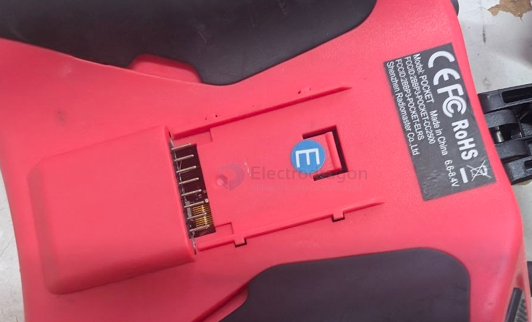
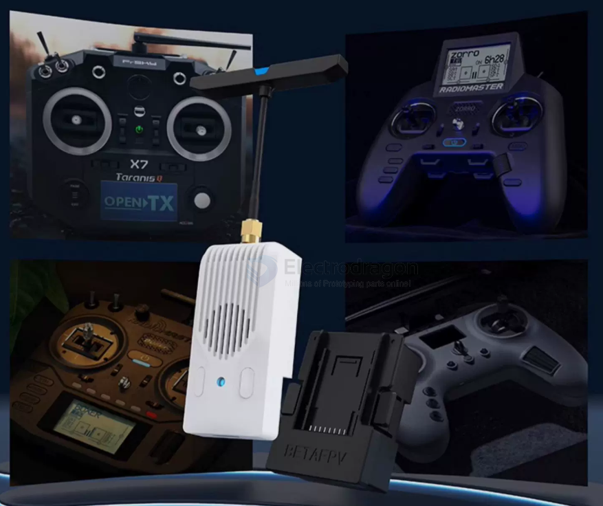
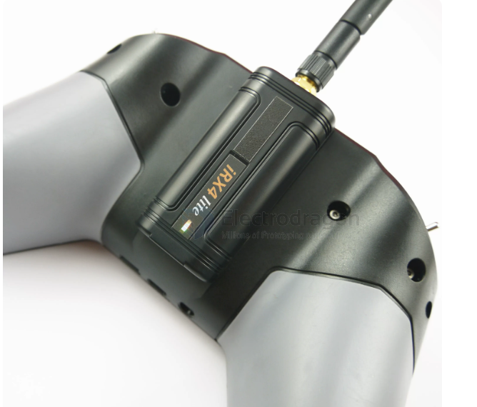

# radiomaster-pocket-module-dat

- [[RC-RF-module-bay-dat]] - [[RC-dat]] - [[RF-dat]]

- [[CC2500-dat]] - [[A7105-dat]] - [[CYRF6936-dat]] - [[radiomaster-pocket-module-dat]]

- [[TI-network-dat]] - [[CC2500-dat]]

- [[radiomaster-dat]] - [[radiomaster-pocket-module-dat]] - [[radiomaster-pocket-dat]] - [[radiomaster-pocket-CC2500-dat]] - [[frsky-dat]]

## nano socket 

## nano module long-range 

Nano高频头V2 远航2W大功率fpv穿越机信号增强ELRS

## nano module 4-in-1

Combine these keywords depending on the functionality you want to add:

* **General Module Searches:**
  * `RM Pocket 高频头` (RM Pocket RF Module)
  * `Nano 外置高频头` / `Lite 接口高频头` (Nano External RF Module / Lite Interface RF Module)
* **For FlySky / Multi-Protocol Support (4-in-1):**
  * `RadioMaster 4合1高频头 Nano` (RadioMaster 4-in-1 RF Module Nano)
  * `RM 4in1 高频头 Nano版` (RM 4in1 RF Module Nano Version)
  * `四合一多协议高频头 Nano` (4-in-1 Multi-Protocol RF Module Nano)
* **For ELRS / 915MHz Long-Range Upgrades:**
  * `ELRS 外置高频头 Nano` (ELRS External RF Module Nano)
  * `RadioMaster Ranger Nano`

---

## 2. Recommended Specific Models to Search

| Category / Requirement | Specific Model Search Term | Supported Receivers / Features |
| :--- | :--- | :--- |
| **4-in-1 Multi-Protocol** | **`RadioMaster RM 4IN1 Nano`** | Supports **FlySky** (AFHDS/AFHDS 2A), Spektrum (DSMX), Hubsan, Futaba, etc. |
| **4-in-1 Alternative** | **`iRangeX IRX4 Nano`** | Third-party compact, budget-friendly 4-in-1 module. |
| **ELRS Extension** | **`RadioMaster Ranger Nano`** | 2.4GHz ELRS high-power external module. |
| **TBS Crossfire** | **`TBS Crossfire Nano TX`** / **`TBS Tracer Nano`** | 915MHz / 2.4GHz long-range modules. |

概况：
这款四合一高频头模块将CC2500，NRF24L01，A7105，CYRF6936 四款射频芯片集成于一块电路板。可以识别遥控输出的PPM信号，然后转化为对应的遥控协议，实现对接收机或飞机的控制。当前支持的协议包括：华科尔DEVO，地平线DSM2，富斯，易思凯，睿思凯，伟力，哈博森，驰远，Futaba SFHSS Assan等协议。
这款高频头，可以更灵活，便捷的控制多个不同品牌的四轴，直升机以及固定翼，由于延续使用您所熟悉的遥控器，操作手感和飞行体验也更佳.

工作参数：
工作电压：5-9伏                                                         工作电流：<=150mA
工作频率：2.4G ISM band                                             射频功率：+22dBm   
主控芯片：STM32F103CBT6 (128K ROM, 20K RAM)        净重：32g，带天线
                       

高频头串口模式下使用操作：
Xlite 遥控器出厂默认可支持多协议高频头，只需要以下简单的步骤就可以使用：

先安装好高频头，打开遥控器，进入模型设置菜单，找开 External RF 选项，再选择 MULT 模式，之后选择对应的协议，这样就可以使用高频头了．

如果遥控器没有相关选项，可能你的遥控器固件没有包含多协议高频头相关功能，请到OpenTX官网下载最新的固件，并升级遥控器，当通过 Companion下载固件时，需要勾选multimodule选项．

相关信息请参见:
https://github.com/pascallanger/DIY-Multiprotocol-TX-Module

关于高频头固件升级：

现在高频头发货已经升级到最新的固件,一般无需自己升级,
高频头可以通过三种方式升级固件:
1,USB口,也就是高频头正面标有USB的接口,需要自备Micro USB数据线,一般推荐用这种方式升级.
2,通过遥控器升级,需要遥控器支持,仅限于OpenTX,EdgeTX等开源系统遥控器.
3,USB转串口,需要自备USB转串口线,另外需要拆开高频头.

对应的升级步骤,请参考网盘资料:
http://pan.baidu.com/s/1bokfOjt

## 2. Protocol Capabilities (Internal CC2500 vs. FlySky)

The CC2500 version **does not** natively support FlySky protocols (AFHDS / AFHDS 2A) because it lacks the **A7105** RF chip.

| RF Chip | Protocols Supported |
| :--- | :--- |
| **CC2500** *(Inside Pocket CC2500)* | FrSky (D8, D16), Futaba (S-FHSS), RadioLink, Corona, Redpine |
| **A7105** *(Not included)* | FlySky (AFHDS, AFHDS 2A), Hubsan |
| **CYRF6936** *(Not included)* | Spektrum (DSM2, DSMX), Walkera DEVO |

To control FlySky receivers, you must attach an external **Nano 4-in-1 Multi-Protocol Module**.

---

## 3. External Module Support
The RadioMaster Pocket features a **Nano-size (Lite)** external module bay on the back.

### Compatible Modules
* **Multi-Protocol / FlySky:** RadioMaster RM 4IN1 Module (Nano), iRangeX IRX4 Nano
* **Long Range / ELRS:** RadioMaster Ranger Nano (2.4GHz), RadioMaster Bandit Nano (915MHz), TBS Crossfire Nano TX

---

## 4. How to Bind Pocket (CC2500) to Mobula6 (FrSky D8)

1. **Configure EdgeTX on Radio:**
   * Press and hold **`MDL`** -> Scroll to **Internal RF**.
   * Set **Mode** to `FrSky`.
   * Set **Subtype** to `D8` *(Recommended for onboard SPI receivers)*.

2. **Put Drone in Bind Mode:**
   * Connect Mobula6 to **Betaflight Configurator**.
   * Go to the **Receiver** tab -> Click **Bind Receiver** (or enter `bind_rx` in the CLI tab).

3. **Initiate Bind:**
   * Scroll down to **`[Bind]`** on the radio screen and press the scroll wheel.
   * The drone's LED will turn solid once successfully paired.

## ref 

