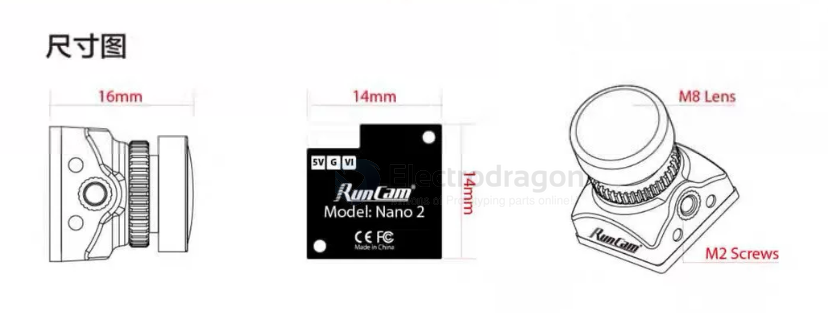

# runCAM-dat.md

- [[runcam-VRX-dat]] - [[runcam-dat]] - [[runcam-wifilink-dat]] - [[openIPC-dat]]

- [[EMax-dat]] - [[runcam-dat]] - [[openIPC-dat]] - [[camera-IP-dat]]

wiring ==  [[runcam-dat]] - [[camera-FPV-dat]] - [[camera-analog-dat]]

- [[caddxFPV-dat]] - [[runcam-dat]] - [[camera-FPV-dat]] - [[camera-wireless-dat]]

- [[runCAM-nano4-dat]]

- [[runCAM-nano2-dat]] == 89 CNY

- [[runCAM-nano3-dat]] == ? CNY

- [[runCAM-nano4-dat]] == 119 CNY

- [[runCAM-dat]] - [[runCAM-nano4-dat]] - [[runCAM-nano3-dat]] - [[runCAM-nano2-dat]] - [[runcam-split3-dat]]

## nano 2 

## RatelPro

- [[caddx-RatelPro-dat]] - [[caddx-dat]]

## ref 