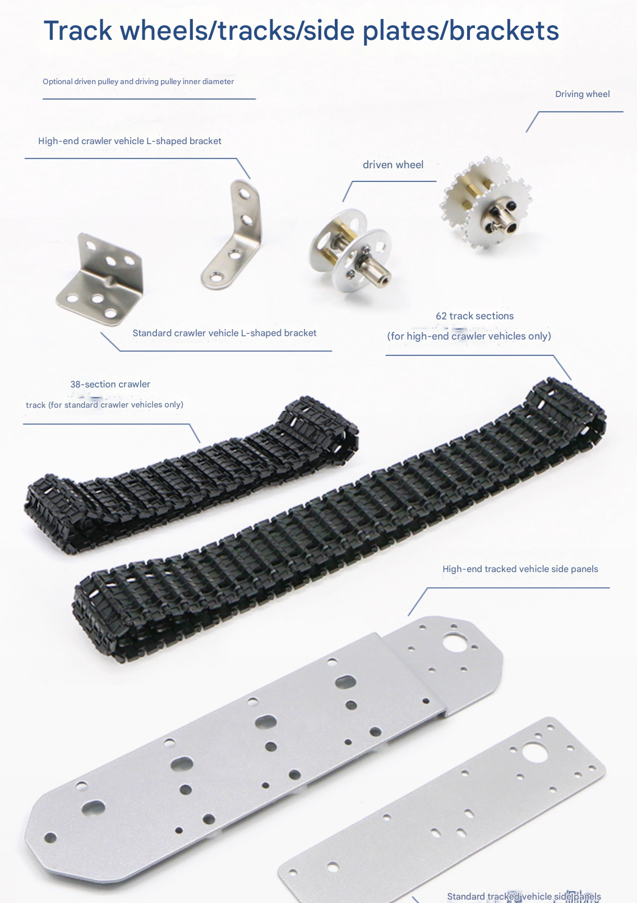
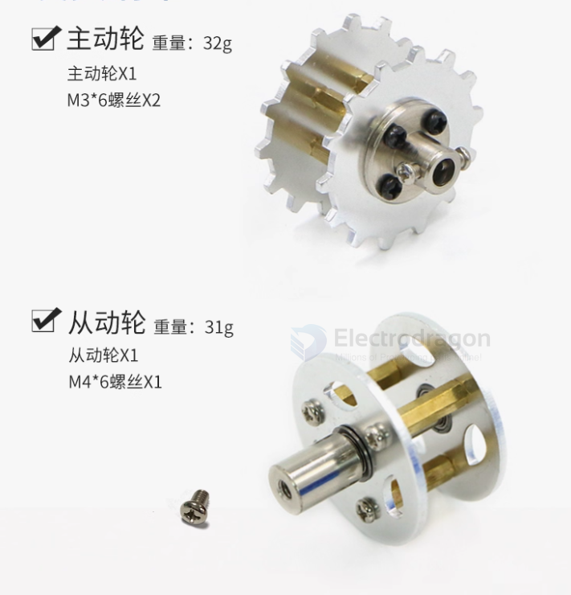
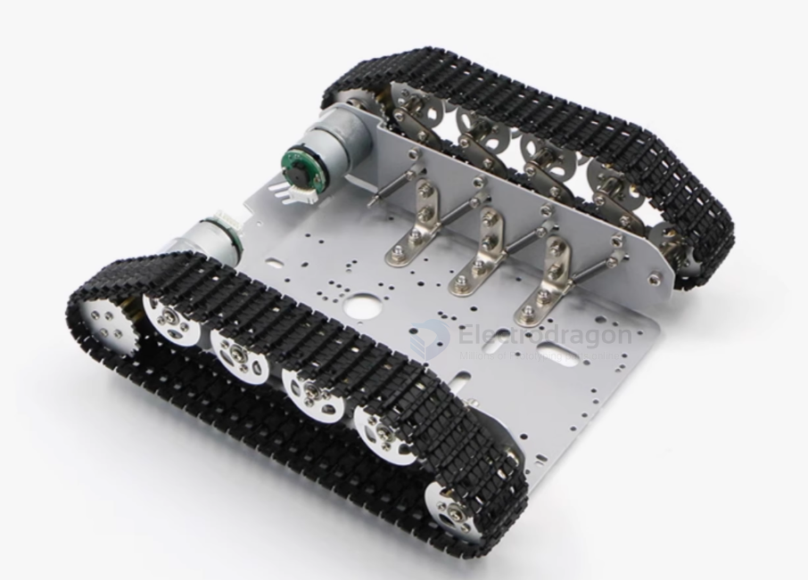
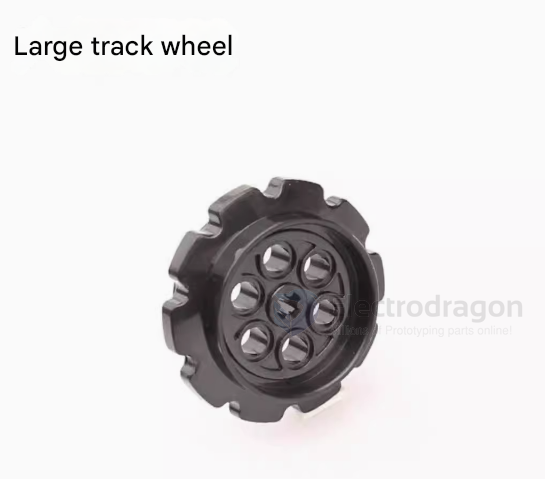
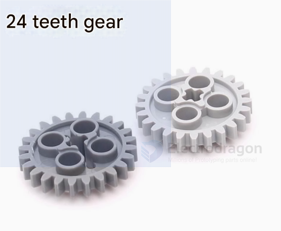
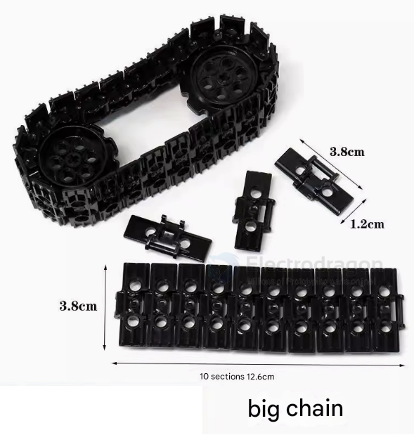

# tank-track-dat

- [[tank-wheels-supporting-dat]]

## Tracked Vehicle Powertrain Components

A tracked vehicle uses continuous tracks instead of wheels to move over difficult terrain. Its powertrain consists of several key components that transmit engine power to the tracks efficiently:

1. **Engine (Power Source)**
   - Provides mechanical power, usually via an internal combustion engine or electric motor.
   - The engine’s output is typically transmitted through a **transmission** or **gearbox** to control speed and torque.

2. **Transmission / Gearbox**
   - Adjusts the engine output to the proper torque and speed for the tracks.
   - May include forward/reverse gears for directional control.
   - Can be **hydrostatic**, **mechanical**, or **electric drive** depending on vehicle design.

3. **Final Drive**
   - Converts torque from the transmission into rotation for the **drive sprockets**.
   - Usually contains reduction gears to increase torque and reduce track speed.
   - Protects the drivetrain from overloads.

4. **Drive Sprocket (Active Wheel / Propulsion Wheel)**
   - Located at one end of the track (front or rear, depending on design).
   - Engages with the track’s drive holes to pull or push the track.
   - Responsible for **propelling the vehicle**.

5. **Idler Wheel (Tension or Guide Wheel)**
   - Located opposite the drive sprocket.
   - Guides the track and maintains proper tension.
   - Can be adjusted to prevent track sagging or slipping.

6. **Road Wheels / Rollers (Supporting Wheels)**
   - Distributed along the length of the track frame.
   - Support the vehicle weight and allow smooth track motion.
   - Reduce friction between the track and vehicle body.

7. **Return Rollers (Optional)**
   - Located on top of the track frame.
   - Support the upper run of the track, preventing sagging and improving stability.

8. **Track / Continuous Band**
   - Flexible but strong metal or rubber assembly.
   - Encircles the drive sprocket, idler, and road wheels.
   - Transfers propulsion to the ground and distributes weight over a large area.

**Summary of Roles:**

| Component      | Role                                     |
| -------------- | ---------------------------------------- |
| Engine         | Provides power                           |
| Transmission   | Adjusts speed and torque                 |
| Final Drive    | Converts torque to drive sprocket        |
| Drive Sprocket | Propels the track                        |
| Idler Wheel    | Guides track, maintains tension          |
| Road Wheels    | Support weight, reduce friction          |
| Return Rollers | Support upper track run                  |
| Track          | Provides traction and distributes weight |

## ✅ When Tank Tracks Are Better
- **Soft Terrain** (sand, mud, snow):
  - Tracks distribute weight over a larger surface, preventing sinking.
- **Uneven Terrain** (rocks, slopes, obstacles):
  - Tracks provide better grip and stability.
- **Heavy Loads**:
  - Tracks can support and move heavier equipment with more traction.

## ✅ When Wheels Are Better
- **Hard, Flat Terrain** (pavement, concrete):
  - Wheels are faster and more energy-efficient.
- **Speed & Efficiency**:
  - Wheeled systems are usually lighter and less power-hungry.
- **Maintenance & Cost**:
  - Wheels are simpler, cheaper, and easier to repair.

## 🔍 Summary Table

| Feature          | Tank Tracks                    | Wheels                     |
| ---------------- | ------------------------------ | -------------------------- |
| Traction         | Excellent on rough terrain     | Good on hard surfaces      |
| Speed            | Slower                         | Faster                     |
| Efficiency       | Lower (more friction)          | Higher                     |
| Terrain Handling | Superior on soft/uneven ground | Best on smooth/hard ground |
| Weight Support   | High                           | Moderate                   |
| Maintenance      | More complex and expensive     | Easier and cheaper         |

## BOMS 

Cogs

Chains 

## guide 

- [tank #track disassemble and re-assemble](https://t.me/electrodragon3/371)

## ref 

- [[robot-dat]] - [[tank-dat]]