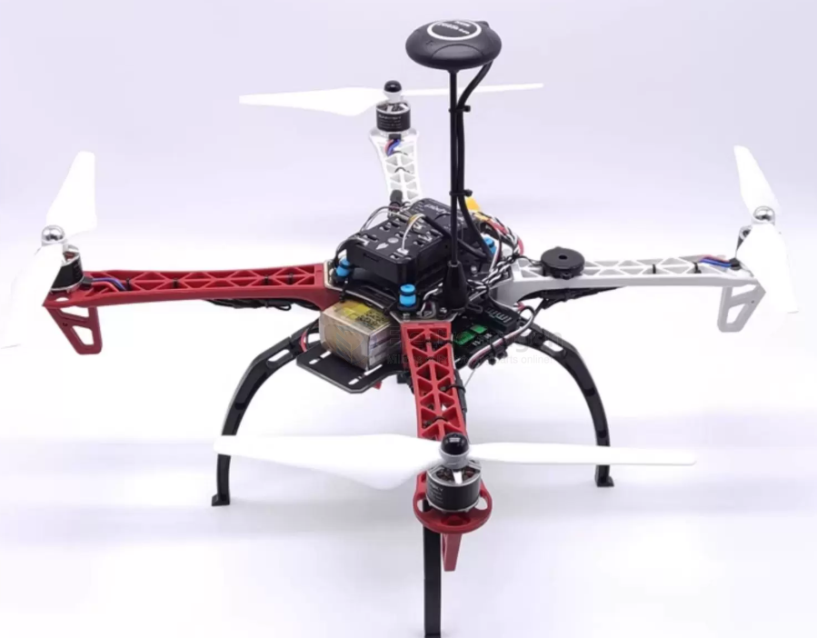

# F450-dat

使用Pixahwk2.4.8飞控，它采用了新标准的32位处理器STM32F427，搭配5611气压计。是接口丰富、性价比高的开源飞控。

- [[STM32-dat]] - [[pixahwk-dat]] 

- [[sensor-barometer-dat]] - [[location-dat]]

- [[ardupilot-dat]]

- [[battery-FPV-dat]]

配套地面站MissionPlanner

它有如下功能：

1. 无人机的调试，参数设置工具;
2. 使用配套地图可设置航线，无人机按照航线自动飞行;
3. 直接从下拉菜单中选择任务命令，控制无人机；
4. 下载飞行日志并分析;
5. 结合SITL(软件在环仿真)系统进行仿真
6. 更多功能等待您的发掘，不止于此….

## ref 