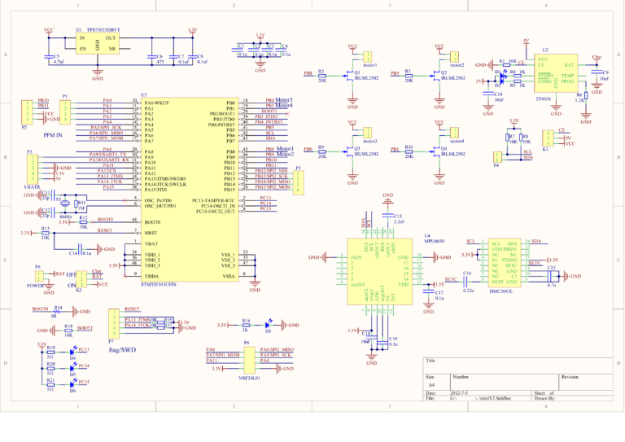

# quadcopter-dat

- [[Coreless-Motor-dat]] - [[motor-dat]]

## Multirotor Drones (or Multirotor UAVs).

Multirotor refers to any drone with multiple rotors (propellers) for lift and control.

Subcategories include:

Tricopter – 3 rotors

Quadcopter – 4 rotors

Hexacopter – 6 rotors

Octocopter – 8 rotors

## Quadcopter vs Octocopter

| Feature                         | Quadcopter                                                                                             | Octocopter                                                                                                             |
| ------------------------------- | ------------------------------------------------------------------------------------------------------ | ---------------------------------------------------------------------------------------------------------------------- |
| **Power & Payload**             | Sufficient power for small drones; simple structure and lightweight; relatively low energy consumption | Higher thrust, can carry heavy cameras or sensors; multi-motor redundancy allows flight even if one or two motors fail |
| **Drawbacks**                   | Limited payload; less stable in high wind                                                              | High energy consumption; complex structure, heavier; higher requirements for takeoff and operation                     |
| **Stability & Wind Resistance** | Easy to control in low wind; agile and responsive                                                      | Strong wind resistance; multi-motor redundancy increases flight safety                                                 |
| **Drawbacks**                   | Weak wind resistance; prone to crash if one motor fails                                                | Slightly slower response; less agile than quadcopter                                                                   |
| **Cost & Maintenance**          | Low cost; fewer motors and controllers, easier maintenance                                             | High cost; complex maintenance, more motors prone to failure; higher battery requirements                              |
| **Typical Applications**        | Recreational aerial photography, educational experiments, light surveillance                           | Professional aerial photography, industrial inspection, payload transport, rescue missions                             |
| **Summary**                     | Lightweight, flexible, low cost; suitable for recreational and light-duty tasks                        | Powerful, wind-resistant, heavy-lift capable; suitable for professional and industrial use                             |

## opensource 

### cleanfight 

https://github.com/cleanflight/cleanflight

https://github.com/cleanflight/cleanflight/tree/master/docs

https://cleanflight.com/

### Openpilot 

## Commerial 

### CJMCU 

- https://www.rcgroups.com/forums/showthread.php?2456739-Openpilot-port-to-CJMCU-stm32-quadcopter

- https://oscarliang.com/build-fpv-micro-quadcopter-smallest-quad/

#### new version from https://aeracoop.net/cjmcu2-open-source-brushed-quadcopter/

https://github.com/Edragon/cjmcu2

## BOM

### receiver 

- [DT 2.4GHz Receivers](https://www.deltang.co.uk/)

### props 

### motors 

### motor drive 

- [[mosfet-dat]]

## forum 

- http://www.multiwii.com/forum
- https://www.rcgroups.com/forums

## hexquadcopter 

- http://www.multiwii.com/forum/viewtopic.php?f=12&t=4893&p=53317#p53317

## ref 

- [[quadcopter]]