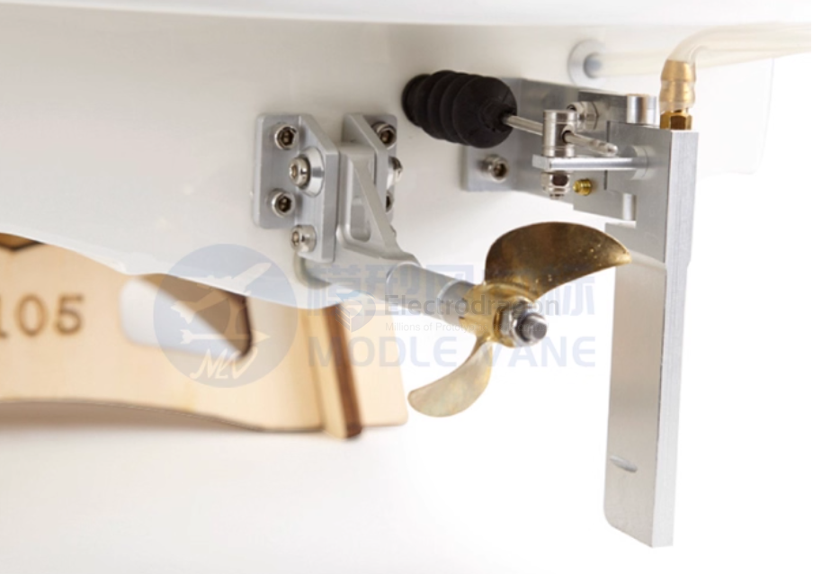
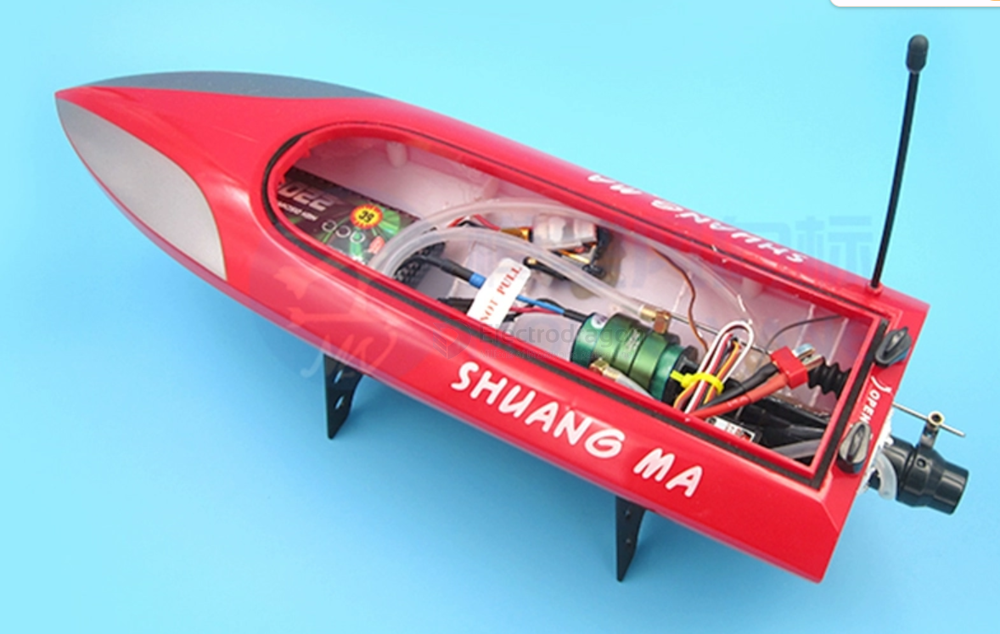
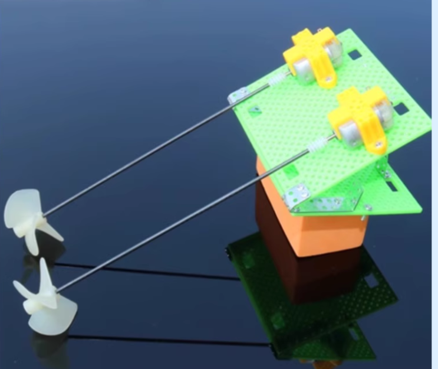
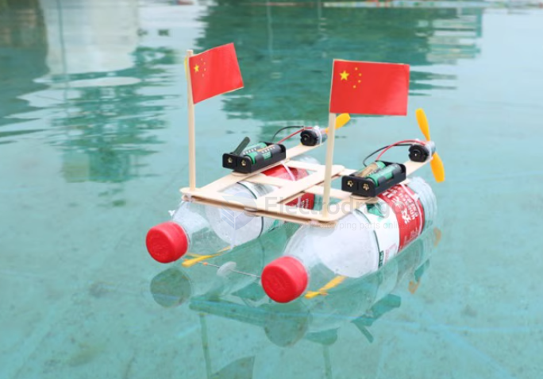
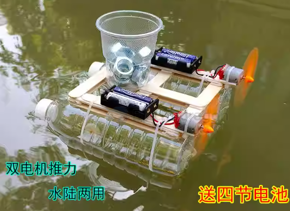
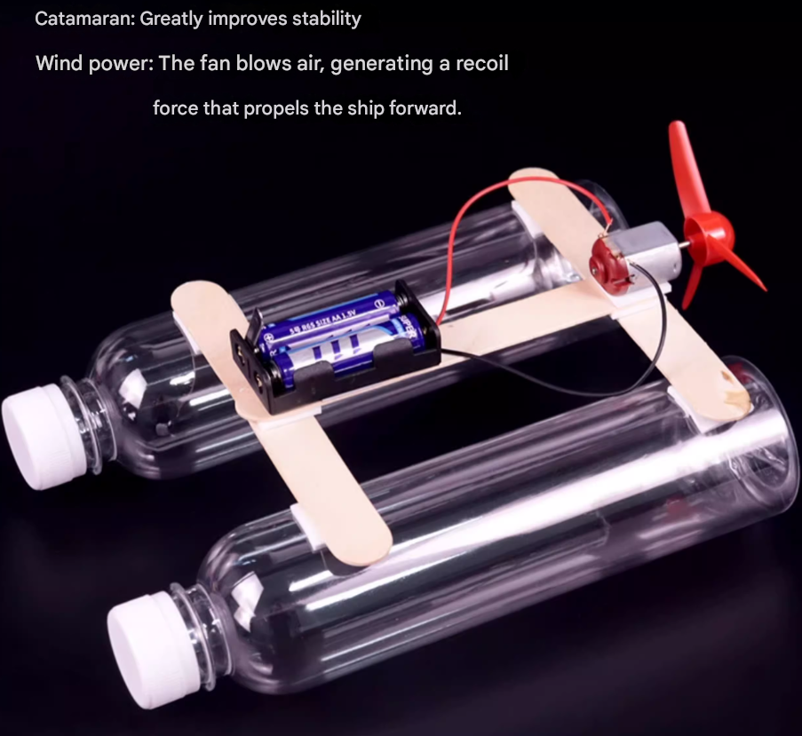
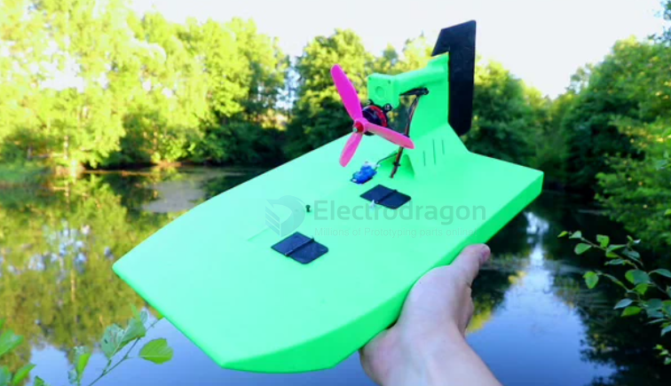
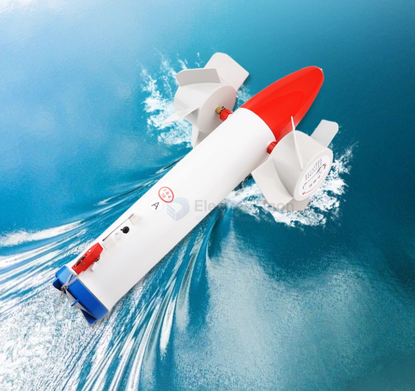

# rc-boat-dat

- [[rc-boat-accessories-dat]] - - [[rc-boat-accessories]]

- [[pump-dat]] - [[pump-jet-dat]] - [[propeller-dat]]

- [[motor-waterproof-dat]] - [[motor-dat]]

- [[shaft-supporter-dat]] - [[servo-dat]]

## Wave Deflector / Wave Breaker Plate (压浪板)

A **wave deflector** is a structure or plate used to **redirect, reduce, or break incoming waves**, protecting a surface, structure, or vessel from direct impact.  

- In **boats or ships**, it is usually installed at the bow or deck to **prevent water from splashing onto the deck**.  
- In **coastal or marine engineering**, similar structures help **reduce wave energy hitting seawalls, docks, or harbors**.

## jet pump vs propeller 

| Feature              | Jet Pump                  | Propeller                 |
|---------------------|---------------------------|---------------------------|
| Safety              | High (no exposed blades)  | Low (blades exposed)      |
| Shallow water use   | Excellent                 | Poor                      |
| Efficiency          | Lower                     | Higher                    |
| Top Speed           | Moderate                  | Higher                    |
| Maintenance         | Moderate                  | Easy                      |
| Debris handling     | Better                    | Worse                     |
| Low-speed thrust    | Weaker                    | Stronger                  |

**Conclusion:**  
- **Jet pump:** Safer and better for shallow water, maneuverability, and RC boats running in ponds/lakes.  
- **Propeller:** Better for speed, efficiency, and simpler builds, especially in deeper water.

## propeller setup 

- [[propeller-dat]]

## DIY level build 

## air-propelled 

Catamaran: Greatly improves stability. 

Wind power: Fans blow air, generating a recoil force that propels the hull forward.

## air-propelled 2

- [[3d-print-dat]] - [[hinge-dat]] connect blue part 

## propeller version 1 

## ref 

- [[rc-apps-dat]]

- [[rc-apps]] - [[rc-boat]]

- [[waterproof-container-dat]]