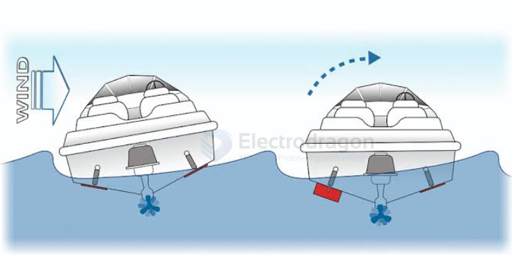

# rc-boat-motion-dat

- [[rc-boat-motion-dat]] - [[rc-boat-dat]]

- [[propeller-dat]] - [[rc-boat-motion-dat]] - [[rc-boat-dat]] - [[propeller-toy-boat-dat]]

- [[mosfet-dat]] - [[motor-driver-dat]] - [[motor-driver-mosfet-dat]] - [[motor-driver-mosfet-test-1.ino]]

- [[ELRS-dat]]

- [[differential-steering-dat]] - [[differential-steering-boat-dat]] - [[motion-control-dat]]

left_motor-propeller_CW-run_CW // right_motor-propeller_CCW-run_CCW: Straight Forward

left_motor-propeller_CW-run_CCW // right_motor-propeller_CCW-run_CW: Straight Reverse

left_motor-propeller_CW-run_CW // right_motor-propeller_CCW-run_CW: Right Turn / Clockwise Pivot

left_motor-propeller_CW-run_CCW // right_motor-propeller_CCW-run_CCW: Left Turn / Counter-Clockwise Pivot

CW + CCW: Forward

CCW + CW: Reverse

CW + CW: Right Turn / Clockwise Pivot

CCW + CCW: Left Turn / Counter-Clockwise Pivot

## reduce speed

### 1. Mechanical & Propeller Modifications (Most Effective)

Changing mechanical properties reduces boat speed without losing low-speed torque or forcing the motors to run in a stalled high-friction zone.

* **Install Smaller Diameter or Lower Pitch Propellers**:
  * **Concept**: Stock props move too much water per revolution. A propeller with a smaller diameter or a lower pitch (shallower blade angle) pushes less water.
  * **Result**: The motors can spin at higher, smoother RPMs (where MOSFETs and motors operate efficiently) while the boat travels much slower.
* **Add Reduction Gearboxes (2:1 or 3:1)**:
  * **Concept**: 380 motors are high-RPM, low-torque motors that struggle at low voltage/PWM. A gear reduction lowers propeller RPM while multiplying low-end torque.
  * **Result**: Eliminates motor stalling, reduces motor heat, and provides ultra-fine low-speed control.

---

### 2. Power Supply Adjustments (Lower Voltage)

Brushed DC motor speed is directly proportional to applied voltage ($RPM \propto Voltage$).

* **Reduce Battery Voltage**:
  * If currently running a **2S LiPo (7.4V–8.4V)**, switch to a **4.8V–6V battery pack** (or use a high-current step-down Buck converter).
  * **Result**: Lowering system voltage lowers the motor's top speed, making the bottom 10%–20% of your throttle range much more usable and precise.

---

### 3. Hull & Hydrodynamic Enhancements (Directional Stability)

At ultra-low speeds, differential steering boats can wander or drift easily due to wind and surface ripples. Adding hull drag stabilizes tracking.

* **Add Trim Tabs or Turn Fins**:
  * Mount small vertical fins (Turn Fins) or angled plates (Trim Tabs) under the stern/transom.
  * **Result**: Increases tracking stability in water, preventing low-speed yawing and keeping the boat moving straight.
* **Lower the Center of Gravity with Ballast Weight**:
  * Add a small weight (e.g., lead sinkers or wheel weights) at the lowest central point inside the hull.
  * **Result**: Increases water displacement and drag to reduce speed while keeping the boat grounded against wind and waves.

## 4. Software & Controller Optimization

Combined with your 3.3V MCU + MOSFET H-Bridge driver board:

* **Apply a Throttle Cap / Scale Output**:
  * Restrict max PWM in software (e.g., map `0–255` output down to a max of `0–80`).
* **Use Software "Kickstart" Pulse**:
  * Trigger a 20ms burst at 30%–40% PWM whenever starting from 0, then immediately settle down to 5%–10% PWM. This breaks static friction instantly and avoids prolonged motor whining.

---

### Recommended Combination Strategy

| Strategy | Recommended Changes | Primary Benefit |
| :--- | :--- | :--- |
| **Quick & Non-Invasive** | Switch to low-pitch props + Add software kickstart + Add trim tabs | Reduced speed, zero motor stall, improved tracking |
| **Maximum Performance** | Add 2:1 gearboxes + Lower battery voltage to 6V | Massive low-speed torque, silent & smooth crawling |

## ref 

