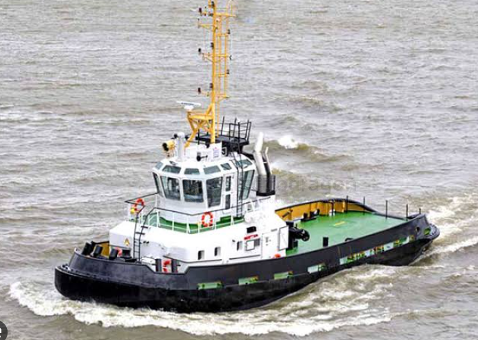
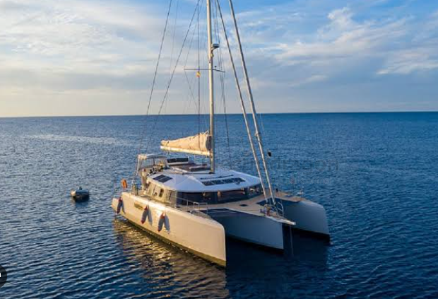
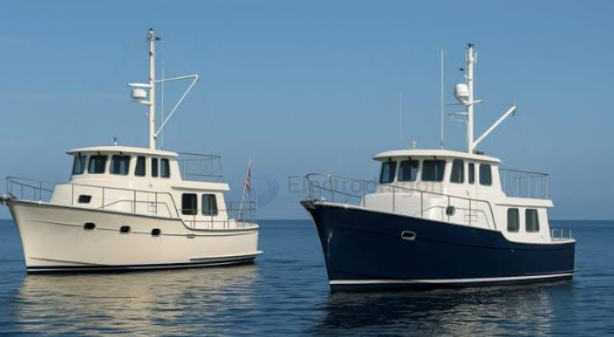
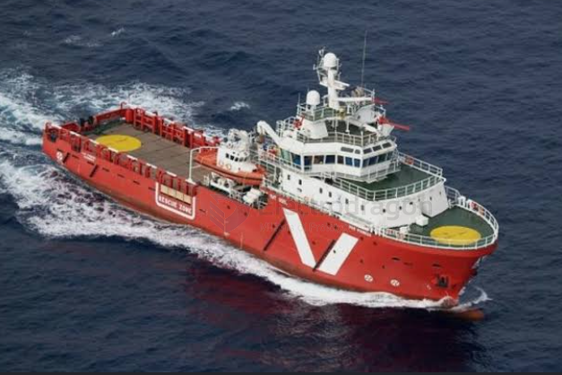

# rc-boat-types-dat

- [[Displacement-Hull-dat]]

- [[hull-mutiple-dat]] - [[Trimaran-dat]] - [[boat-bait-dat]] - [[Trawlers-dat]]

- [[boat-air-dat]]

- [[boat-dual-jet-pump-dat]]

When operating an RC boat at **slow speeds in rough or choppy water**, the key design priority is stability and wave resistance rather than high-speed planning. 

---

### Best Hull Types for Slow & Stable Navigation

* **Scale Tugboats & Workboats (Displacement Hull)**
  * **Design**: Deep draft, wide beam, and heavy displacement.
  * **Performance**: Excellent stability due to a low center of gravity (especially with ballast added). They push through waves smoothly rather than bouncing over them.

* **Bait Boats & Trimarans / Catamarans (Multi-Hull Design)**
  * **Design**: Twin or triple hulls providing a wide footprint on the water.
  * **Performance**: High lateral stability that prevents rolling in cross-waves. Ideal for maintaining a straight, slow cruise in turbulent water.

* **Deep-V Trawlers & Rescue Vessels**
  * **Design**: Sharp V-shaped bow that transitions to a stable midsection.
  * **Performance**: Cuts directly through oncoming chop, minimizing wave impact and keeping the bow down at lower throttle levels.

---

### Key Technical Considerations

* **Powertrain Setup**: Use a **low KV brushless motor** or a **high-turn brushed motor** (e.g., 540/550 size, 35T–55T) paired with a large-diameter propeller. This provides high low-end torque and fine throttle control without unnecessary speed.
* **Low Center of Gravity**: Place heavy components (like LiPo/Lead-acid batteries) as low in the deep bilge as possible.
* **Waterproofing**: Ensure a dual-hatch setup or heavy-duty rubber gasket system to seal the electronics compartment from splash and swell.
* **Weed Guard / Jet Drive**: If operating in natural lakes or rivers, use a prop guard or jet drive system to prevent algae and debris from seizing the drive shaft.

## selection for **rivers (shallow/currents)** and **coastal waters (chop/small waves)**

Top Recommended Hull Types

1. **Catamaran / Trimaran (Multi-Hull)**
   * **Best for**: Ultimate stability and shallow water capability.
   * **Why**: Wide footprint prevents rolling in cross-waves at slow speeds. Shallow draft makes it ideal for river navigation.

2. **Displacement / Scale Tugboat Hull (Deep Bilge + Ballast)**
   * **Best for**: Heavy wave absorption and steady cruising.
   * **Why**: Low center of gravity acts like a weighted pendulum. Pushes smoothly through chop rather than rocking or jumping.

3. **Modified-V Hull (Semi-Displacement)**
   * **Best for**: All-around balance between rivers and coastal entries.
   * **Why**: Sharp V-bow slices through head waves, while a flatter stern provides lateral stability at low throttle.

---

### Quick Comparison

| Hull Type | Stability in Waves | Shallow River Suitability | Slow-Speed Comfort |
| :--- | :--- | :--- | :--- |
| **Catamaran** | ★★★★★ (Top) | ★★★★★ (Shallow) | ★★★★★ (Very Stable) |
| **Tugboat / Round** | ★★★★☆ (High) | ★★★☆☆ (Medium Draft) | ★★★★★ (Smooth) |
| **Modified-V** | ★★★★☆ (Good) | ★★★★☆ (Good) | ★★★★☆ (Balanced) |

**Key Tip:** Choose a **Catamaran** for maximum lateral stability and shallow-water safety, or a **Tugboat-style hull** with ballast placed low in the bilge for classic wave handling.

## ref 