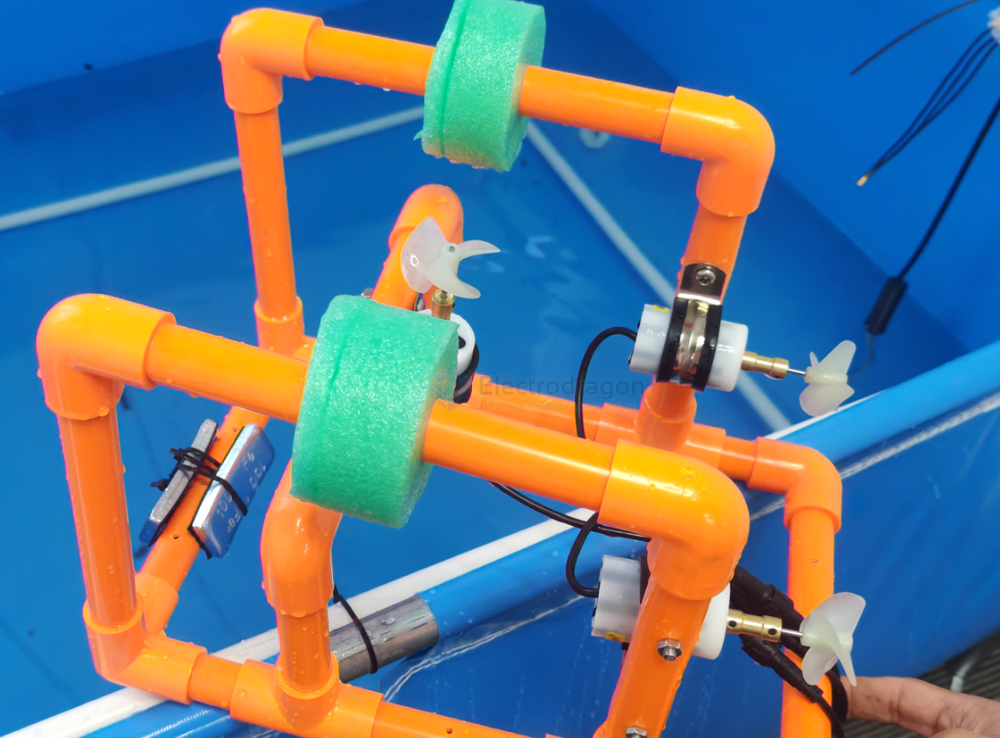
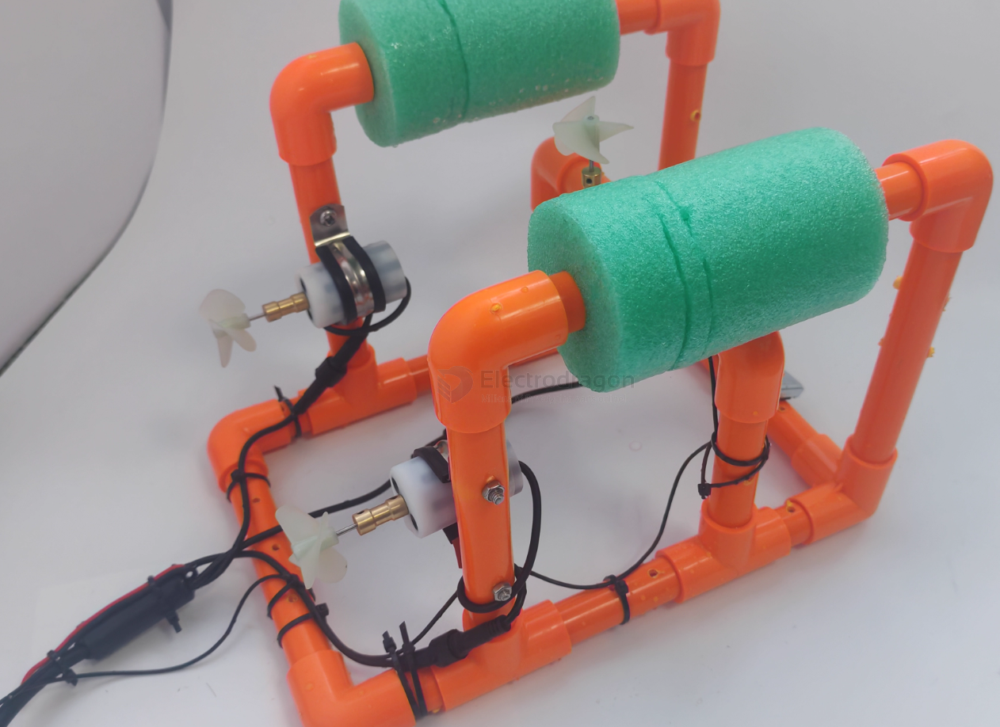

# rc-submarine-dat

- [[motor-waterproof-dat]] - [[propeller-dat]] 

- [[PVC-tube-dat]]

- [[mechanical-claw-dat]]

- [[waterproof-dat]]

## design 1 

bottom [[PVC-tube-dat]] with holees to keep heavy at bottom 

top [[foam-dat]] keep light to towards up

## ref 

- [[rc-submarine]] - [[rc-marine-dat]] - [[rc-apps]]