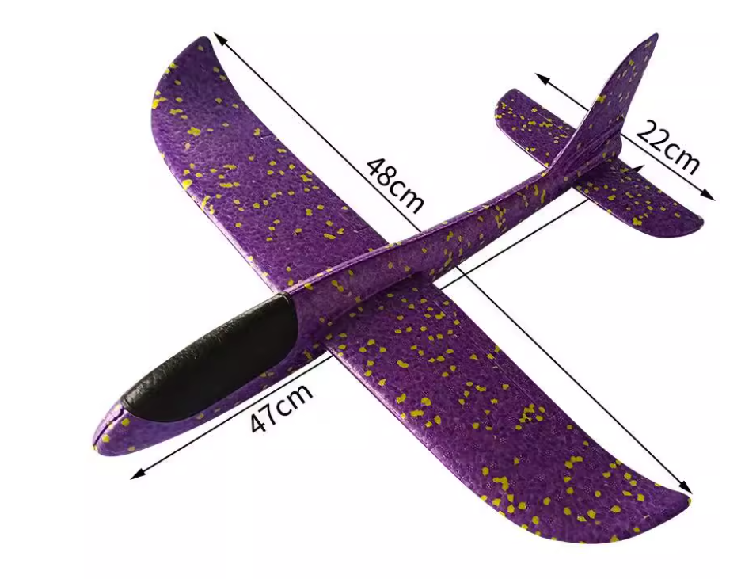

# Aircraft-hand-launched-dat

- [[Aircraft-hand-launched-dat]] - [[Aircraft-powered-hand-launched-dat]]

## classification by size 

- 82 
- 86
- 120 

## info 

standard toy fixed wing 

A hand-launched aircraft equipped with a power plant (like an electric motor and propeller) falls under a few specific categories depending on how it is operated:

### 1. From a Propulsion Standpoint: A "Powered Fixed-Wing Aircraft"
Because it carries a motor and provides continuous thrust, **it is no longer a glider**. Instead, it is classified strictly as a **powered fixed-wing aircraft** (or a motorized model airplane / UAV).

### 2. From a Launch Perspective: A "Powered Hand-Launched Aircraft"
In the RC model and drone community, classification is often based on how the aircraft takes off:
* **English terminology:** **Powered hand-launched aircraft** or **Hand-launched UAV**.
* **Common examples:** Many FPV long-range fixed-wing planes and foam park flyers are designed with efficient, glider-like airframes to maximize flight time, but because they feature an electric motor and require a physical toss to launch, they are referred to as powered hand-launches.

### 3. The Grey Area: A "Motor Glider" (Powered Glider)

- [[glider-motor-dat]]

If the aircraft is fundamentally a glider design (featuring high aspect-ratio wings optimized for soaring) but has a motor—often with **folding propellers**—added to its nose, it is specifically called a **Motor Glider**:
* **How it works:** You hand-launch it under motor power to climb to altitude. Once high up, you cut the motor, the propeller blades fold back flat against the fuselage, and it transitions into a **pure glider** riding thermal currents.

---

### Summary
* If it **flies continuously using motor power**, it is simply a **powered hand-launched fixed-wing plane**.
* If the motor is **only used to climb, and it spends most of its flight gliding**, it is a **motor glider** launched by hand.

## ref 