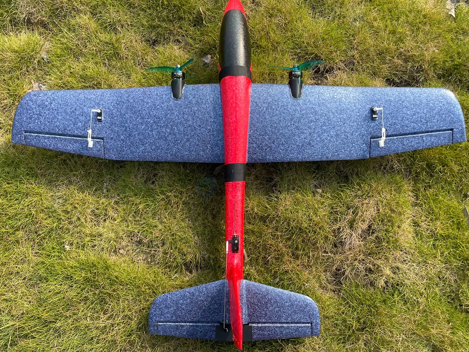
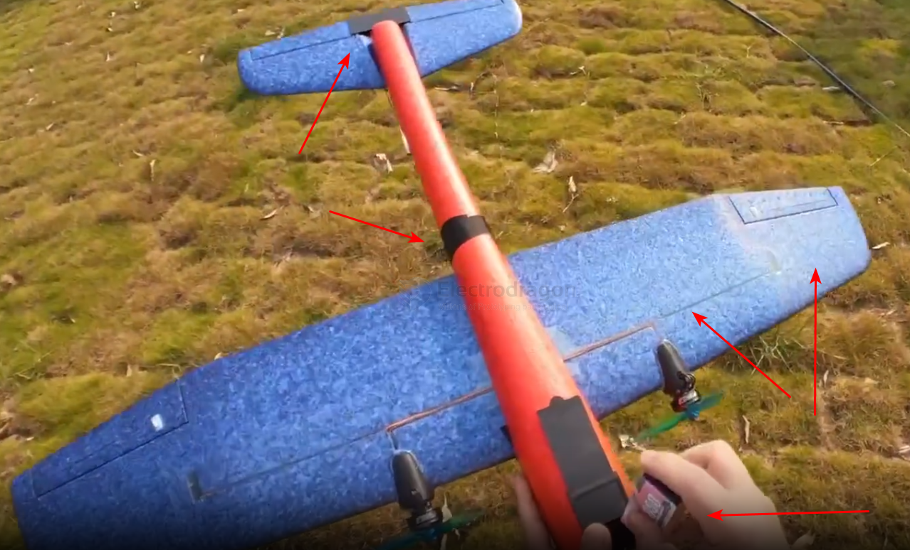

# Aircraft-powered-hand-launched-dat

- [[Aircraft-powered-hand-launched-dat]] - [[Aircraft-hand-launched-dat]]

- [[aerodynamic-dat]]

## BOM 

- [[propeller-tractor-dat]]

## build 

- [[servo-accessories-dat]] - [[airplane-engine-dat]]

- [[Center-of-Gravity-dat]]

## 装机步骤（详细版）2
1. **加固**：机翼下埋碳杆加强翼梁（热熔胶固定，贯穿翼展）
2. **机头开槽** → 嵌入层板电机座 → 热熔胶固定 → 锁电机（拉进式桨面朝前）
3. **走线**：电调放机舱（散热面外露），BEC 红线黑线接 ELRS 接收机电源，油门信号线接油门通道
4. **对频**：Pocket 与 ELRS 接收机对频，设置油门通道、缓启动
5. **电池舱**：机腹开舱 + 魔术贴固定，位置按重心调整
6. **配重**：重心调到机翼前缘后 **25-30% 弦长处**（电池前后挪动）
7. **地面测试**：缓启动测试（1-2 秒）→ 推油门检查推力方向 → 全油门测试 30 秒散热
8. **首飞**：无风/微风天，右手捏机翼根部后缘抛出（手不经过桨盘平面），50-70% 油门爬升

### process 

改装步骤（合并）1

1. 拆手抛机原配重块/原桨（如果是推桨版）
2. 机头切平 → 热熔胶固定电机座（带下推角 2-3°，木板/碳板加固）
3. 机翼下埋碳棒加强（防折，手抛机普遍偏软）
4. 水平尾翼后缘切升降舵（宽 1.5cm）+ 垂直尾翼切方向舵（有水平尾翼，不需要副翼混控）
5. 舵机×2 装尾部（升降舵 + 方向舵，细线引到飞控/接收机）
6. 舵角 + 连杆接舵面（舵机 → 舵面连接）
7. 机舱放电池 + 飞控（重心调在翼弦 30%）
8. 电池用魔术贴/扎带固定（重心控制在 25-35% 翼弦处）
9. 地面测试：舵面方向、油门响应、重心
10. 手抛首飞（开自稳模式最稳）

辅料
- 热熔胶枪 + 胶棒: 固定电机座/舵机（泡沫机必备）
- 碳纤维棒/竹签: 加强机翼（手抛机普遍偏软）
- 舵角 + 连杆: 舵机 → 舵面连接
- 魔术贴/扎带: 固定电池

关键参数
- 重心位置: 翼弦 30%（前缘量起）
- 电机: 2204 1400KV + 8寸桨
- 电池: 3S 800mAh
- 起飞方式: 手抛（轻推油门）
- 推重比: 你这架 ~0.6-0.8:1 足够

### key points 

**重心 (CG)**
• 说明: 最重要！重心在翼弦 25-35% 处，偏后必炸

**电机 KV 匹配**
• 说明: 3S + 1400-1800KV 是手抛机甜点

**舵面方向**
• 说明: 升降/副翼方向反了直接炸，地面测试必查

**首飞**
• 说明: 找空旷草地，开自稳模式，手抛轻推油门

**泡沫修复**
• 说明: 热熔胶 + 泡沫胶随时修补，摔不坏多修几次就会飞了

## endurance 

续航分析（30 分钟可行性）

- **纯动力巡航 30 分钟不可行**：需 2S 1500mAh（75g+）→ 起飞重量 300g+ → 翼载荷超标、失速速度高、难飞
- **爬升-滑翔战术可行**：爬升 20s（~45W）+ 滑翔 70s（0W）→ 平均功率 ~10W
  - 2S 800mAh（5.9Wh）→ 理论 35 分钟，实际 ~25-30 分钟
  - 2S 1000mAh（7.4Wh）→ 理论 44 分钟，实际 ~30-40 分钟
- **达成 30 分钟前提**：
  1. 电池 2S 800-1000mAh（起飞总重 ~260-270g，翼载荷接近上限）
  2. 战术纪律：爬升到 40-50m 收油 → 滑翔到 10-15m 再爬升；滑翔阶段电机完全停转
  3. 飞热气流（柏油路/屋顶上方），白赚续航
- **风险**：270g 起飞重量是 82cm 泡沫机上限附近（抛投用力、失速速度高、转弯柔和）；结构加固必须到位；风天不飞
- 30 分钟 = 留空时间，电机只工作约 1/3 时间

### 飞行战术（长留空关键）
- **爬升-滑翔锯齿**：全油门爬升到 50m → 收油滑翔 400-500m（滑翔比约 1:8-1:10）→ 再爬升
- **找热气流**：公园柏油路、屋顶上方上升气流，滑进去白嫖高度
- 巡航油门 40% 左右维持平飞即可，别一直全油门
- 纯动力续航 6-13 分钟，爬升-滑翔可到 15-35 分钟

### 安全要点

- 拉进式机头桨打手风险：**抛掷手法**（捏机翼后缘，手不经过桨盘）+ **电调缓启动**双保险
- 炸机后先收油门再捡机
- 大电池（800mAh+）机头重 → 电池后移配重，头重会俯冲

## one tractor 

### cost and BOM 

version 1 

| 项目     | 建议                                    | 价格      |
| -------- | --------------------------------------- | --------- |
| 电机     | 2204 1400KV（机头拉式，带桨保护器）     | ¥35       |
| 电调     | 20A（够用）                             | ¥25       |
| 桨       | 8寸慢速桨（带桨保护器，手抛降落在草地） | ¥10       |
| 电池     | 3S 800mAh（放机头后部/机舱）            | ¥45       |
| 舵机     | 9g ×2（升降舵 + 方向舵——最简单）        | ¥20       |
| 接收机   | ELRS（复用你遥控器）                    | ¥35       |
| 飞控     | F405 Wing（强烈推荐）                   | ¥120      |
| 辅料     | 碳棒加强、热熔胶、连杆舵角              | ¥20       |
| **合计** | **带飞控**                              | **~¥310** |

version 2 长航时版
| 部件     | 规格                         | 说明                                         |
| -------- | ---------------------------- | -------------------------------------------- |
| 无刷电机 | **2212 980KV**（~45g）       | 大桨低转速，巡航电流 ~3A，效率拉满           |
| 螺旋桨   | **10×4.7 慢速桨（SF）**      | 买 2-3 个备用，炸机易断                      |
| 电调     | **20A 带 5V BEC**            | BEC 给 ELRS 接收机供电                       |
| 电池     | **2S 800-1000mAh**（40-50g） | 1000mAh = 30 分钟续航档；800mAh = 日常轻飞档 |
| 电机座   | 3mm 层板电机安装座           | 机头开槽嵌入                                 |
| 加固     | 2-3mm 碳杆×50cm              | 机翼下埋入加强翼梁（82cm 翼展+动力必须）     |
| 辅料     | 热熔胶/泡沫胶/魔术贴/扎带    | —                                            |

**布局**：拉进式（机头桨）· **控制**：纯动力直飞，遥控器油门（缓启动）

### 因为你这架有水平尾翼，不需要三角翼混控：

9g 舵机 ×2：
  #1 → 升降舵（水平尾翼后缘，切一条）
  #2 → 方向舵（垂直尾翼后缘，切一条）

控制：
  推杆上下 → 升降（抬头/低头）
  左右 → 方向（左转/右转）

为什么不用副翼？ 新手 + 手抛机，方向舵转弯更简单直观，副翼需要和升降协调（副翼+升降混控），对新手不友好。升降+方向 = 入门最稳组合。

## 动力手抛机 - 2x motors 

## ref 

- [[Aircraft-powered-hand-launched]] - [[Aircraft-powered-hand-launched]] - [[rc-aircraft]]