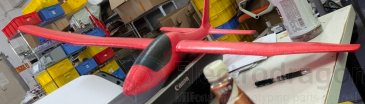
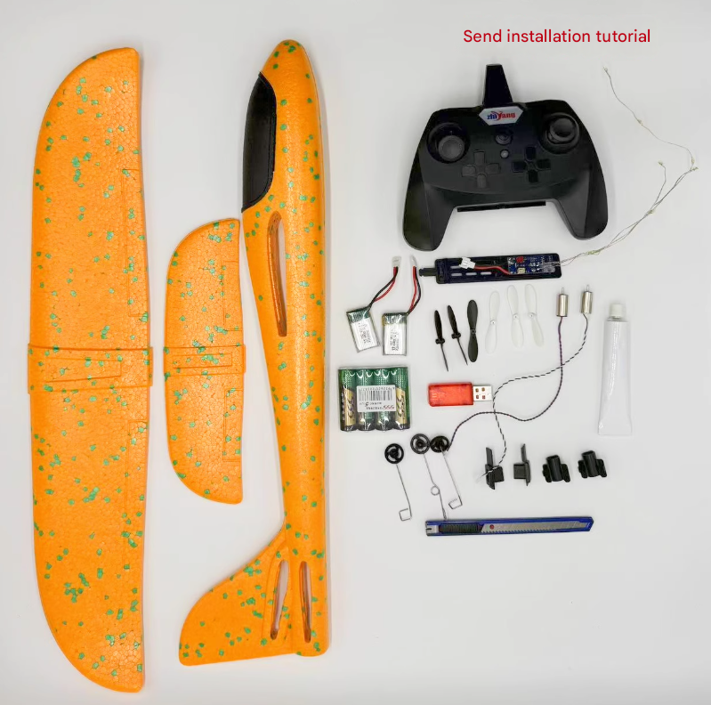

# Aircraft-powered-hand-launched-dat

- [[Aircraft-powered-hand-launched-dat]] - [[Aircraft-hand-launched-dat]]

## BOM 

- [[propeller-tractor-dat]]

## build 

### process 

改装步骤（简单流程）

1. 拆手抛机原配重块/原桨（如果是推桨版）
2. 尾部装电机座（热熔胶+木板/碳板固定）
3. 机翼埋碳棒加强 + 开副翼槽，装舵机
4. 舵机连杆接舵面
5. 装接收机/飞控（机头附近，重心调整）
6. 电池用魔术贴固定（重心控制在 25-35% 翼弦处）
7. 地面测试：油门响应、舵面方向、重心
8. 手抛起飞（带飞控开自稳模式最稳）

热熔胶枪 + 胶棒
• 说明: 固定电机座/舵机（泡沫机必备）

碳纤维棒/竹签
• 说明: 加强机翼（手抛机普遍偏软）

舵角 + 连杆
• 说明: 舵机 → 舵面连接

魔术贴/扎带
• 说明: 固定电池

### key points 

**重心 (CG)**
• 说明: 最重要！重心在翼弦 25-35% 处，偏后必炸

**电机 KV 匹配**
• 说明: 3S + 1400-1800KV 是手抛机甜点

**舵面方向**
• 说明: 升降/副翼方向反了直接炸，地面测试必查

**首飞**
• 说明: 找空旷草地，开自稳模式，手抛轻推油门

**泡沫修复**
• 说明: 热熔胶 + 泡沫胶随时修补，摔不坏多修几次就会飞了

## one tractor 

### cost

**电机**
• 建议: 2204 1400KV（机头拉式，带桨保护器）
• 价格: ¥35

**电调**
• 建议: 20A（够用）
• 价格: ¥25

**桨**
• 建议: 8寸慢速桨（带桨保护器，手抛降落在草地）
• 价格: ¥10

**电池**
• 建议: 3S 800mAh（放机头后部/机舱）
• 价格: ¥45

**舵机**
• 建议: 9g ×2（升降舵 + 方向舵——最简单）
• 价格: ¥20

**接收机**
• 建议: ELRS（复用你遥控器）
• 价格: ¥35

**飞控**
• 建议: F405 Wing（强烈推荐）
• 价格: ¥120

辅料
• 建议: 碳棒加强、热熔胶、连杆舵角
• 价格: ¥20

**合计**
• 建议: 带飞控 ~¥310
• 价格: 

### 因为你这架有水平尾翼，不需要三角翼混控：

9g 舵机 ×2：
  #1 → 升降舵（水平尾翼后缘，切一条）
  #2 → 方向舵（垂直尾翼后缘，切一条）

控制：
  推杆上下 → 升降（抬头/低头）
  左右 → 方向（左转/右转）

为什么不用副翼？ 新手 + 手抛机，方向舵转弯更简单直观，副翼需要和升降协调（副翼+升降混控），对新手不友好。升降+方向 = 入门最稳组合。

---

改装步骤（针对你这架）

1. 机头切平 → 热熔胶固定电机座（带下推角 2-3°）
2. 水平尾翼后缘切升降舵（宽 1.5cm）+ 垂直尾翼切方向舵
3. 机翼下埋碳棒加强（防折）
4. 机舱放电池+飞控（重心调在翼弦 30%）
5. 舵机×2 装尾部（细线引到飞控）
6. 地面测试：舵面方向、油门、重心
7. 手抛首飞（飞控自稳模式）

重心位置
• 数值: 翼弦 30%（前缘量起）

电机
• 数值: 2204 1400KV + 8寸桨

电池
• 数值: 3S 800mAh

起飞方式
• 数值: 手抛（轻推油门）

推重比
• 数值: 你这架 ~0.6-0.8:1 足够

## 动力手抛机 - 2x motors 

## ref 
