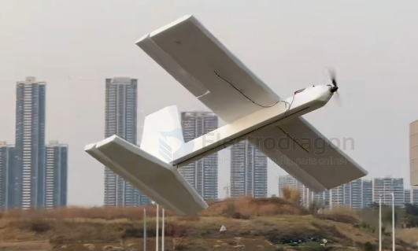

# airplane-foam-dat

- [[airplane-sheet-dat]] - [[airplane-foam-dat]] - [[rc-aircraft-build-dat]] - [[rc-aircraft-dat]]

- [[foam-dat]] - [[airplane-foam-dat]] - [[Aircraft-powered-hand-launched-dat]]

## build 

pure foam build 

## capabilties 

**Yes, absolutely! Not only can they glide and fly long-range, but EPP foam aircraft are currently among the most popular and mainstream airframes in the Long-Range FPV and RC glider communities.**

Many people mistakenly assume that EPP foam is "soft, cheap-looking, or toy-like" and unsuitable for long-range flight. In reality, modern high-performance EPP foam aircraft are designed to combine both **crash resistance** and **efficient gliding**.

Here are the core reasons why EPP foam aircraft excel at gliding and long-range flight:

### 1. Why Are EPP Foam Aircraft Good for Long-Range? (Core Advantages)
* **High Payload Capacity:** Long-range flying requires carrying large-capacity batteries (e.g., 4S/6S LiPo), GPS, a flight controller, a video transmitter, and an HD camera. EPP foam has low density and high buoyancy, allowing a very light airframe to support large internal compartments and heavy batteries.
* **Crash Resistance & High Fault Tolerance:** Long-range flying often takes you to fields, mountains, or unfamiliar airspace, where hard landings, hidden rocks in the grass, or crashes are inevitable. EPP's high toughness lets the airframe absorb impact energy through deformation, and it can usually be glued back together and resurrected on the spot — critical for players on long-distance exploration flights.
* **Low Wing Loading & High Lift-to-Drag Ratio:** Many long-range EPP aircraft use **high aspect ratio (long slender wing)** designs, providing an excellent lift-to-drag ratio that greatly helps with long loitering and gliding.

### 2. Classic Long-Range EPP Foam Aircraft Representatives
In the RC community, there are several famous EPP long-range/glider "evergreens":
* **ZOHD series (e.g., Dart, Dolphin, Nano Talon):** Airframes made from high-density EPP, some models with front or rear motors, excellent streamlined design — representatives balancing both speed and long-range.
* **Reptile Dragon / S800 Flying Wing:** Tailless flying wing designs made of EPP, good wind resistance, high flight efficiency, ideal for mounting large batteries for beyond-visual-line-of-sight (BVLOS) FPV flight.
* **Bixler / EasyStar series Motor Gliders:** Classic EPP high-wing electric gliders with a large glide ratio — cut the throttle and they can drift for a long time on faint air currents.

### 3. Secrets to Ultra-Long Endurance in EPP Long-Range Aircraft
1. **Battery & Weight Balance:** Long-range aircraft typically use large-capacity lithium-ion batteries (e.g., packs built from 18650 or 21700 cells), paired with high-efficiency brushless motors and low-KV, large folding propellers, achieving very low cruise current (e.g., only 3A-5A).
2. **Flight Controller for Auto Loiter/RTH:** Long-range aircraft usually add an ArduPilot or iNav flight controller. When the signal weakens or the battery runs low after flying far, one click triggers **RTH (Return-to-Home, auto return)** and the aircraft autonomously flies back smoothly to the launch point.

---

### 💡 Summary
EPP foam aircraft can not only glide — they are the **most cost-effective and reassuring choice for long-distance FPV flight**. Many veteran pilots may own expensive carbon-fiber/fiberglass composite gliders, yet they still choose EPP for long-range trips because "tough and durable" always comes first when flying in the field.

## features 

An **EPP foam airplane** (EPP 泡沫机) is a model aircraft or drone whose airframe is primarily made from **EPP** (Expanded Polypropylene, 聚丙烯发泡材料). 

In the RC model and FPV drone community, EPP is considered the gold-standard material for builds due to several distinct characteristics:

### 1. Key Characteristics of EPP Foam
* **Extreme Flexibility & "Memory":** Unlike brittle materials (like EPS/Styrofoam or traditional balsa wood), EPP is rubbery and highly flexible. When you crash an EPP plane into a tree or the ground, the foam bends, compresses, and then **bounces back to its original shape** with little to no damage.
* **Easy to Repair:** If an EPP plane does break or snap during a severe crash, it can be easily glued back together in minutes using regular **CA glue (super glue) with kicker** or **hot glue**.
* **Lightweight and Durable:** It offers a fantastic strength-to-weight ratio, keeping the plane light enough to fly efficiently while surviving heavy abuse.

### 2. Why Are EPP Foam Airplanes So Popular?
* **The Ultimate Training Aircraft:** Because beginners inevitably crash a lot ("learning to fly means learning to crash"), EPP trainers allow new pilots to walk away from crashes, bend the nose back into shape, and keep flying.
* **FPV & Combat Wings:** Many durable flying wings (like the ZOHD series or Reptile Dragon) and FPV platforms are molded from EPP because they can carry heavy batteries and cameras while surviving rough belly landings on dirt or gravel runways.

---

### Summary
An **EPP foam plane** is essentially an **unbreakable or highly crash-resistant foam aircraft** designed to withstand harsh impacts, making it the favorite material for both beginners learning to fly and FPV pilots pushing the limits.

## ref 

