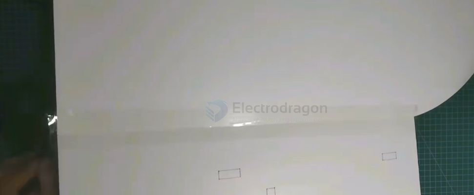
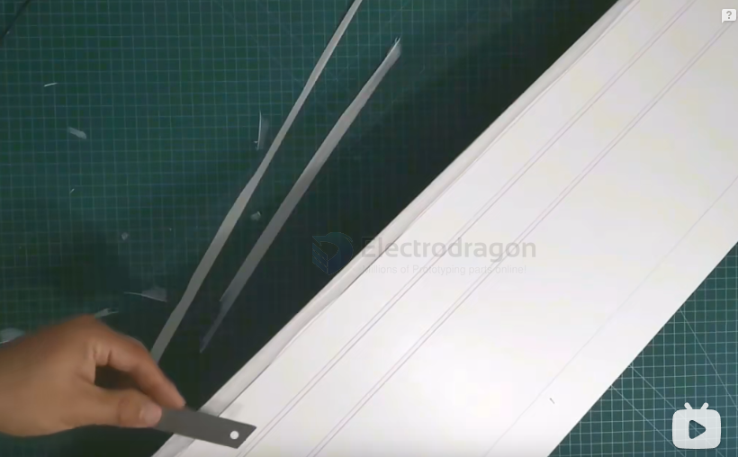
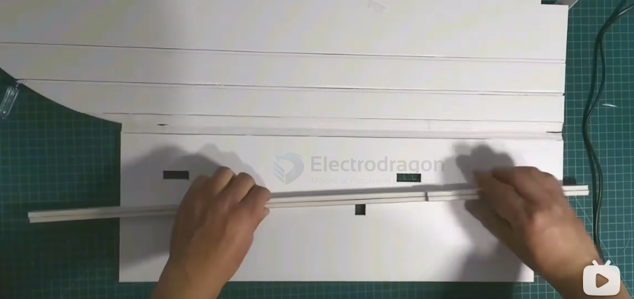
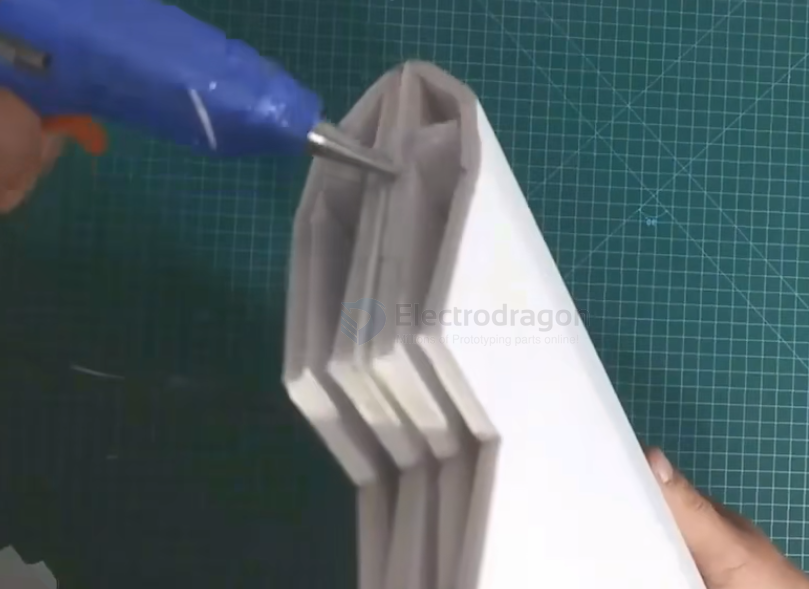
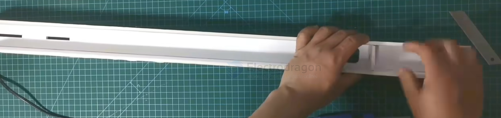
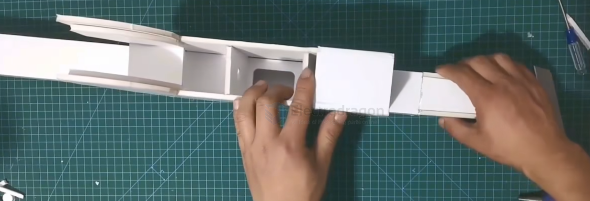
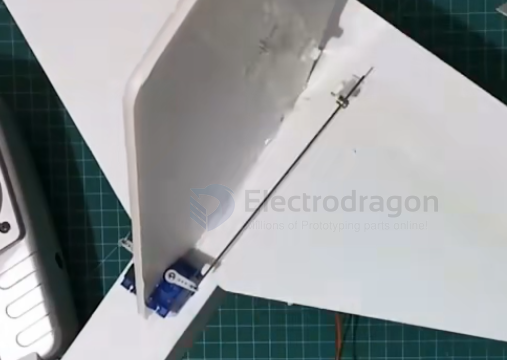
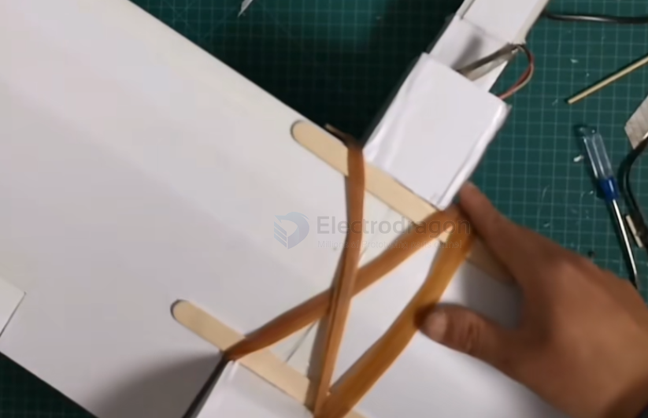

# airplane-sheet-dat

- [[airplane-sheet-dat]] - [[airplane-foam-dat]] 

- [[fab-materials-dat]] - [[fab-mechanics-dat]] - [[sheet-dat]]

1. KT板：表皮覆膜 + 泡棉芯（经典的三明治夹层）

结构形态： 典型的三明治夹层板（Sandwich Panel）。
表层： 两面是薄薄的纸面或塑料膜（面层）。
芯材： 中间夹着一层发泡聚苯乙烯（PS）泡棉。  
受力原理： 就像工字钢一样，两层的表皮负责承受主要的抗拉和抗压应力（提供硬度和抗弯能力），中间的泡棉负责把两层表皮撑开、保持厚度并传递剪切力。它的缺点是表皮太脆、芯材太疏松，一受外力容易整体崩溃。

2. PP魔术板（中空板）：表皮 + 内部格子筋（蜂窝/中空夹层）
   
结构形态： 这是一种中空筋条夹层结构（Corrugated / Hollow Structure）。
表层： 上下两层平整的塑料薄膜（面板）。
芯材： 中间没有发泡泡沫，而是由无数道塑料立筋交织成的一排排“井”字形或蜂窝状的方形/三角形中空管道。
受力原理： 它利用了几何学中“管状/筋条结构”的抗压原理。虽然内部是空的（空气占了大部分体积），但那些纵横交错的塑料立筋相当于无数个微型支撑柱，把上下两层塑料皮牢牢撑住。因此，它在不增加太多重量的前提下，拥有极强的抗撕裂和抗弯刚性。

## build 

cut back and tape another side 

45 degree side cut for later 90 degree fold

create slots to add ribs 

- [[wing-dat]] 

build the fuselage - [[airplane-fuselage-dat]] 

build head and [[propeller-tractor-dat]] holder 

add [[motor-servo-dat]] - [[airplane-sheet-dat]]

install [[propeller-tractor-dat]]

[[airplane-fuselage-dat]] wrap up with [[wing-dat]]

## ref 