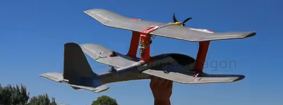
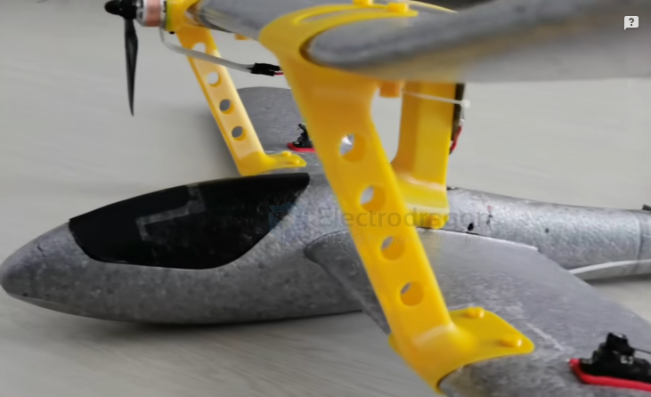

# Multiplane-dat

## 多翼机： Multiplane

In aviation English and technical terminology, multi-level wing (double or multi-wing) designs are most standardly referred to as:

* **Biplane (double wing / two-wing):** The most common type (e.g., wings arranged one in front of the other, or stacked one above the other).
* **Triplane (triple wing / three-wing):** Seen historically, such as the Fokker Dr.I triplane fighter from World War I.
* **Multiplane (multi-wing):** A general term covering designs with two or more wings.

---

### Structural Characteristics and Common Types

* **Upper Wing & Lower Wing:** In a biplane, the wings are usually divided into the **Upper wing** and **Lower wing**.
* **Interplane Struts & Wires:** Because the two wings must stay fixed relative to each other while bearing alternating loads, they are typically connected by **Interplane struts** and reinforced with **Rigging wires / Flying wires**.

### Why This Design Existed? (Pros & Cons)

**Advantages (loved during the golden age of early aviation):**
* **Huge Lift:** With a short fuselage, two wings provide a very large total wing area, giving excellent low-speed takeoff/landing capability and remarkable turning maneuverability.
* **Rigid Structure:** Early materials (such as wood and fabric) were not strong enough; biplanes used wires and struts to form a truss-like box structure with excellent torsional resistance.

**Disadvantages (reasons it was gradually phased out):**
* **Huge Air Drag:** Two wings plus many struts and wires create significant interference drag, making it hard to reach high top speeds.
* In modern models or real aircraft, apart from **classic aerobatic planes (e.g., the Pitts Special)**, historical/vintage replicas, or models pursuing extreme low-speed performance or special flying styles, the vast majority of modern aircraft (both military and civilian) have long since moved to monoplane designs.

## ref 

