# fixed-wing-dat

- [[rc-kits-dat]]

## fixed wing types 

## 1. Monoplane (上单翼 / Single-Wing Aircraft)

A **monoplane** is an aircraft that has **only one main wing** on each side of the fuselage.  

### Characteristics:
- Simple structure  
- Less drag → more efficient than biplanes  
- Common in modern aircraft  

### Example:
- Cessna 172 (small light aircraft)  
- Boeing 737 (commercial jet)  
- Many RC fixed-wing planes  

---

## 2. Other Wing Configurations

| Wing Type | Description | Example |
|-----------|------------|---------|
| **Biplane (双翼机)** | Two wings stacked vertically | WWI fighter planes, Pitts Special RC plane |
| **Triplane (三翼机)** | Three wings stacked vertically | Fokker Dr.I (WWI) |
| **Canard** | Small forward wing in front of main wing | Wright Flyer, Beech Starship, some RC models |
| **Delta Wing (三角翼)** | Triangular wing shape, often for high-speed jets | Concorde, Dassault Mirage |
| **Flying Wing** | No distinct fuselage, entire aircraft is wing | Northrop B-2, some RC flying wings |
| **Sesquiplane** | One wing much smaller than the other | Some WWI aircraft |
| **Tandem Wing** | Two wings in line front-to-back | Rutan Quickie, some experimental RC planes |

---

## 3. Notes

- **Monoplane** is dominant today due to efficiency and simplicity.  
- **Biplanes and triplanes** offer more lift at low speeds but have more drag.  
- **Canard and tandem wings** are mostly experimental or for special aerodynamics.  
- RC hobbyists often experiment with delta, flying wing, or canard designs for agility or stability.

- [[wing-dat]] - [[aerodynamic-dat]] - [[physics-dat]]

## cardboard model 

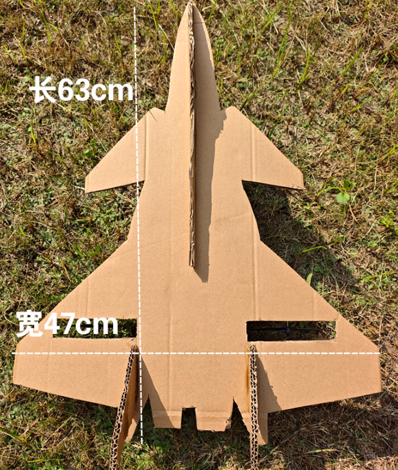

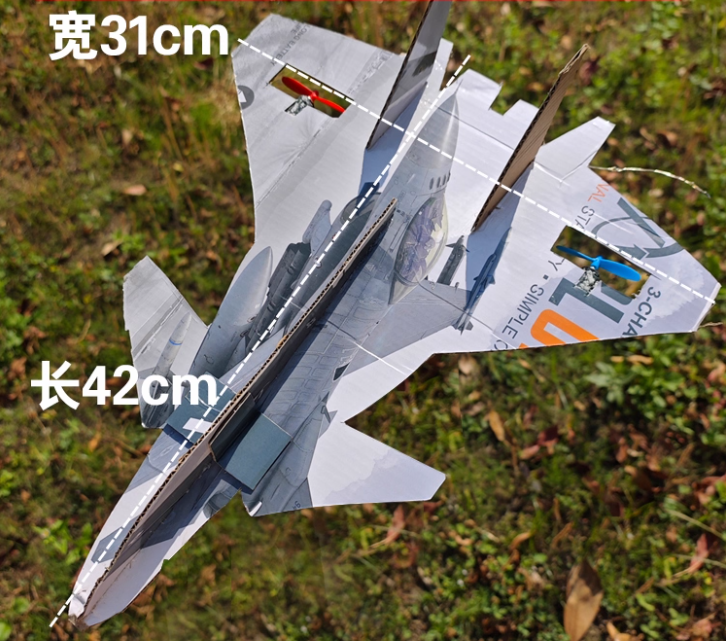

三角翼

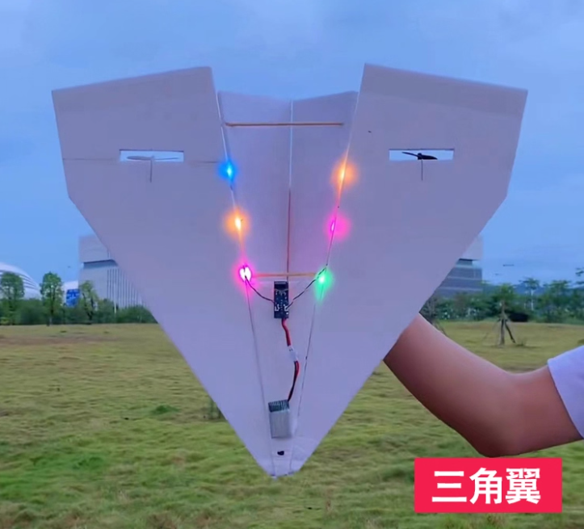

手抛机

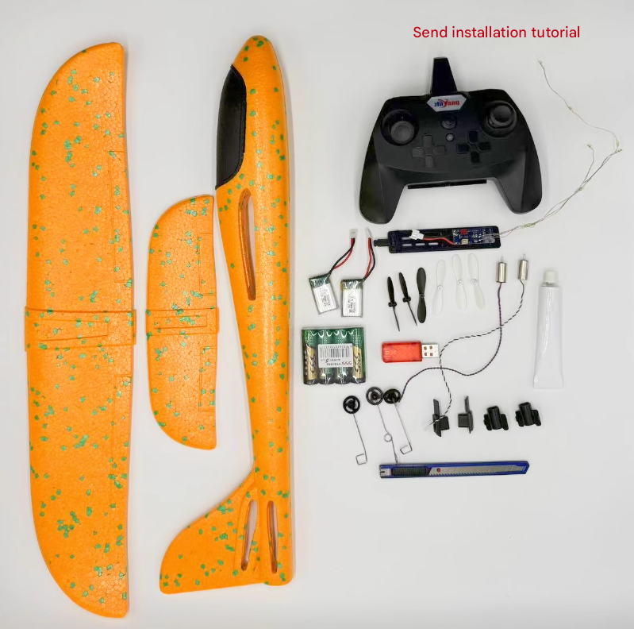

standard toy fixed wing 

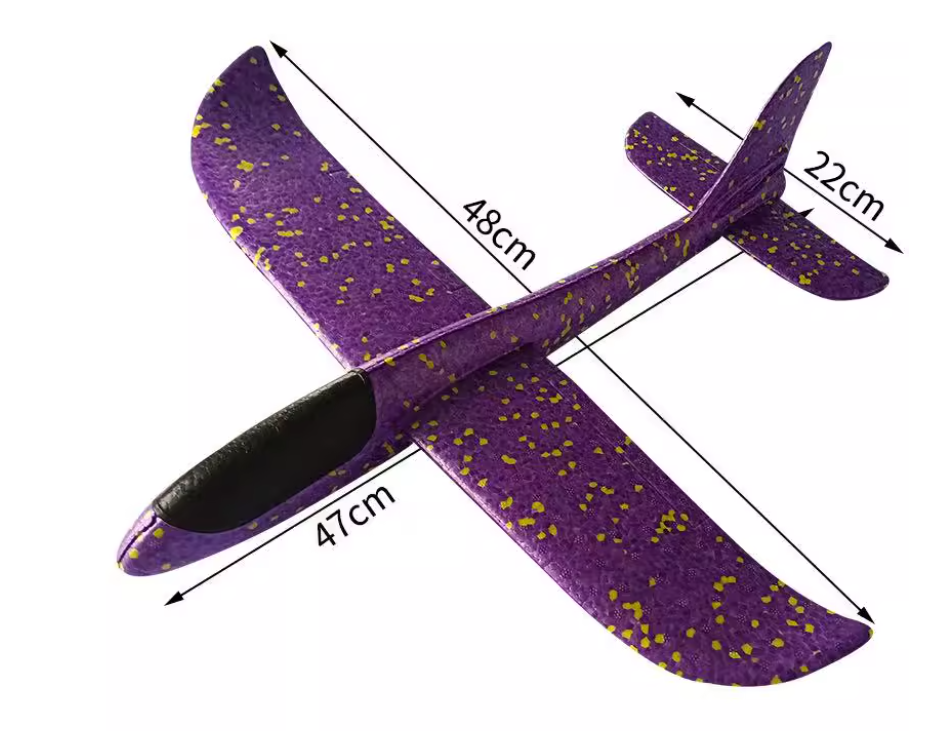

## jian-10

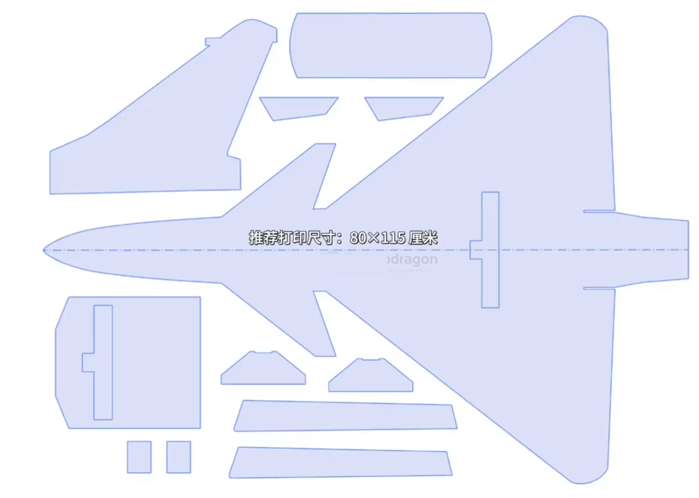

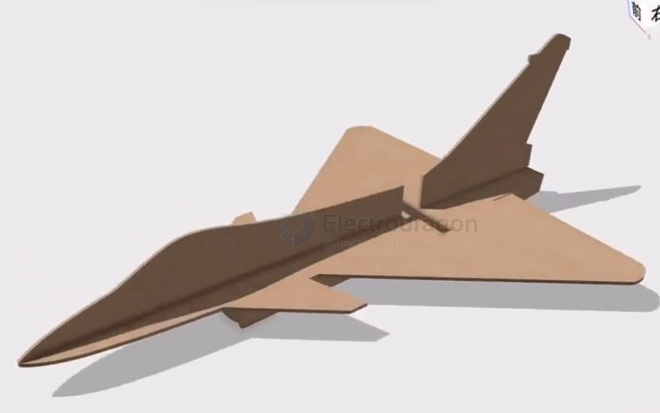

## uncommon shape 

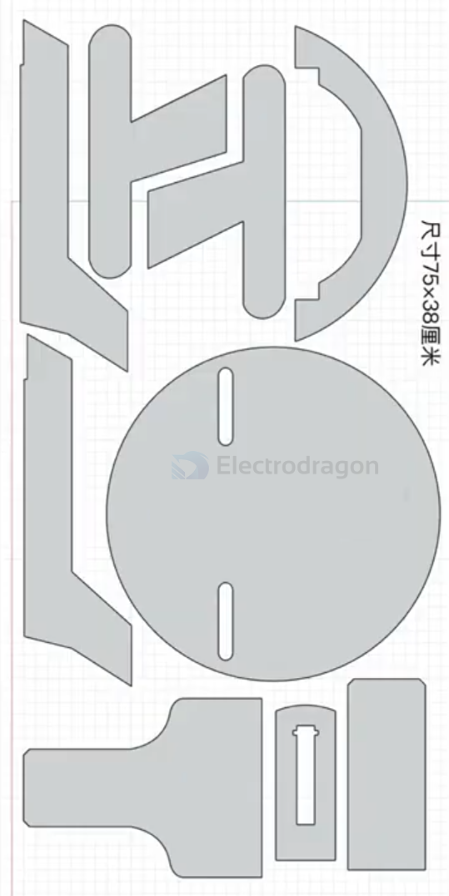

## 3d printed 

- [[3d-print-dat]]

F14 

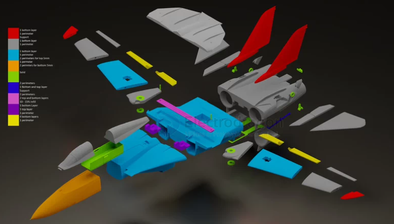

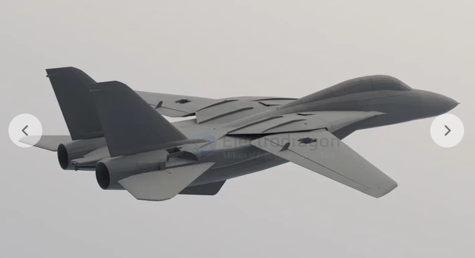

## tools 

center of gravity and balance checker 

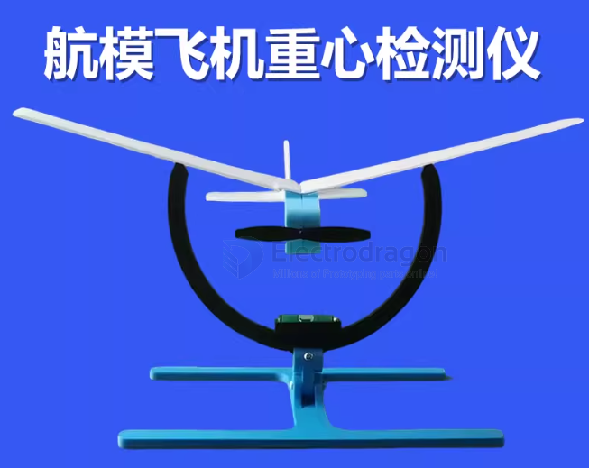

## ref 

- [[fixed-wing]]

- [[rc-apps-dat]]