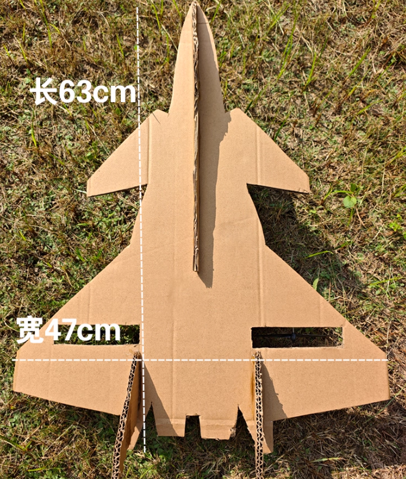
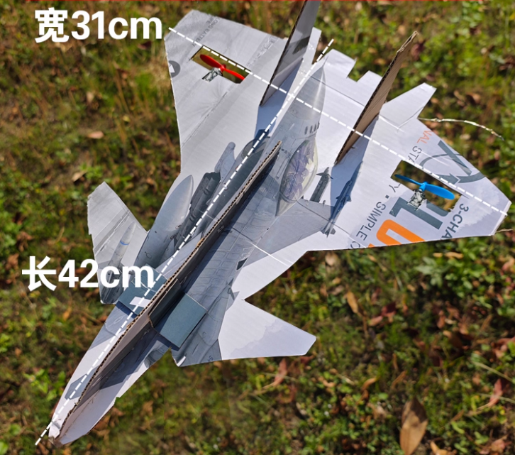
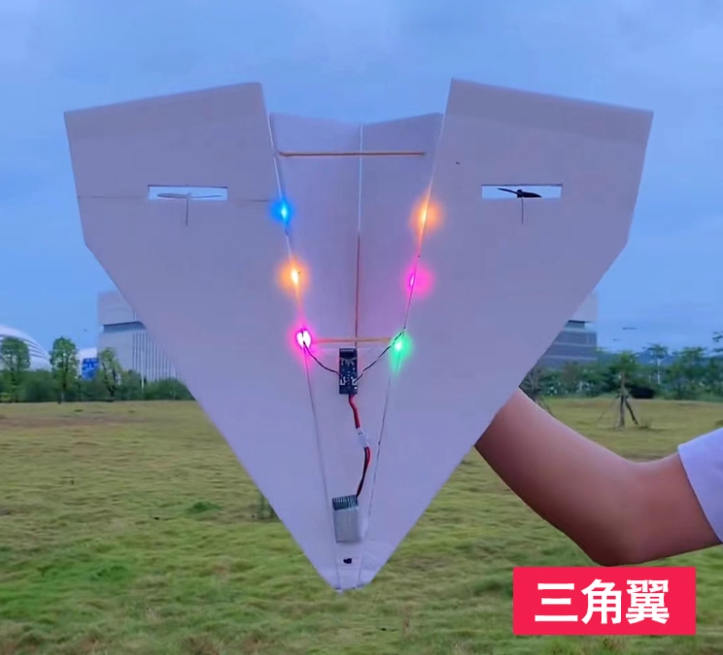
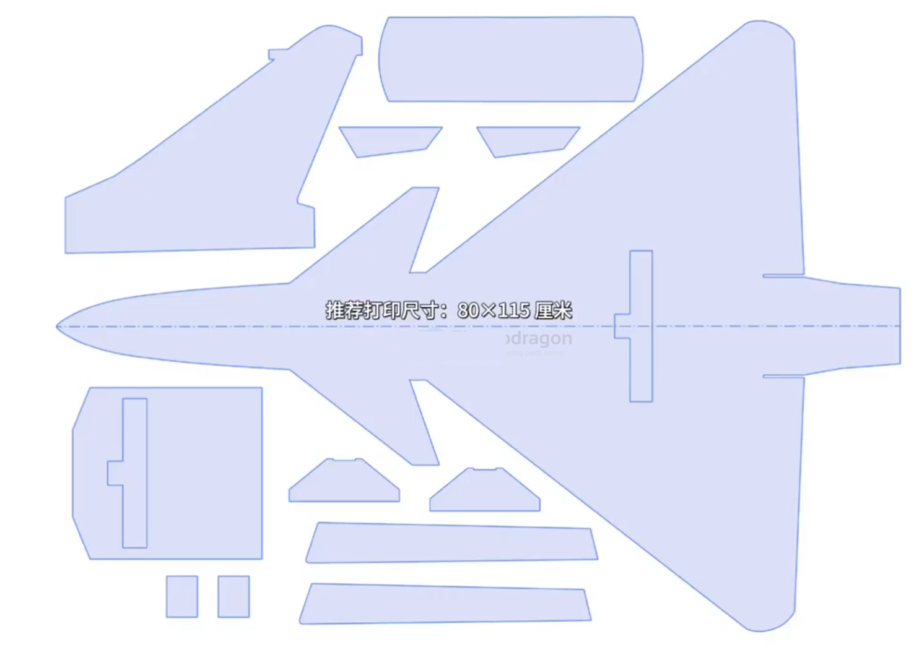
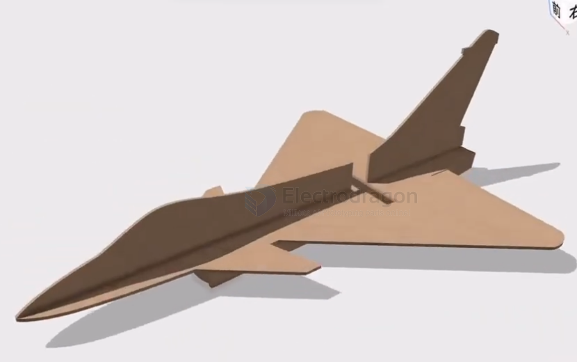
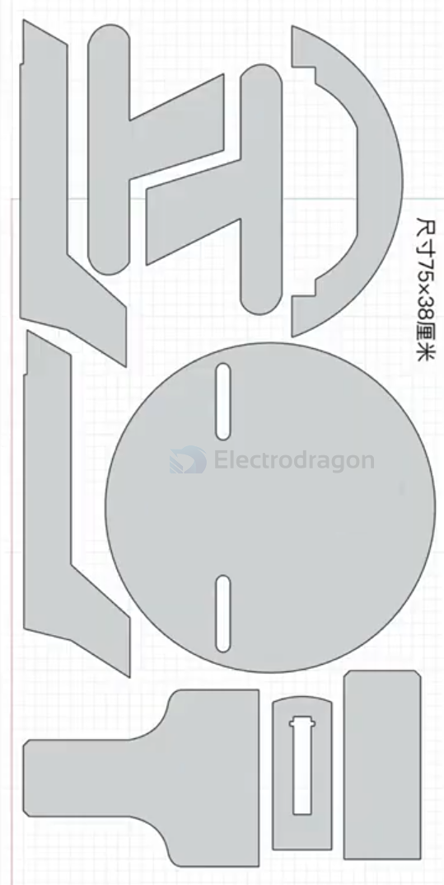
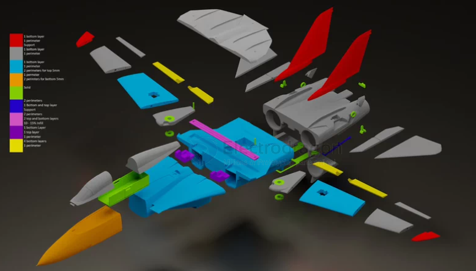
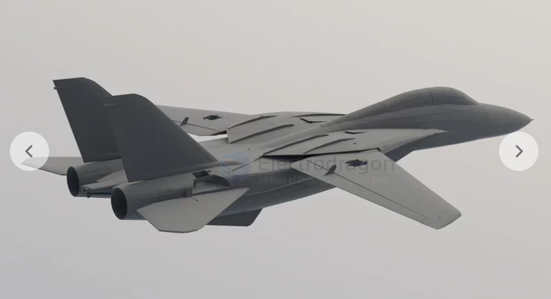
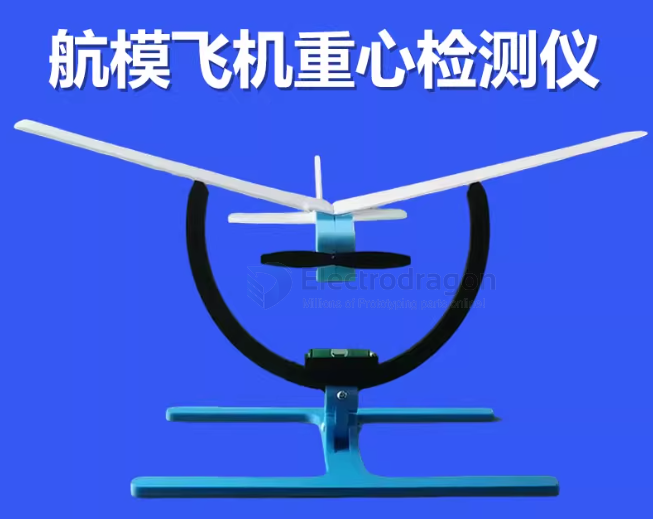

# fixed-wing-dat

- [[rc-kits-dat]]

- [[fixed-wing-dat]] - [[FPV-dat]] - [[flight-simulation-dat]]

- [[glider-dat]]

- [[landing-gear-dat]]

fixed-wing-vehicle == FPV


## thrust 

- [[thrust-dat]]

固定翼典型推重比

**滑翔机/高升力机**
• 推重比 (T/W): 0.3-0.5:1
• 说明: 机翼够大，动力只用来巡航/爬升

**通用航模/FPV 固定翼**
• 推重比 (T/W): 0.5-0.8:1
• 说明: 正常巡航，够爬升

**运动机/特技机**
• 推重比 (T/W): 1-1.5:1
• 说明: 可以垂直爬升、筋斗

**竞速机**
• 推重比 (T/W): 1.5-2:1
• 说明: 高速冲刺

**战斗机（军机）**
• 推重比 (T/W): 1-1.3:1
• 说明: 现代战机标配 ≥1

关键：推重比 >1 就能垂直爬升（战机就是这个标准）。


## engines 

在航模和无人机（特别是固定翼）设计中，**双发动机（Twin-engine）** 与 **单发动机（Single-engine）** 的选择会直接影响飞机的飞行性能、控制逻辑、续航以及制作成本。

以下是双发动机相比于单发动机的核心优缺点对比：

---

### 一、 双发动机的优点 (Advantages)

1. **更强的推力与负载能力 (Higher Thrust & Payload):**
   * 双发可以安装更大总功率的动力系统，能够轻松带起更重的电池、云台、高清图传或挂载设备，非常适合大型 FPV 远航机和测绘无人机。
2. **独特的动力冗余 (Redundancy - 针对大型机或油机):**
   * 在部分双发设计中，如果其中一个发动机在空中因故障停车，凭借另一个发动机（或通过合理的飞行姿态调整），飞机仍有一定的概率飞回并安全着陆，而单发失速就直接“炸机”。 *(注：对于轻型电动航模，双发单侧失效时通常会产生剧烈偏航，如果不靠飞控很难救回来)*
3. **更具张力的气动与外观设计 (Aero & Layout Flexibility):**
   * **推力后置双发（如双发布局的 FPV 航模）：** 螺旋桨在机翼后方或机身尾部，机头可以做到绝对干净，完美避开螺旋桨对摄像头的遮挡（俗称“无桨视野”），特别适合航拍和 FPV。
   * **经典双发布局（如双发运输机模型）：** 还原度极高，姿态优美。
4. **螺旋桨滑流效应的互补 (Prop Wash):**
   * 双发可以设计成反向旋转（Counter-rotating，一个顺时针一个逆时针），从而完美抵消单螺旋桨带来的扭矩反作用力和螺旋桨旋转滑流偏转，起飞和直线巡航更加稳定。

---

### 二、 双发动机的缺点 (Disadvantages)

1. **结构复杂、成本更高 (Higher Cost & Complexity):**
   * 你需要购买**两台电机、两个电调（ESC）**、更多的信号线。这意味着更高的预算，且焊接和电路布线比单发复杂一倍。
2. **重量增加与电耗损耗 (Weight & Efficiency Loss):**
   * 双发系统意味着多了一个电机的重量。同时，两台小电机在总效率上通常不如单台同等总功率的大电机，巡航时的电能消耗可能会更高，一定程度上会缩短航时。
3. **单侧失效时的控制灾难 (Asymmetric Thrust / Engine-Out Handling):**
   * 如果在飞行中**左侧电机突然故障停转或桨叶打断**，右侧电机还在全速运转，会瞬间产生巨大的**单边偏航力矩（Yaw Moment）**。如果飞机没有飞控进行自动差动补偿，飞机会在 1 秒内失速旋转并坠毁。
4. **调试更麻烦:**
   * 两个电调的行程校准、两台电机的同步性、以及油门混控都需要仔细调试，否则可能会因为两边推力不均导致飞机总往一侧跑偏。

---

### 三、 总结与选型建议

| 对比维度 | 单发动机 (Single-Engine) | 双发动机 (Twin-Engine) |
| :--- | :--- | :--- |
| **结构/布线** | 🟢 简单、省时省力 | 🔴 复杂（双电机、双电调） |
| **成本** | 🟢 较低 | 🔴 较高 |
| **航拍/FPV视野** | 🟡 前置容易被桨叶挡住（除非布局特殊） | 🟢 容易实现无桨纯净视野 |
| **故障风险** | 🔴 坏了就直接降落（无备用） | 🟡 单侧故障时对偏航控制要求极高 |
| **适用机型** | 绝大多数新手教练机、轻型滑翔机、普通 FPV 机 | 大型远航机、航拍机、特定军标/双发仿真机 |

* **如果是新手入门：** 坚决推荐**单发动机**（最好是电机后置的动力滑翔机布局），结构简单、皮实耐摔、容错率高。
* **如果你是为了追求无桨航拍视野、玩大型 FPV 远航或喜欢双发布局的外观：** 那么**双发动机**会带来极佳的乐趣与可玩性。


## wings 

- [[wing-tail-dat]] - [[wing-main-dat]] 

## fixed-wing types

- [[monoplane-dat]] - [[biplane-dat]] - [[triplane-dat]] - [[canard-dat]] - [[delta-wing-dat]] - [[flying-wing-dat]] - [[sesquiplane-dat]] - [[tandem-wing-dat]]

- un-powered [[glider-dat]] - [[sailplane-dat]]

- powered 

### 手抛机和 滑翔机 

无论是手抛机还是滑翔机，它们的空气动力学布局都是**机翼固定在机身上**，依靠机翼与空气的相对运动产生升力，因此**它们本质上都属于固定翼飞机（Fixed-wing aircraft）**的范畴。

我们可以这样梳理它们的从属关系：

1. **固定翼（Fixed-wing）** 是一个大类（包含了所有不是靠旋翼或扑翼飞行的飞机，比如客机、战斗机、航模、无人机）。
2. **滑翔机（Glider）** 是固定翼家族中的一个子类（特点是无动力或主要靠滑翔）。
3. **手抛机（Hand-launched aircraft）** 是指一类**起飞方式**的统称，它既可以包含无动力手抛滑翔机，也可以包含带有电机的动力手抛固定翼。


### fixed-wing and glider 

**Glider（滑翔机）** 和 **Fixed-wing（固定翼）** 之间是**包含与被包含**（即“属种”）的关系：**所有滑翔机都是固定翼飞机，但并非所有固定翼飞机都是滑翔机。**

为了更直观地理解，可以从以下几个维度来看它们的区别与联系：

### 1. 定义与核心区别
* **Fixed-wing（固定翼）：** 指机翼固定在机身上、不通过旋转产生升力的航空器。它的分类非常广泛，涵盖了所有靠机翼与空气相对运动产生升力的飞机。
* **Glider（滑翔机）：** 是一种**没有动力装置（或仅有辅助动力用于起飞）**的固定翼飞机。它依靠重力和上升气流（热气流、地形风等）在空中飞行和维持高度。

### 2. 它们的关系图解
```text
Fixed-wing Aircraft (固定翼飞机家族)
 ├── Powered Fixed-wing (动力固定翼：如客机、战斗机、普通油机/电动遥控固定翼)
 └── Gliders / Sailplanes (滑翔机/无动力固定翼：如初级练习滑翔机、竞技DLG、大型无动力航模)
```

3. 在遥控模型（RC）和无人机领域的应用
4. 
传统固定翼（Powered Fixed-wing）： 装有电机或发动机、油箱/电池，可以持续飞行、做特技或长航时巡航。

滑翔机（Glider / Sailplane）：

纯滑翔机： 没有任何动力，需要靠橡筋弹射、手抛、或者由动力拖曳机（Tug plane）带上高空后释放。

动力滑翔机（Motor Glider）： 现代遥控模型中很常见的一种折中方案——机头带有一个折叠螺旋桨。上去时开机爬升到高空，到达高度后关闭电机并收起桨叶，随后进入纯滑翔状态。


## auto mode 

In fixed-wing model aircraft or drones, **Auto Aileron**, **Auto Elevator**, and **Auto Hover** are not independent mysterious devices. Instead, they are specific control dimensions or flight modes managed by an **autopilot system** (such as ArduPilot, iNav, or PX4) through sensors and algorithms.

The implementation relies on three core elements: **Perception (sensors)**, **Decision (PID control algorithms)**, and **Execution (servos/motors)**.

---

### I. Core Hardware and Underlying Logic

Regardless of whether it is controlling the ailerons, elevator, or achieving a hover, the underlying architecture remains the same:
1. **Sensors (IMU + GPS + Barometer):** The Inertial Measurement Unit (gyroscope and accelerometer) on the flight control board monitors the aircraft's attitude (Pitch, Roll, Yaw), angular velocity, and acceleration in real time.
2. **PID Control Algorithm:** The flight controller sets a "target value" (e.g., wings level, holding altitude, or nose pointing straight up) and compares the real-time measured value with the target to generate an "error." The PID (Proportional-Integral-Derivative) algorithm quickly calculates how much the control surfaces need to deflect and how much throttle needs to be adjusted.
3. **Actuators:** The flight controller outputs PWM signals to the servos (controlling ailerons and elevators) and the Electronic Speed Controller (ESC controlling motor RPM) to dynamically correct the aircraft's attitude.

---

### II. How Each Feature is Implemented

#### 1. Auto Aileron (Automatic Roll Control)
* **Function:** Controls the **Roll axis**, used to keep wings level, execute automatic coordinated turns, or automatically level the wings when encountering crosswinds or turbulence.
* **Implementation:**
  * **Stabilize / Rate Mode:** When hands are off the transmitter sticks, if the gyroscope detects a wing tilt (e.g., the left wing is lifted by a gust of wind), the flight controller **automatically applies opposite counter-control to the ailerons** (lowering the left aileron and raising the right aileron) to bring the aircraft back to level.
  * **Navigation / Waypoint Mode:** During automated return-to-home (RTH) or waypoint flights, the flight controller calculates the required turn direction based on the GPS track, proactively calculating and controlling aileron deflection to achieve a coordinated turn.

#### 2. Auto Elevator (Automatic Pitch Control)
* **Function:** Controls the **Pitch axis**, used to keep the nose level, lock the flight altitude, and control climbs or descents.
* **Implementation:**
  * **Altitude / Attitude Hold:** The barometer and accelerometer monitor altitude and pitch angle. If the aircraft sinks due to a downdraft, the flight controller automatically pulls up on the **elevator** to raise the nose; if the nose pitches up too high, it pushes down on the elevator to prevent a stall.
  * **Throttle Integration:** In many fixed-wing autopilots, the elevator is mixed with the throttle (such as in Altitude Hold mode) to ensure a balance between speed and altitude during climbs or level flight.

#### 3. Auto Hover (Fixed-Wing Vertical Hover)
* **Characteristics and Challenges:** Traditional fixed-wing aircraft rely on airflow over the wings to generate lift. **Auto Hover** refers to making a regular fixed-wing model (usually a 3D aerobatic plane or a specialized VTOL aircraft) hover vertically in mid-air, nose-to-sky, like a helicopter or multirotor.
* **Implementation:**
  * **Extreme Control Surfaces and High Power:** During a hover, the forward airspeed drops to zero, rendering the wings and traditional aerodynamic lift useless. Control relies entirely on the **prop wash (powerful slipstream blown backward by the propeller) passing over the tail control surfaces (ailerons, elevator, rudder)** to generate tiny corrective forces. This requires a Thrust-to-Weight Ratio (TWR) greater than 1.0 (typically 1.5 or higher).
  * **Full-Channel Takeover:** 
    * **Auto Throttle:** Maintains total thrust equal to the aircraft's weight, instantly increasing throttle if the plane drops and decreasing it if it surges upward.
    * **Auto Elevator / Aileron / Rudder:** During a hover, the flight controller treats the ailerons, elevator, and rudder like the differential motors of a quadcopter. If the nose tilts to the right, the flight controller simultaneously manipulates the corresponding control surfaces, using the propeller's slipstream to "push" the nose back to vertical.
  * **Software Support:** When enabling 3D Auto Hover or VTOL modes in ArduPilot (Plane) or iNav, the flight controller switches to a dedicated set of high-sensitivity PID tuning parameters designed specifically for hover states, maintaining vertical balance through high-frequency micro-adjustments of all control surfaces and the throttle.

#### 1. Auto Rudder (Automatic Yaw Control / Coordination)
* **Function:** Controls the **Yaw axis** using the rudder.
* **How it works:** 
  * **Coordinated Turns:** Prevents "slip and skid" during turns by automatically applying rudder proportional to the aileron input, ensuring smooth, aerodynamically efficient turns.
  * **V-Tail / Differential Thrust Mixing:** In aircraft with V-tails or dual motors, the autopilot automatically mixes yaw control into the appropriate surfaces or differential motor speeds.
  * **Crosswind Correction (Sideslip):** During final approach and landing in crosswinds, the autopilot can automatically yaw the aircraft into the wind (crabbing) to keep the ground track aligned with the runway.

#### 2. Auto Throttle (Automatic Speed and Power Control)
* **Function:** Manages the motor's ESC to control airspeed, power consumption, or thrust.
* **How it works:** 
  * Works in tandem with pitch control to maintain a target **Airspeed** (using a pitot tube) rather than just throttle percentage. 
  * If the plane pitches up to climb, Auto Throttle automatically increases power to prevent a stall; during descents, it cuts power to prevent overspeeding.

#### 3. Auto Takehand / Auto Launch (Automatic Hand-Launch / Bungee Launch)
* **Function:** Safely launches a fixed-wing drone from a hand toss or a catapult without requiring manual stick inputs during the critical first few seconds.
* **How it works:** 
  * The autopilot detects a stationary state, arms the motor, and waits for the pilot to throw the plane (detected via a sudden spike in acceleration). 
  * Once the launch is detected, the motor ramps up to full power automatically, and the autopilot locks the pitch and roll axes level until the plane gains safe altitude and airspeed.

#### 4. Auto Land (Automatic Landing)
* **Function:** Brings the fixed-wing aircraft down to a pre-defined touchdown point completely autonomously.
* **How it works:** 
  * **Approach Phase:** Flies a predefined glide slope (typically using GPS and a barometer or laser/lidar altimeter) toward the landing zone.
  * **Flare Maneuver:** Just before touchdown, the autopilot executes a controlled pitch-up (flare) to bleed off excess airspeed and cushion the impact, cutting the motor right at touchdown.

#### 5. Return-to-Home (RTH / Auto RTL)
* **Function:** An emergency or convenience safety feature that automatically flies the aircraft back to its takeoff location and loiters (circles) above it.
* **How it works:** 
  * Triggered by a switch loss, low battery, or failsafe. 
  * The plane climbs to a safe preset altitude, turns toward home using GPS, navigates back, and enters an automated loiter circle until the pilot regains control or initiates a manual/auto landing.

#### 6. Auto Circle / Loiter
* **Function:** Maintains a continuous circular flight pattern around a specific GPS coordinate or target.
* **How it works:** 
  * The autopilot calculates continuous roll and pitch adjustments to hold a fixed radius and altitude against wind drift, often used for aerial photography of a single point of interest or while waiting for landing clearance.

#### 7. Terrain Following (AGL Altitude Hold)
* **Function:** Keeps the aircraft at a constant height **above ground level (AGL)** rather than mean sea level (MSL), preventing crashes into rolling hills or mountains.
* **How it works:** 
  * Uses onboard radar, laser altimeters, or pre-loaded digital elevation maps (DEM) combined with GPS to dynamically adjust the pitch/altitude profile during low-altitude mapping or survey missions.


## fixed wing types 


## 1. Monoplane (上单翼 / Single-Wing Aircraft)

A **monoplane** is an aircraft that has **only one main wing** on each side of the fuselage.  

### Characteristics:
- Simple structure  
- Less drag → more efficient than biplanes  
- Common in modern aircraft  

### Example:
- Cessna 172 (small light aircraft)  
- Boeing 737 (commercial jet)  
- Many RC fixed-wing planes  

---

## 2. Other Wing Configurations

| Wing Type | Description | Example |
|-----------|------------|---------|
| **Biplane (双翼机)** | Two wings stacked vertically | WWI fighter planes, Pitts Special RC plane |
| **Triplane (三翼机)** | Three wings stacked vertically | Fokker Dr.I (WWI) |
| **Canard** | Small forward wing in front of main wing | Wright Flyer, Beech Starship, some RC models |
| **Delta Wing (三角翼)** | Triangular wing shape, often for high-speed jets | Concorde, Dassault Mirage |
| **Flying Wing** | No distinct fuselage, entire aircraft is wing | Northrop B-2, some RC flying wings |
| **Sesquiplane** | One wing much smaller than the other | Some WWI aircraft |
| **Tandem Wing** | Two wings in line front-to-back | Rutan Quickie, some experimental RC planes |

---

## 3. Notes

- **Monoplane** is dominant today due to efficiency and simplicity.  
- **Biplanes and triplanes** offer more lift at low speeds but have more drag.  
- **Canard and tandem wings** are mostly experimental or for special aerodynamics.  
- RC hobbyists often experiment with delta, flying wing, or canard designs for agility or stability.

- [[wing-dat]] - [[aerodynamic-dat]] - [[physics-dat]]

## cardboard model 





三角翼




## jian-10






## uncommon shape 




## 3d printed 

- [[3d-print-dat]]


F14 





## tools 

center of gravity and balance checker 



## ref 

- [[fixed-wing]]

- [[rc-apps-dat]]