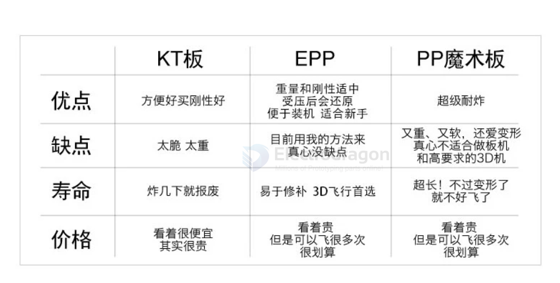
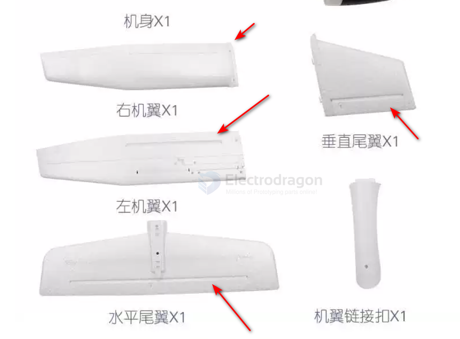

# rc-aircraft-dat

- basic - [[RC-kits-dat]] - [[landing-gear-dat]]

- [[quadcopter-dat]] - [[mobula8-dat]] - [[UAV-dat]] - [[DJI-quadcopter-dat]]

- [[radiomaster-dat]]

## tech 

- [[Multiplane-dat]]

- [[wing-mixing-dat]]

- [[rc-aircraft-build-dat]] - [[rc-aircraft-dat]]

- [[airplane-engine-twin-dat]] - [[airplane-engine-dat]]

- [[aerodynamic-dat]] - [[physics-dat]]

## 6in 

- [[DJI-flip-dat]]

## mode 

- 定高 Althold
- 悬停 Hover
- 返航 Return
- 降落 Land
- 绕卷 Circle
- 无头 Headless
- 自稳 Stabilization
- 有头 Head
- 失控返航 Out of control return
- 低电降落 Low power down

## build 

- [[rc-aircraft-build-dat]] 

- [[flight-controller-dat]]

## types 

- 遥控扑翼机 Ornithopter [[Ornithopter-dat]]

- [[fixed-wing-dat]] - [[glider-dat]] - [[Aircraft-powered-hand-launched-dat]]

- [[helicopter-dat]]

- [[FPV-dat]] - [[FPV-size-dat]] 

- [[DJI-dat]] - [[DJI-flip-dat]]

- [[VTOL-dat]]

| 类型 | 推重比 | 续航 | 悬停能力 | 特点 |
| --- | --- | --- | --- | --- |
| 多旋翼（7寸） | 2-3:1 | 20 分钟 | ✅ 悬停 | 灵活易操作，续航短 |
| 固定翼（FPV） | 0.5:1 | 40-90 分钟 | ❌ 不能悬停（必须一直飞） | 续航长，需持续飞行 |
| 垂直起降固定翼 (VTOL) | 0.6:1 + 旋翼组 | 40-60 分钟 | ✅ 悬停+巡航 | 起飞悬停、巡航省电 |

> VTOL（垂直起降固定翼）：起飞用旋翼（悬停），巡航切固定翼模式（机翼升力省电）——这是航拍续航的最优解，也是 DJI 未来的方向。

### types by materials 

- [[airplane-sheet-dat]] - [[airplane-foam-dat]] 

| 材料 | 抗摔性 (Durability) | 刚性 (Stiffness) | 重量 (Weight) | 价格 (Price) | 适合人群 / 场景 |
| :--- | :--- | :--- | :--- | :--- | :--- |
| **KT板** | ❌ 极差（易碎） | 🟢 较好（平整） | 🟢 极轻 | 💰 极便宜 | **室内机、超低成本新手练手、模型DIY初学者** |
| **EPP** | 🟢 极佳（抗摔耐撞）| 🟡 较软（需碳棒） | 🟡 较轻 | 💰 中等 | **户外固定翼、FPV远航机、新手抗摔首选** |
| **PP魔术板**| 🟢 很好（坚固耐用）| 🟢 较好（抗弯） | 🔴 稍重 | 💰 中等 | **耐用型小飞机、不怕风吹雨打的功能性机身** |

在很多航模店或淘宝商家那里，“PP板”和“PP魔术板”经常是混用的。

结构： 它的学名是 PP塑料中空板（Corflute / Corrugated Plastic）。外表看起来像是两层薄塑料皮，中间夹着一层“井”字形或蜂窝状的支撑肋。

特点：

具备极强的抗撕裂、防水、耐折性能。

相比于软乎乎的 EPP 泡沫，PP板拥有极高的抗弯刚性，不需要额外塞碳条就能支撑起一定的结构。

它的价格便宜、用美工刀就能裁切，常被用来做耐摔的小型航模机身、Fpv耐撞机壳或者涵道机风道。

## control channels channels 

### Channel 1: Aileron Action

Control theright-and-left lean of the aircraft.To level the slantwise aircraft,youmust make
thecontrol rod act inreverse direction.Otherwise,it will makethe aircraftoverturn.

### Channel 2: Elevator Action

Control the aerocraft to descend orascend.Pulling the control rod down will driveup the head,
and the aeroplane will ascend.Boosting it upwill make thehead downhill,and the aeroplane
willdescend.

### Channel 3: Throttle Operation

Control the power. Pulling the control rod down will minish down the power group, and boosting
the control rod up will increase thepower group.

### Channel 4: Rudder Action

Control the swerve of the aerocraft. Turning the control rod to left will make the head of the
aircraft turn left, and turning it to right will make the head turn right.

### Channel 5: LandingGear/GyroAction

This channel is for switch variable. It is a switch to control landing gear when used for airplane
state, but it will be a switch for gyroscope when used for helicopter.

### Channel 6: Screw-pitch/Flaperon Action

The angle adjustingof the flaperon isfor the airplane state,and the adjustingof themain
screw-pitch is forhelicopter state.

## concept 

### Differential-Thrust Aircraft (Differential Control)

“Differential” aircraft use the thrust difference between left and right propulsion units (usually motor + propeller) to control direction. This control method is called differential thrust.

#### What is a differential-thrust aircraft?
A differential-thrust aircraft does not rely on a conventional rudder to turn. Instead, it produces a yaw moment by creating a thrust difference between the left and right motors/propellers.

#### How it works
- Left thrust > Right thrust → aircraft yaws right  
- Right thrust > Left thrust → aircraft yaws left  
- Left thrust = Right thrust → aircraft flies straight

This is similar to the steering method used by twin-motor RC boats or differential-drive

## tech and concept 

- [[aerodynamic-dat]] - [[power-physics-dat]] - [[motion-dat]] - [[network-dat]] - [[physics-dat]]

- [[Center-of-Gravity-dat]] - [[Thrust-dat]] 

## learning curve and process 

For a beginner starting out in RC (Remote Control) fixed-wing aircraft, the golden rule is simple: **Do not start by flying alone with an expensive, high-speed jet or complex warbird.** 

To build your skills safely, avoid constant "crashes," and actually enjoy the hobby, here is the recommended step-by-step roadmap to get started:

### Phase 1: Practice on a Simulator First (Zero Cost, Zero Risk)
Before buying any physical gear, train your muscle memory on a computer or phone simulator.
* **Why:** RC controls require counter-intuitive reflexes (especially when the plane is flying *toward* you, as left and right are reversed). 
* **What to do:** Spend 10–20 hours practicing basic takeoffs, straight-and-level flight, figure-eights, and landings.
* **Recommended Software:** 
  * **PC:** *RealFlight* (industry standard) or *PicaSim* (great physics, cheap/free options).
  * **Mobile:** *Leo's RC Simulator* or *Absolute RC* (as discussed earlier).

---

### Phase 2: Get the Right Beginner Trainer Plane
Once you move to the real world, your first plane must be forgiving, slow, and durable.
* **The Material:** Must be **EPP foam** (as discussed, highly crash-resistant and easy to glue back together).
* **The Layout:** **High-wing trainer** (the main wing sits *on top* of the fuselage). High-wing planes are naturally self-leveling and very stable, whereas low-wing sports planes roll over and crash easily.
* **Top Beginner Models:**
  * **HobbyZone Carbon Cub S2** or **Aeroscout S 1.1m**: Widely regarded as the best first planes because they often come with built-in "safe tech" (panic buttons and GPS stabilization).
  * **Bixler / EasyGlider style (Motor Gliders):** Excellent choices because the propeller is mounted high up in the back (pusher style), protecting the motor and blades from breaking during rough belly landings.

---

### Phase 3: Choose a Beginner-Friendly Radio Transmitter
Your transmitter (remote controller) is an investment that will stay with you for years.
* **What to look for:** Look for OpenTX/EdgeTX-based open-source radios (like **Radiomaster TX16S** or **Radiomaster Boxer/Pocket** with an ExpressLRS (ELRS) or multi-protocol module). They offer incredible value, future-proofing, and work seamlessly with simulators.

---

### Phase 4: Essential Accessories & Rules for Day One
1. **Find a Buddy Box or Instructor (If Possible):** Joining a local RC flying club or finding an experienced pilot to "buddy box" with you (where they can take over the controls instantly if you mess up) saves a lot of crashed planes.
2. **Fly in Open Spaces:** Find a massive, empty soccer field, park, or dry riverbed with **zero trees, power lines, or people**. Trees are absolute magnets for beginner airplanes.
3. **Check the Wind:** For your first few flights, only go out on completely calm days (wind under 10 km/h). Wind is a beginner's worst enemy.

---

### Summary Checklist to Start:
1. Download a **RC Simulator** and practice for a week.
2. Buy a durable **EPP High-Wing Trainer** (motor glider style is great).
3. Get a reliable **Computer Radio** that connects to your simulator.
4. Head to an **empty field** on a calm, windless morning.

## reserved control to build 

## ref 

- [[RC-dat]] - [[airplane]] - [[RC]]

- [[airplane-dat]]

- [[rc-aircraft]]