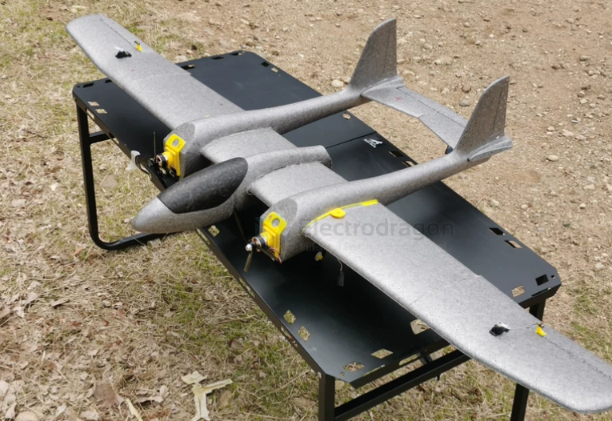

# wing-twin-boom-dat

双尾撑布局是双尾蝎最核心的工程结构特征。

**结构特点**：它摒弃了传统的单杆式后机身，而是从主机翼的两侧向后延伸出两条独立的“尾撑杆”（Boom）。这两条尾撑杆分别连接一个垂直尾翼，并在两个垂尾顶端连接水平尾翼，形成一个闭合的方框/倒“门”字形框体结构。  

工程优势：  

**结构刚度高**：双尾撑与平尾、垂尾连成一体，形成了坚固的框体闭环受力结构，抗扭刚度好。  

**利于多发动机与货舱布置**：短机身设计可以把尾部空间腾出来，便于在机头、机尾或机翼上布置多台发动机（如双发、三发甚至四发的双尾蝎衍生型），同时也为中部的任务舱段/货舱留出了不受传动轴干扰的大容积空间。

## ref 

