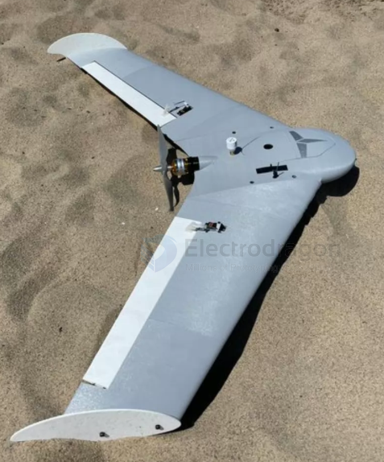

# wing-flying-dat

- [[fixed-wing-dat]] - [[wing-flying-dat]]

**TBRC Wings** (full name usually **Team Basement RC Wings**) is a highly renowned **high-performance FPV Flying Wing brand and series** in the international RC and FPV (First-Person View) communities.

Among RC enthusiasts — especially those into FPV racing, long-range flying, and aggressive combat flying — TBRC wings enjoy an excellent reputation. Their main characteristics and background include:

### 1. Brand & Classic Models

* **Longtime Specialists:** TBRC focuses on designing and producing crash-resistant, high-speed, tailless Flying Wings suited for FPV payloads.
* **Classic Models:**
  * **TBRC 60 (e.g., V3 version):** A very classic extra-large FPV wing platform (large wingspan, e.g., the TBRC 60 offers excellent long-endurance cruise capability and superb stability).
  * **TBRC Reflex 38:** Designed specifically for FPV Wing Racing, this model has won major awards in several well-known FPV events (e.g., NAFPV races, Fatshark Frenzy races).
  * **Warlock series / WRA Spec Wing:** High-performance, high-agility wings launched for spec-series events or general players.

### 2. Core Features

* **High-Strength, Crash-Resistant Material:** TBRC wings typically use a specially formulated high-performance EPP foam (what they call **#Superfoam**). This material offers exceptional toughness and impact resistance — after a crash it can often "come back to life at full strength," making it ideal for aggressive flying and beginner practice.
* **Large Internal Bay:** The FPV-oriented airframes leave a spacious electronics bay, easily accommodating large-capacity batteries (e.g., 4S or larger), video transmitters, HD cameras (such as GoPro), flight controllers, and GPS.
* **Balance of High Speed & High Angle-of-Attack Performance:** Their airfoil designs balance stability at high speed with stall resistance during slow approaches — capable of both aggressive racing and long-range cruising.

If you hear people talking about "TBRC wing" in the FPV community or on video platforms like YouTube, they are usually referring to these **aggressive/crash-resistant EPP flying wings built for FPV proximity flying, aerial racing, or large-battery cruising**.

## ref 

- [[rc-aircraft]] - [[wing-flying]]