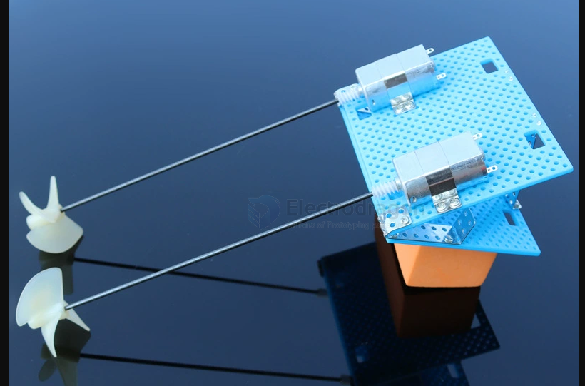
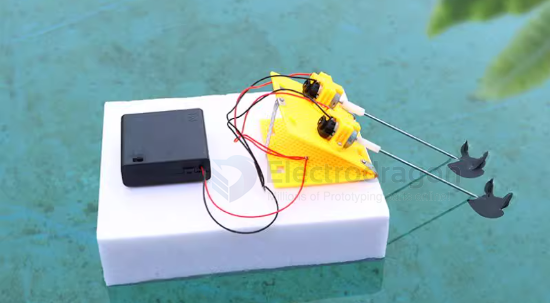
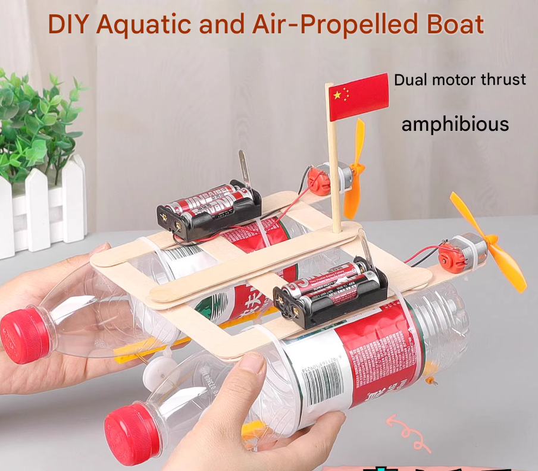

# rc-boat-dat

## propeller setup 

- [[propeller-dat]]

## air-propelled 

Catamaran: Greatly improves stability. 

Wind power: Fans blow air, generating a recoil force that propels the hull forward.

## ref 

- [[rc-apps]] - [[rc-boat]]