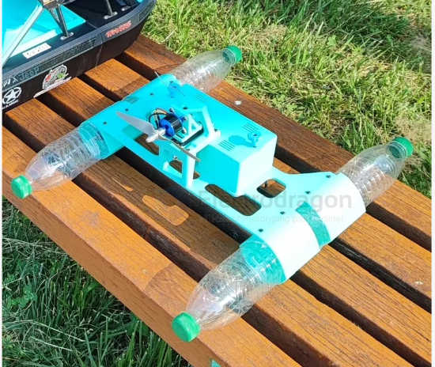
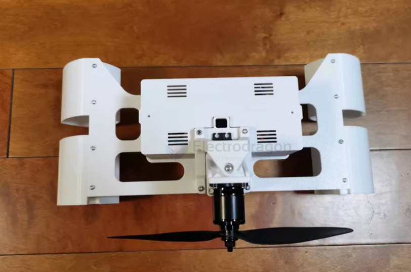
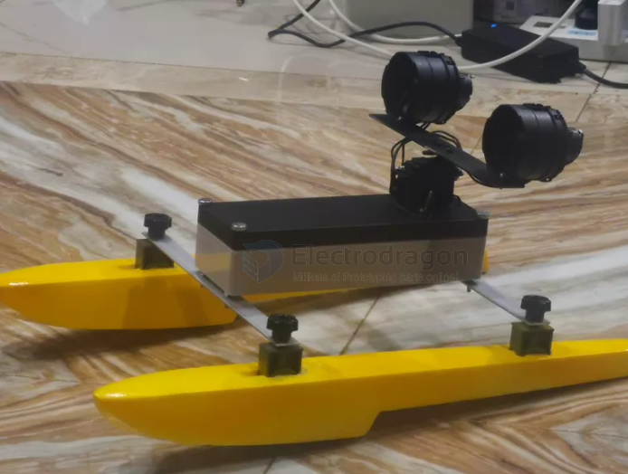

# boat-air-dat

- [[rc-boat-dat]]

底座：适配17g舵机和2205无刷电机(旧的五寸穿越机电机都能玩)。自己配合30/40a电调都可以。遥控+接收机100块钱6通道的鸡腿控就挺好，还带电压回传，或者高阶玩家用elrs接收机六通道的控制，可以加射灯，炫彩灯等。浮筒凭自己想象，饮料瓶，pvc水管，泡沫板，3d打印船壳或者水鞋。这个底座diy后，可玩性很高，不怕水草杂物。

2212电机，1400kv。

2205无刷电机(旧的五寸穿越机电机都能玩)

- [[motor-brushless-dat]] - [[motor-servo-dat]]

## disadvantages

**慢速下极难控舵（低速操纵性极差）**

风动船主要依靠风扇吹出的风流经过舵片来改变方向。在慢速航行时，风速极低，舵效几乎为零。

它没有深入水下的水舵，在慢速下遇到河道水流或近海涌浪，极易被浪花和水流推着走，完全失去转向能力。

**重心过高，极易翻船（抗风浪能力弱）**

风动船需要将重的电机、螺旋桨和防护网架高高挂在船体上方。

这导致船只的重心（Center of Gravity）非常高。在近海遇到侧向微小风浪或侧风时，高耸的风扇架会像一把“帆”一样抓风，产生极大的倾覆力矩。

**船体多为平底（不破浪且拍浪严重）**

为了减少水面阻力，风动船通常采用平底船型（Flat-bottom）。

平底船在近海微风浪中航行时，浪花会剧烈拍击船底（Pounding），不仅颠簸严重，还极易导致船头打横或被涌浪掀翻。

## ref 

- [[rc-boat]] - [[boat-air]]

- [[projects]]