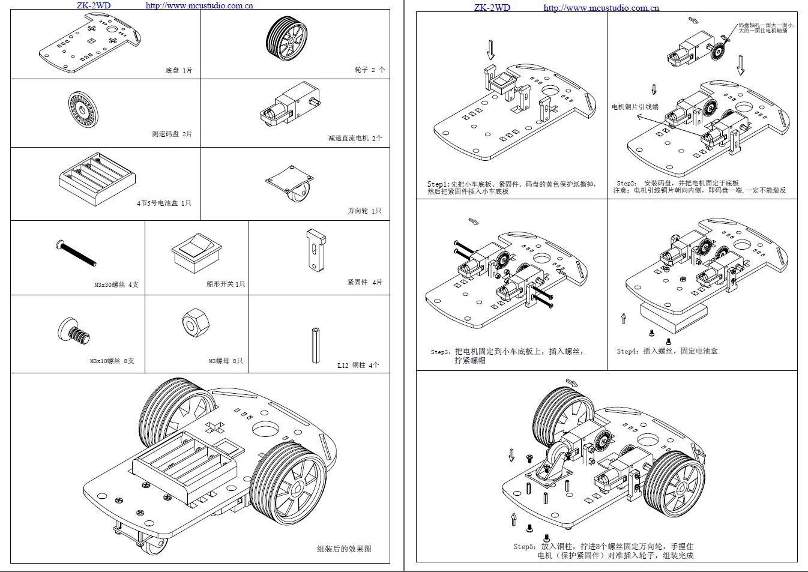
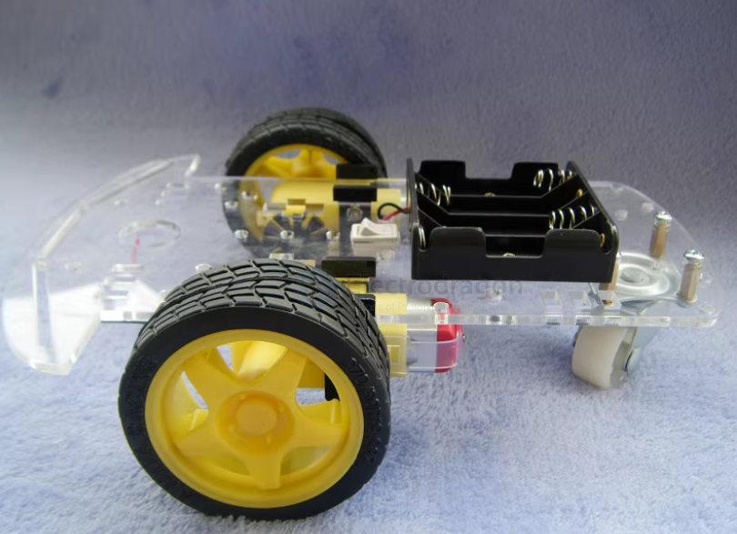

# rc-car-toy-dat

## Rover Version 2 

assembly guide and teardown of a $20 RC toy car

## Rover Version 1 

Very basic version 

including functions == [[ultrasonic-sensor-dat]], [[interactive-dat]] - [[infrared-dat]] - [[line-finder-dat]] - [[MCU-dat]] - [[chassis-dat]] - [[cad-dat]] - [[wheels-dat]] - [[PCB-accesories-dat]]

plastic chassis 4WD

basic demo code 1 here == [[RC-code-dat]]

## ref 

- [[sensor-Infrared-dat]] - [[sensor-IR-reflective-dat]] - [[line-finder-dat]]

- [[motor-driver-dat]] - [[L298-dat]]

- [[motor-tt-dat]]

- [[rc-rover-dat]]
