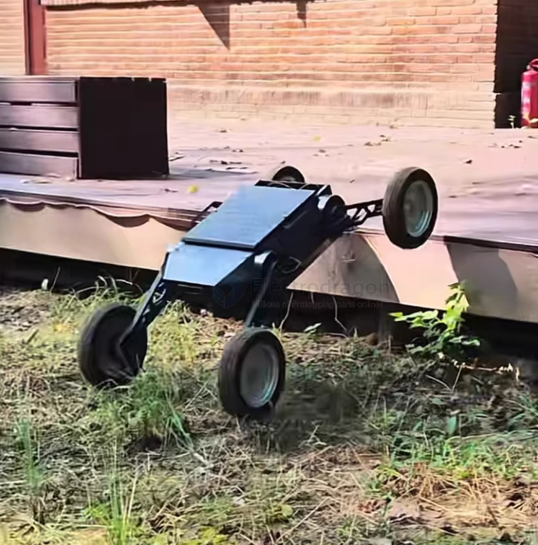
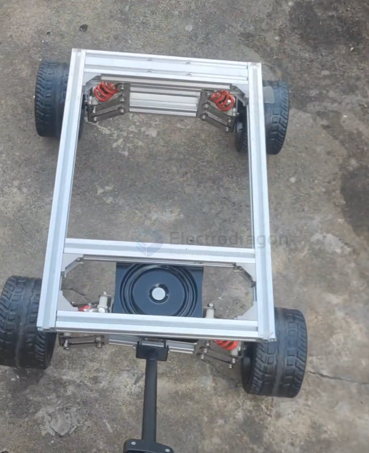
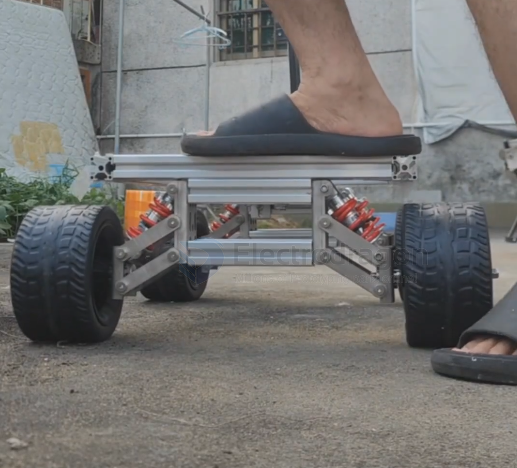
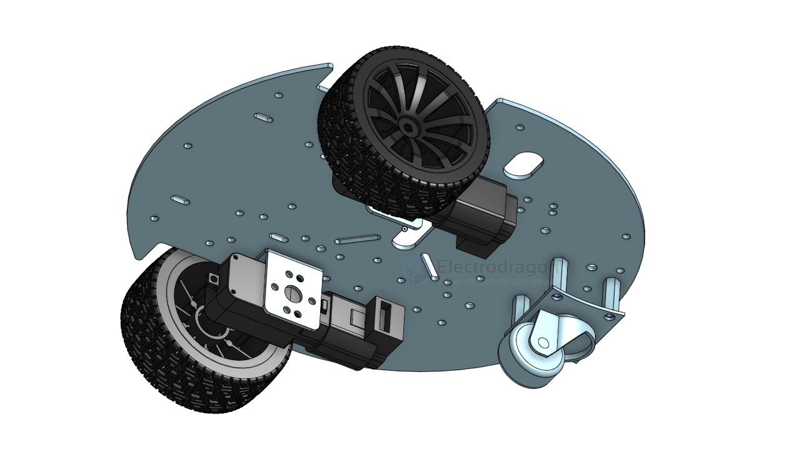
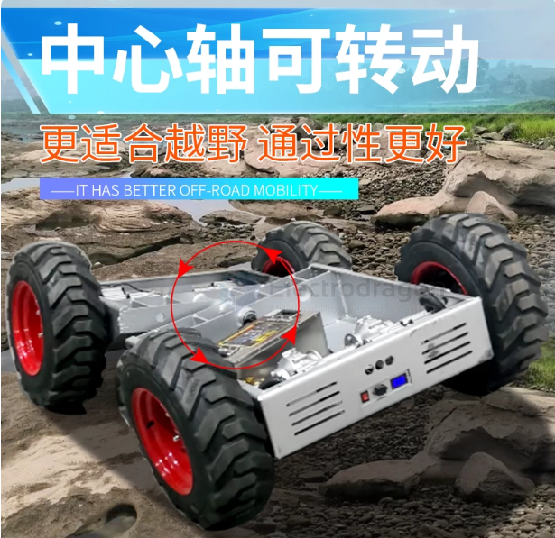
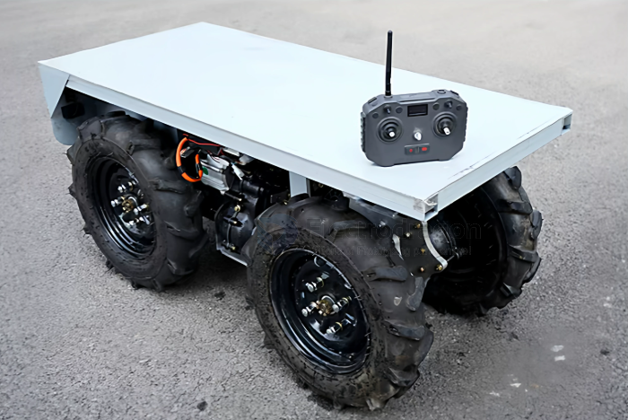
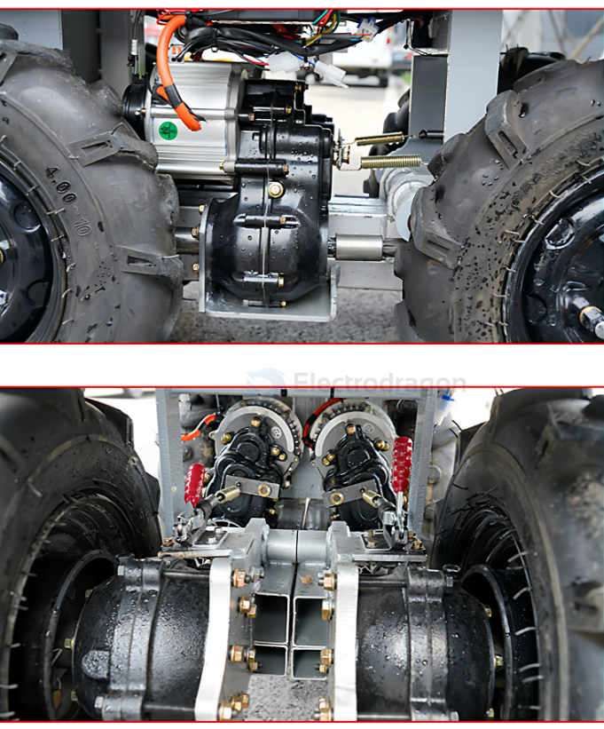

# rover-dat

- [[ardupilot-dat]] - [[rc-dat]]

- [[RC-car-dat]] - [[rover-dat]] - [[RC-car-hack-dat]]

- [[rc-signal-dat]]

- ARKV6X Flight Controller Overview
- ARK FPV Flight Controller Overview == STM32H743IIK6 MCU
- CUAV V5 Plus Overview == STM32F765

- [[motor-rover-dat]]

## build types 

- [[rc-car-toy-dat]] - [[rc-car-dat]] - [[Curiosity-rover-dat]] - [[app-remote-rover-dat]] - [[tank-dat]] - [[rc-vehicles-dat]]

## features 

- [[off-road-dat]]

- [[gearbox-differential-dat]] - [[gearbox-dat]] - [[rc-rover-dat]]

- [[servo-dat]] - [[gimbal]] to take action or control [[sensor-Camera-dat]]

- [[DCDC-down-dat]]

- [[ELRS-dat]] - [[RC-dat]]

- [[relay-dat]] - [[mosfet-dat]] - [[acturator-dat]] conrol 
  
- [[pump-dat]] - water shoot 

- [[buzzer-dat]] - sound alarm

- [[selfie-stick-dat]]

- [[USB-dat]] - [[power-dat]] charge 

- [[ADC-dat]] - [[battery-dat]] monitor 

- [[network-dat]] - communication - [[A7670-dat]] 

- [[location-dat]]

## mechanics 

- [[suspension-dat]] - [[fab-mechanics-dat]] - [[chassis-dat]] - [[wheels-dat]] - [[shaft-connector-dat]] 

## boards 

- [[SDR1064-dat]] - [[SDR1117-dat]]

## rover info 

## stroller version 

## code 

- [[RC-code-dat]]

## 3D printed 

- [[markus-rover-dat]]

### 3D files 

[differential drive robot](https://cad.onshape.com/documents/78baf3d450629341539223b8/w/67b1d15167c8efd1d8242192/e/0e64a58d61cf14a49375d9c6?renderMode=0&uiState=68301fdbbe87bf505c7cb858)

[TT Motor 4WD Car Mecanum wheel](https://cad.onshape.com/documents/ffe6ad9ac868a2e0b125a547/w/06961ea3665cb10f47c1f6fe/e/c6b6790270216188fea6ddec?renderMode=0&uiState=6830205c37d051363fada807)

[Another TT Motor 4WD Car Mecanum wheel](https://cad.onshape.com/documents/3fc9a68709b7b211c126b7b0/w/fd59e3cfbe0cf012d3264ef8/e/f35859a1e063a8642be26811?renderMode=0&uiState=68302088624d574aaab00cc0)

## board 2 

- [[ESP32-dat]] - [[ELRS-dat]]

## board 

- [[SDR1064-dat]] 

chip based [[PCA9685-dat]], [[L293-dat]], [[L298-dat]], [[TB6612-dat]] see more at [[motor-driver-dat]]

Parts - [[TT-motor-dat]] - [[mecanum-wheel-dat]]

## Rover Price and BOM cost 4WD

- 4x 125mm [[wheel-dat]] plus [[shaft-connector-dat]] = 4x $3 == $12 
- 4x 100KG [[Motor-reduction-Gear-dat]] == 4x $11 = $44 
- [[sheet-dat]] built frame == $5
- 4x [[motor-driver-dat]] plus [[MCU-dat]] == 4x $2 + 1x $2 == $10
- 1x [[battery-dat]] == $5
- 1x [[battery-charger-dat]] == $1

subtotal == $77

## build 

## types 

In the commercial, hobby-grade RC market, defining which vehicle has the "best off-road performance" depends entirely on whether your goal is **"slowly conquering extreme obstacles"** or **"blasting across rugged terrain at high speeds."**

The absolute pinnacles of commercial off-road RC cars are **Rock Crawlers** and **Monster Trucks** (including truggies). Additionally, there is a hidden king of high-speed off-roading known as the **Desert Truck** (or Rock Racer). 

Each approaches off-roading from a completely different mechanical philosophy. Here is a detailed breakdown of their unique characteristics:

---

### 1. Rock Crawlers / Trail Trucks — The Kings of "Extreme Obstacle Clearance" 👑
*(攀爬车 —— 极端地形的“极限通过性”王)*

If off-roading means **"going where absolutely nothing else can go, even if it takes a slow and steady climb,"** then the rock crawler is the undisputed champion. Its core characteristics are **extreme low-speed torque and mechanical traction.**

* **Key Features:**
  * **Specialized Drivetrain:** They come standard with permanently locked differentials (直轴), or high-end models (like the Traxxas TRX-4 or Axial SCX10 III) feature remote-locking differentials controlled directly from the transmitter.
  * **Extreme Torque:** Outfitted with massive gear reduction ratios (low-gear transmissions). The motor is tuned for raw pulling power rather than speed. Top speeds are usually only 5–15 km/h (walking pace).
  * **Massive Suspension Articulation:** Incredible chassis twist ("flex") paired with ultra-soft, ultra-sticky compound tires designed to bite onto rocks.
* **Off-Road Edge:** It can crawl up near-vertical 50-to-60-degree rock faces, deep ruts, exposed tree roots, and muddy streams like a mechanical lizard. 
* **Iconic Models:** Traxxas TRX-4, Axial SCX10 Series, Yikong YK4082.

---

### 2. Monster Trucks — The "All-Terrain Brute Force Crushers" 🦖
*(大脚车 —— 暴力碾压的“全地形摧毁者”)*

If off-roading means **"whatever obstacle is in front of me, I will launch over it at full throttle,"** the Monster Truck is the embodiment of raw speed and power. Its core identity revolves around **bashing, massive ground clearance, and oversized tires.**

* **Key Features:**
  * **Oversized Footprint:** Equipped with comically massive tires and an incredibly high chassis. For typical grass, sand pits, or medium-sized stones, the tire diameter is simply larger than the obstacle, allowing for pure "physical monster-trucking."
  * **Terrifying Power:** Usually powered by high-voltage brushless motor systems (run on 4S, 6S, or even 8S LiPo batteries), hitting speeds of 60–90+ km/h with ease.
  * **Heavy-Duty Shocks:** Features giant, thick oil-filled shocks built specifically to absorb the violent impacts of flying multiple meters into the air ("airtime" or "bashing").
* **Off-Road Edge:** By relying on brutal power and giant tires, it charges at high speeds through deep weeds, loose sand dunes, and chaotic construction site rubble. It doesn't find a line around obstacles; it launches right over them.
* **Iconic Models:** Traxxas X-Maxx, Team Associated Rival MT10, Arrma Granite.

---

### 3. Desert Trucks / Rock Racers — The High-Speed Off-Road Hybrids 🏁
*(沙漠卡车 / 速度攀爬卡 —— 高速越野的平衡大师)*

If you want both the unrestricted speed of a monster truck and the rock-handling capabilities of a crawler, this hybrid—modeled after real-world King of the Hammers or Dakar racers—is the ultimate off-road weapon.

* **Key Features:**
  * **Scale Realism:** Features a realistic tubular cage design. They typically use an Independent Front Suspension (IFS) for high-speed stability, paired with a Solid Rear Axle (整体吊杆后桥) for extreme rear-wheel traction and articulation.
  * **Speed Combined with Skill:** They are much faster than crawlers (speeds ranging from 40–70 km/h), but the drivetrain design (often a locked rear axle and heavy diff oil in the front) keeps them incredibly capable on rocky trails.
* **Off-Road Edge:** This is the true "all-terrain rally king." It glides beautifully across desert sand, gravel paths, and jagged flats at high speeds, while still maintaining the suspension geometry to handle technical rock sections.
* **Iconic Models:** Losi Super Baja Rey, Axial Ryft, Traxxas UDR.

---

## ⚖️ At-a-Glance Off-Road Performance Comparison

| Metric                                 | Rock Crawler                                                   | Monster Truck                                                | Desert Truck                                                                    |
| :------------------------------------- | :------------------------------------------------------------- | :----------------------------------------------------------- | :------------------------------------------------------------------------------ |
| **Absolute Obstacle Clearance (Slow)** | **⭐⭐⭐⭐⭐ (Highest)**                                            | ⭐⭐⭐⭐                                                         | ⭐⭐⭐⭐                                                                            |
| **Terrain Blitzing (High Speed)**      | ⭐                                                              | **⭐⭐⭐⭐⭐ (Highest)**                                          | ⭐⭐⭐⭐⭐                                                                           |
| **Ground Clearance**                   | ⭐⭐⭐⭐                                                           | **⭐⭐⭐⭐⭐ (Highest)**                                          | ⭐⭐⭐⭐                                                                            |
| **Durability (Abuse/Big Jumps)**       | ⭐⭐⭐⭐ (Hard to break due to low speed)                          | **⭐⭐⭐⭐⭐ (Built like a tank)**                                | ⭐⭐⭐                                                                             |
| **Core Source of Fun**                 | Precision lines, scale realism, and technical problem-solving. | Big air jumps, backflips, and raw, chaotic power expression. | High-speed scale handling, drifting on dirt, and realistic suspension movement. |

**Quick Buyer's Guide:**
* If you want to explore **hiking trails, crawl over rock piles, explore dense woods, and wade through streams** using precise control, choose a **Rock Crawler**.
* If you want to go to wide-open **grass fields, skateparks, construction zones, or massive dirt hills to launch high jumps** and smash through obstacles, choose a **Monster Truck**.
* If you want to rip across **dirt tracks, sandy beaches, and gravel flats with realistic scale body roll and high-speed handling**, choose a **Desert Truck**.

## ref 

- [[dc-motor-dat]] - [[motor-driver-dat]] - [[motor-dat]] - [[servo-dat]]

- [[motor-rover-dat]]

- [[rc-car]] - [[maker]] - [[rc-rover]]

- [[rover-v2]]