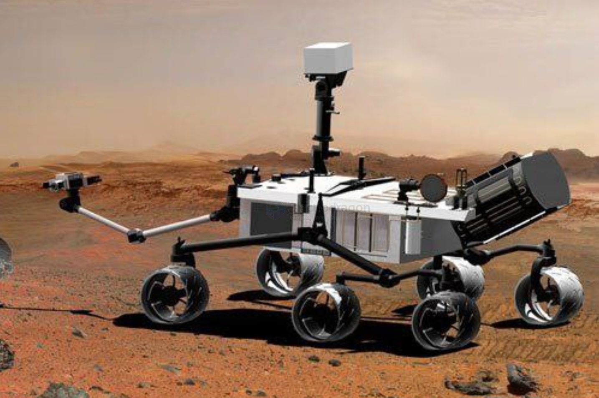

# Curiosity-rover-dat

## reference 

- [CAD animated video](https://www.youtube.com/watch?v=bP7p5Bd2d50&t=74s) 

## chassis 

- [[rocker-bogie-suspension-dat]]

The **Curiosity rover** uses a special mobility system based on the famous NASA **“Rocker–Bogie Suspension”** design.  
Its chassis gives it several important advantages on rough Martian terrain:

---

### 1. **High Stability Over Rough Terrain**
- The rocker–bogie system keeps all wheels in contact with the ground.  
- The rover stays stable even when wheels climb over large rocks or dips.  
- It greatly reduces the chance of tipping over.

---

### 2. **Excellent Obstacle-Crossing Ability**
- Curiosity can climb over rocks as tall as **65 cm** (about twice the wheel diameter).  
- It can also traverse slopes up to **30 degrees**.  
- Ideal for Mars’ uneven, rocky environment.

---

### 3. **Low Shock / Smooth Motion**
- The suspension has **no springs**, so there is no bouncing.  
- Reduces shock to instruments (cameras, spectrometers, drills).  
- Increases measurement accuracy and protects hardware.

---

### 4. **High Durability and Reliability**
- Few moving parts → less chance of mechanical failure.  
- Works in extremely cold Martian temperatures.  
- Designed for long missions (original goal: 2 years, now over 10+ years).

---

### 5. **Six-Wheel Drive System**
- All six wheels have independent motors.  
- If one wheel is damaged, the rover can still move.  
- Provides very strong traction on sand, soil, and rock.

---

### 6. **Articulated Steering (Front & Rear Wheels)**
- Front and rear wheels can steer.  
- Allows “tank-like” pivot turns in place.  
- Reduces turning radius and improves maneuverability.

---

### 7. **High Ground Clearance**
- Tall chassis avoids getting stuck on rocks or ridges.  
- Keeps sensitive scientific instruments safe.

---

### 8. **Central Body (Chassis) Protects Instruments**
- Houses power system (RTG), computers, and sensors.  
- Provides insulation against radiation and extreme temperatures.  
- Serves as a strong frame for the robotic arm and mast.

---

### Summary
Curiosity’s chassis is optimized for:
- stability  
- durability  
- obstacle handling  
- accurate scientific operation  