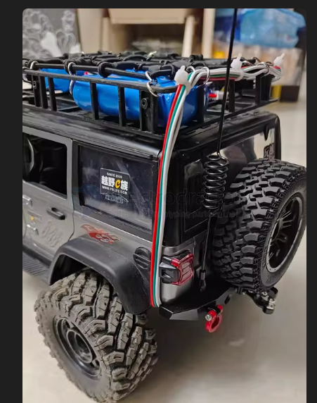

# rc-car-hack-dat

## 1. battery Enlargement 

- [[li-battery-dat]] - [[battery-pack-dat]]

## 2. RC Signal Extension

- improve up to 10KM by [[FPV-dat]] system [[ELRS-dat]], or [[PPM-dat]] == [[Wfly-dat]]

- [[antenna-dat]]

- control system - try to hack by [[arduino-dat]]

## 3. Imaging System 

- [[video-transmission-dat]] == pickup option == [[LTE-dat]]

## 4. GNSS location system 

- [[location-dat]]

## other fancy functions 

- [[WS2812-dat]]

## Accessories

- [[Velcro-dat]]

## Get Inpsired 

The battery can be put in your top luggage rack 

