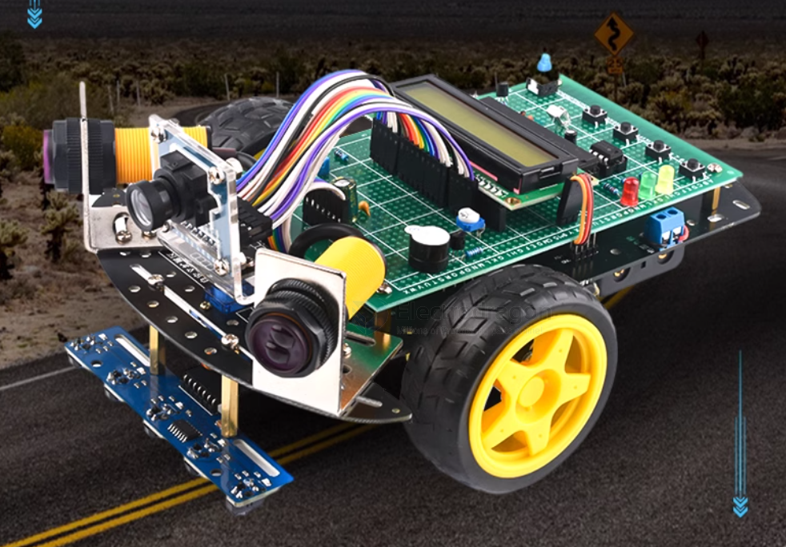
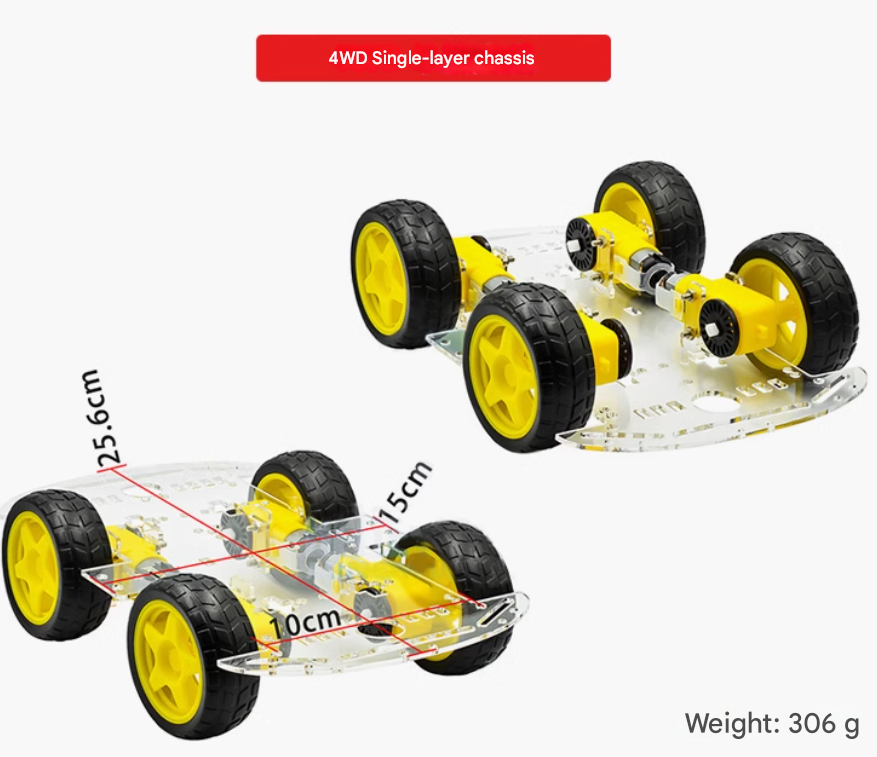
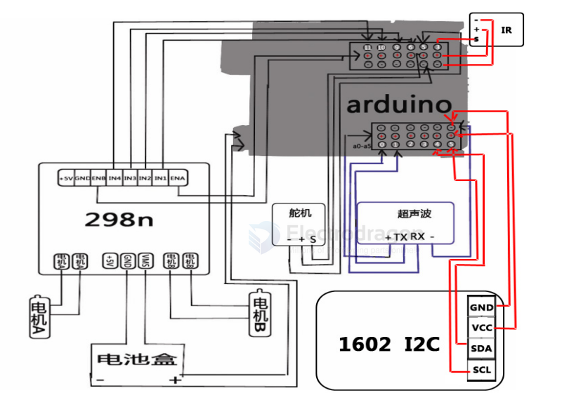
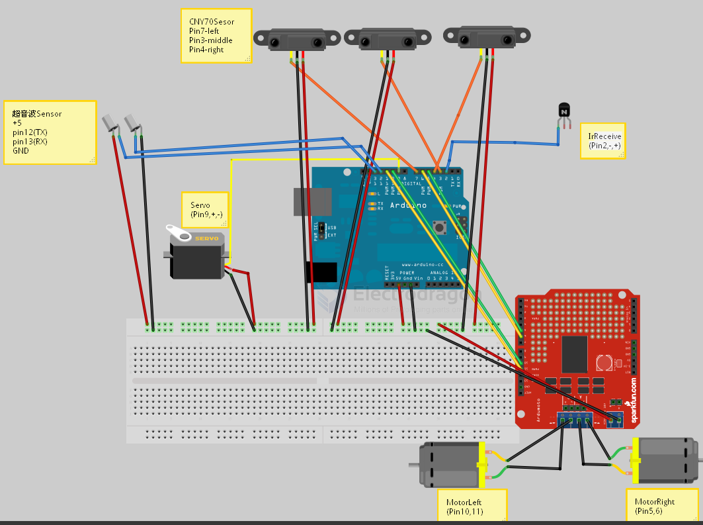
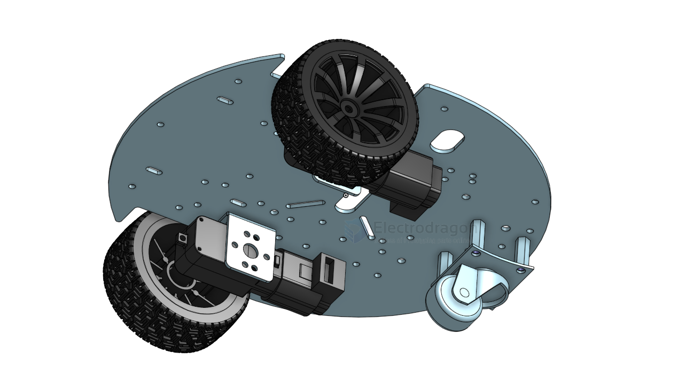

# rover-dat

- [[ardupilot-dat]] - [[rc-dat]]

https://ardupilot.org/rover/index.html

- [[RC-car-dat]] - [[rover-dat]] - [[RC-car-hack-dat]]

- [[rc-signal-dat]]

- ARKV6X Flight Controller Overview
- ARK FPV Flight Controller Overview == STM32H743IIK6 MCU
- CUAV V5 Plus Overview == STM32F765

- [[motor-rover-dat]]

## boards 

- [[SDR1064-dat]]

## Rover Version 

Very basic version 

including functions == [[ultrasonic-sensor-dat]], [[interactive-dat]] - [[infrared-dat]] - [[line-finder-dat]] - [[MCU-dat]] - [[chassis-dat]] - [[cad-dat]] - [[wheels-dat]] - [[PCB-accesories-dat]]

plastic chassis 4WD

basic demo code 1 here == [[RC-code-dat]]

## code 

- [[RC-code-dat]]
## 3D printed 

- [[markus-rover-dat]]

### 3D files 

[differential drive robot](https://cad.onshape.com/documents/78baf3d450629341539223b8/w/67b1d15167c8efd1d8242192/e/0e64a58d61cf14a49375d9c6?renderMode=0&uiState=68301fdbbe87bf505c7cb858)

[TT Motor 4WD Car Mecanum wheel](https://cad.onshape.com/documents/ffe6ad9ac868a2e0b125a547/w/06961ea3665cb10f47c1f6fe/e/c6b6790270216188fea6ddec?renderMode=0&uiState=6830205c37d051363fada807)

[Another TT Motor 4WD Car Mecanum wheel](https://cad.onshape.com/documents/3fc9a68709b7b211c126b7b0/w/fd59e3cfbe0cf012d3264ef8/e/f35859a1e063a8642be26811?renderMode=0&uiState=68302088624d574aaab00cc0)

## board 

- [[SDR1064-dat]] 

chip based [[PCA9685-dat]], [[L293-dat]], [[L298-dat]], [[TB6612-dat]] see more at [[motor-driver-dat]]

Parts - [[TT-motor-dat]] - [[mecanum-wheel-dat]]

## Rover Price and BOM cost 4WD

- 4x 125mm [[wheel-dat]] plus [[shaft-connector-dat]] = 4x $3 == $12 
- 4x 100KG [[reduction-gear-motor-dat]] == 4x $11 = $44 
- [[sheet-dat]] built frame == $5
- 4x [[motor-driver-dat]] plus [[MCU-dat]] == 4x $2 + 1x $2 == $10
- 1x [[battery-dat]] == $5
- 1x [[battery-charger-dat]] == $1

subtotal == $77

## ref 

- [[dc-motor-dat]] - [[motor-driver-dat]] - [[motor-dat]] - [[servo-dat]]

- [[motor-rover-dat]]

- [[rc-car]] - [[maker]]