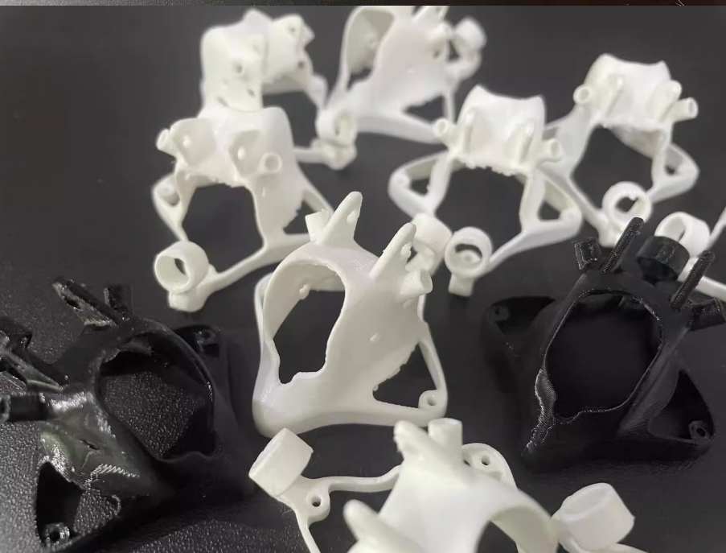
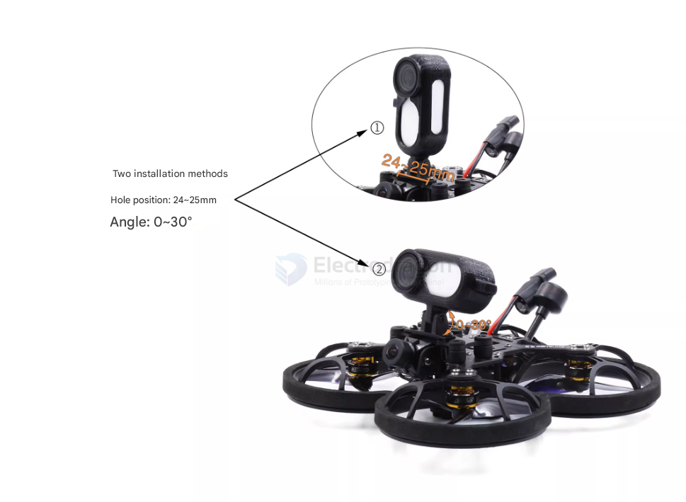
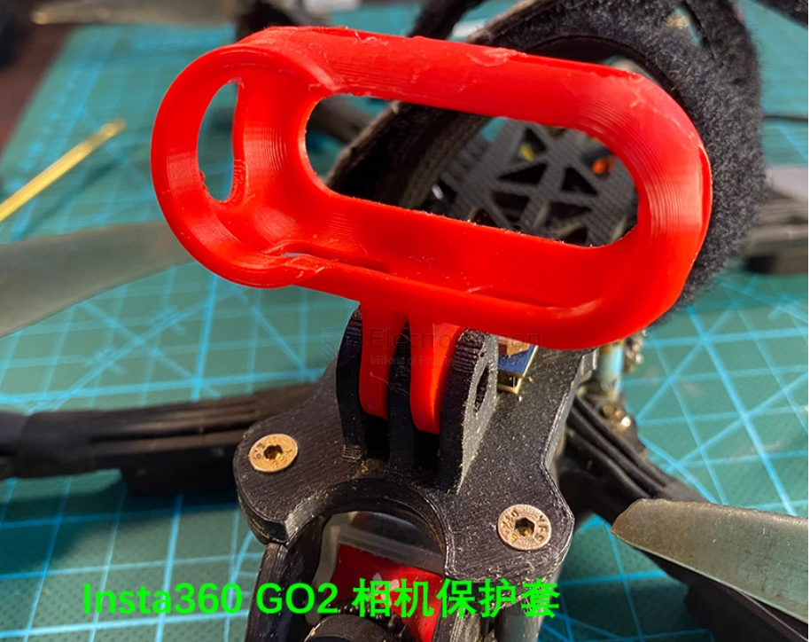

# FPV-accesories-dat

- [[gimbal-dat]]

## mobula 8 

- [[mobula8-dat]] - [[3d-print-dat]]

- landing Gears
https://www.printables.com/model/915475-mobula-8-landing-gears

- landing legs 
https://makerworld.com/en/models/701610-mobula-8-landing-legs#profileId-631151
1.1*1.4*1.4cm

## canopy and camera mount 

- hard case 
https://www.printables.com/model/517225-mobula-8-hard-case

- thumb holder / Thumb - Camera Mount

https://cults3d.com/en/3d-model/gadget/mobula8-thumb-mount = 0.55U 

https://www.printables.com/model/774692-mobula-7-8-hawkeye-thumb-camera-mount

for insta360 go 2

- [[camera-FPV-dat]]

## lollipop antenna mount 

- [[antenna-lolipop-dat]]

https://makerworld.com/en/models/689978-mobula8-reinforced-canopy-with-lollipop-mount#profileId-618749

## ref 

- [[FPV-dat]] - [[FPV]]

- [[antenna-dat]]