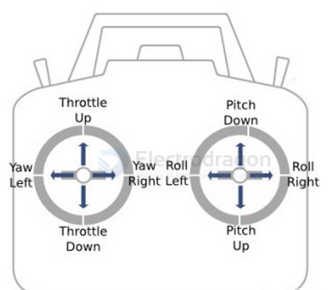
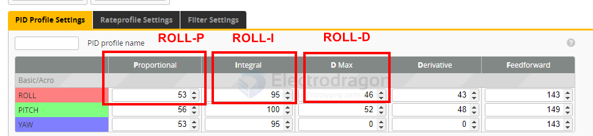

# RC-controller-dat

Check **Channel Map**: should be **AETR**.

- A: Aileron (Roll)
- E: Elevator (Pitch)
- T: Throttle
- R: Rudder (Yaw)

A Roll E Pitch R Yaw T Throttle

Roll Pitch Yaw Throttle

- [[mobula8-dat]]

## drift 

### 2. Calibration & Orientation

7. Betaflight → `Setup` → **Calibrate Accelerometer** (drone must be level).  
8. In `Setup` 3D model: tilt the drone → model should move the same way.  
- If not → fix in Configuration → `Board Alignment` (Yaw 90/180/270 etc).   

### 4. Fixing “Steady Right Drift”

12. If subtrim is correct but it still drifts → go to `PID Tuning`.  
13. Increase **Roll I-term** slightly (+1 → +4, test each step).  
14. If oscillations appear → reduce Roll P or Roll D by small steps (-1).  
15. Check Motor Idle value: `Configuration → DShot Idle` around **5%** (or min_command ≈1050).

